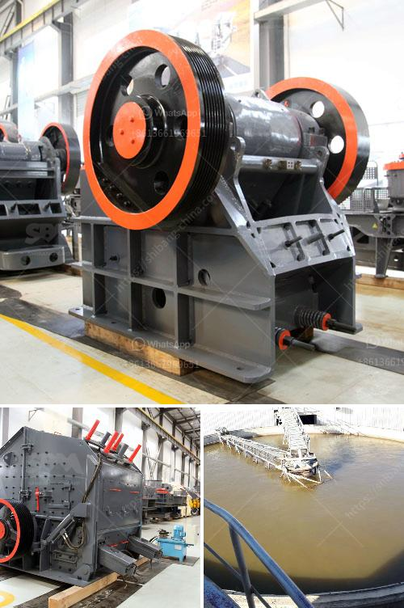

<h3>مصنع تكسير وفحص متنقل</h3>
يعتبر مصنع التكسير والفحص المتنقل أحد المفاهيم الحديثة التي تهدف إلى تحسين عملية تكسير وفحص المواد في مجال البناء والتشييد. يتميز هذا النوع من المصانع بقدرتها على نقل المواد وإجراء عمليات التكسير والفحص بعيدًا عن الموقع الأصلي للمواد. سنناقش في هذه المقالة أهمية هذا النوع من المصانع وفوائده المختلفة.

أحد أهم الأسباب التي تجعل المصانع المتنقلة مطلوبة هو القدرة على توفير الوقت وتقليل التكلفة. في حالة توفر مصنع تكسير وفحص متنقل في موقع البناء يمكن أن يكون له تأثير كبير على العملية الإنتاجية. بدلاً من نقل المواد إلى موقع المصنع التقليدي، يمكن توفير الوقت والجهد والتكاليف المرتبطة بنقل المواد. بالإضافة إلى ذلك، فإن المصانع المتنقلة قادرة على تنفيذ عمليات التكسير والفحص بسرعة أكبر، مما يزيد الإنتاجية ويقلل من الوقت اللازم لإكمال المشروع.

يساهم المصنع المتنقل في تحسين جودة المواد المكسورة والمفحوصة أيضًا. فهو يستخدم أحدث التقنيات والمعدات للتأكد من حصول المواد على المواصفات المحددة. وبالتالي، يتم تجنب الأخطاء والعيوب في المواد، وهو ما يؤدي إلى زيادة الجودة النهائية للمشروع.

بالإضافة إلى ذلك، يمكن للمصانع المتنقلة العمل في الظروف الصعبة والمواقع التي يصعب الوصول إليها. بفضل تصميمها القابل للتعديل، يمكن تنظيم المصنع وتجهيزه بسهولة في أي مكان تقريبًا. وبالتالي، يمكن استخدامها في المناطق النائية أو في المشاريع الكبيرة التي تتطلب تكسير وفحص المواد في موقع البناء نفسه. هذا يقلل من التكاليف المرتبطة بتحويل المواد إلى المصانع التقليدية ويسهل عمليات الصيانة والنقل.

في الختام، يعد مصنع التكسير والفحص المتنقل حلاً مثاليًا لتكسير وفحص المواد في مواقع البناء. فهو يوفر الوقت والجهد والتكلفة، ويحسن جودة المواد المستخدمة في المشاريع. كما يسمح للشركات بمواصلة العمل في الظروف الصعبة والمواقع التي يصعب الوصول إليها. بفضل هذه الفوائد، يتمتع المصنع المتنقل بشعبية متزايدة في صناعة البناء والتشييد.
<h3>Contact us</h3><ul><li><strong>Whatsapp:&nbsp;<a href="https://wa.me/8613661969651">+8613661969651</a></strong></li><li><a href="https://swt.shibang-china.com/?git&amp;zhl&amp;مصنع تكسير وفحص متنقل"><strong>Online Service(chat now)</strong></a></li></ul><h3>Related</h3><ul><li><a href='التكلفة المقدرة لإنشاء مصنع أسمنت في الهند.md'>التكلفة المقدرة لإنشاء مصنع أسمنت في الهند</a></li><li><a href='تكلفة آلة سحق الحجر كسارة الحجر.md'>تكلفة آلة سحق الحجر كسارة الحجر</a></li><li><a href='آلات تكسير الحجر في المملكة المتحدة.md'>آلات تكسير الحجر في المملكة المتحدة</a></li><li><a href='مصنع تكسير المعادن.md'>مصنع تكسير المعادن</a></li><li><a href='آلة تحويل الحجر الجيري إلى مسحوق.md'>آلة تحويل الحجر الجيري إلى مسحوق</a></li></ul>