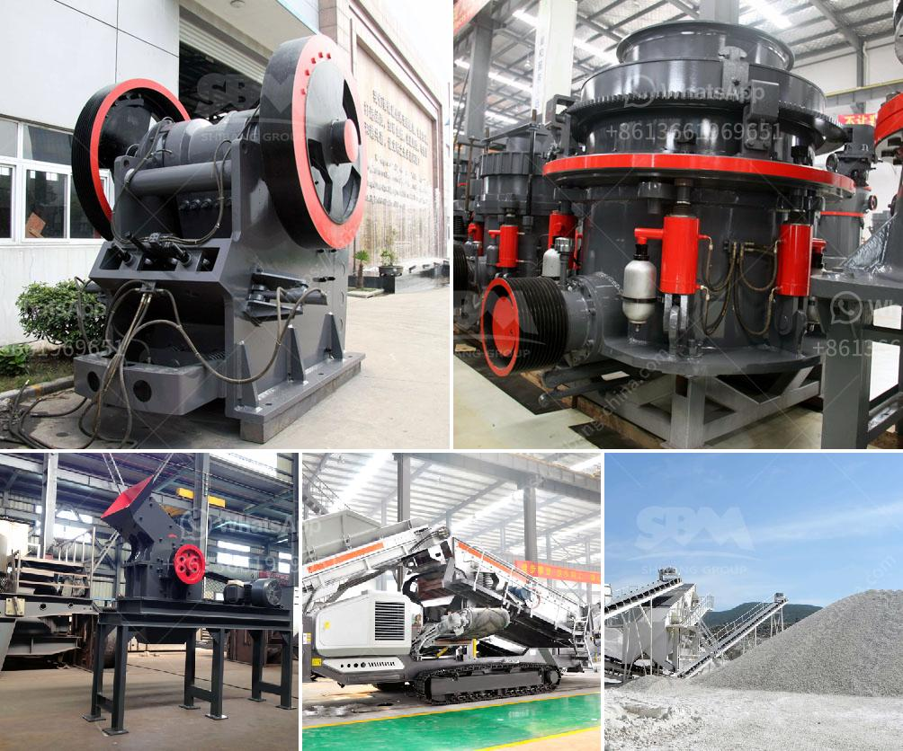

<h3>مصنع جفاف الفحم في الهند</h3>
يعتبر مصنع جفاف الفحم في الهند واحدًا من أبرز المشاريع التكنولوجية الحديثة في صناعة الطاقة والتنمية المستدامة. يتم تحويل الفحم المستخدم في مصنع الجفاف إلى فحم يدعى "الفحم القابل للشحن" وذلك بعد تجفيفه وتقليل نسبة الرطوبة فيه. يتم استخدام هذا الفحم في عمليات توليد الطاقة وصناعة الحديد والصلب والسيمنت وغيرها.

تستخدم تقنية جفاف الفحم في المصنع الهندي المتطورة لتقليل نسبة الرطوبة في الفحم من المعتادة التي تتراوح بين 25% إلى 12% وهذا يساهم في زيادة كفاءة القدرة الحرارية للفحم المستخدم في عمليات توليد الطاقة. بفضل هذه التحسينات في جودة الفحم، يتم تقليل استهلاك الوقود والانبعاثات الضارة وبالتالي تقليل الضرر البيئي والتأثير على صحة الإنسان.

بالإضافة إلى ذلك، يتم تحقيق العديد من الفوائد الاقتصادية والاجتماعية والبيئية عن طريق جفاف الفحم. يقلل هذا الإجراء من تكلفة استخراج الفحم ونقله وتخزينه ويساهم في توفير الوقت والموارد والطاقة. كما يمنح فرص عمل اضافية ويعزز الاقتصاد المحلي في المناطق التي يتم فيها بناء مثل هذه المصانع.

من الناحية البيئية، يقلل تجفيف الفحم من نسبة انبعاثات غازات الدفيئة خلال عمليات الاحتراق في محطات توليد الطاقة والصناعات الأخرى. يساهم أيضًا في تقليل تلوث الهواء وتأثيره السلبي على البيئة وصحة الإنسان.

وباستخدام التكنولوجيا المتطورة والابتكار في مجال جفاف الفحم، يتم تعزيز القدرة التنافسية للصناعة الهندية في الأسواق العالمية. كما يساهم هذا المصنع في تحقيق أهداف التنمية المستدامة والاقتصاد الأخضر والاعتماد على مصادر الطاقة البديلة.

في الختام، يمثل مصنع جفاف الفحم في الهند قفزة نوعية في صناعة الطاقة والتنمية المستدامة. يساهم هذا المصنع في تحقيق العديد من الفوائد الاقتصادية والاجتماعية والبيئية ويعزز القدرة التنافسية للهند في الأسواق العالمية. تجدر الإشارة إلى أهمية الاستثمار في الأبحاث والابتكار لتطوير التكنولوجيا وتطوير المزيد من هذه المشاريع المستدامة لتحقيق تنمية مستدامة وحماية بيئتنا.
<h3>Contact us</h3><ul><li><strong>Whatsapp:&nbsp;<a href="https://wa.me/8613661969651">+8613661969651</a></strong></li><li><a href="https://swt.shibang-china.com/?git&amp;zhl&amp;مصنع جفاف الفحم في الهند"><strong>Online Service(chat now)</strong></a></li></ul><h3>Related</h3><ul><li><a href='كسارة هيدروليكية.md'>كسارة هيدروليكية</a></li><li><a href='كسارات الحجر المستخدمة في ألمانيا.md'>كسارات الحجر المستخدمة في ألمانيا</a></li><li><a href='كسارة على أساس الإيجار في نيجيريا.md'>كسارة على أساس الإيجار في نيجيريا</a></li><li><a href='كسارة الفك في نيبال للبيع.md'>كسارة الفك في نيبال للبيع</a></li><li><a href='سعر طاحونة المطرقة.md'>سعر طاحونة المطرقة</a></li></ul>