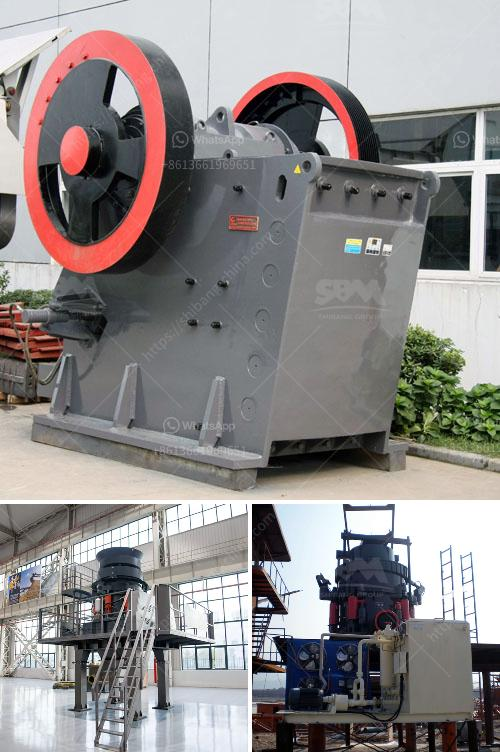

<h3>مصنع خام الكروم الكامل</h3>
يعتبر خام الكروم من المعادن الهامة جدًا في صناعة الصلب والكيماويات. يتم استخراج الكروم من خام الكروم الكروميت الذي له تركيب كيميائي يتألف بشكل رئيسي من أكسيد الكروم الثلاثي بصيغة Cr2O3.

لإنتاج خام الكروم النقي، يتم إقامة مصنع خام الكروم الكامل. يتكون هذا المصنع من عدة مراحل لمعالجة الخام وفصله عن المواد الأخرى المصاحبة.

تبدأ عملية إنتاج خام الكروم بتكسير الخام إلى قطع صغيرة باستخدام الكسارات. تلي ذلك عملية الطحن، حيث يتم طحن الخام بواسطة المطاحن للحصول على حجم جسيمات مناسب.

بعد ذلك، يتم تحويل الخام المطحون إلى خام مخصب باستخدام التعويم. هذه العملية تستفيد من اختلافات الخواص الفيزيائية للخام والمواد الأخرى المرافقة. يتم تعليق الخام المطحون في ماء ويضاف إليه مواد كيماوية تساعد في تكوين فقاعات تعويم ترتبط فقط بجزء الكروم المرغوب. يتم رفع هذه الفقاعات إلى السطح حيث تجمع وتفصل عن باقي المواد الأخرى.

بعد تحويل الخام الكروميت إلى خام مخصب، يتم استخدام عملية التحليل الكيميائي لاستخلاص الكروم من الخام. يتم خلال هذه العملية تعريض الخام المخصب للأحماض المركزة مثل حمض الكبريتيك أو حمض الهيدروكلوريك. تتفاعل الأحماض مع الكروم لتوليد مركبات قابلة للذوبان في الماء، في حين يترسب معظم المواد الأخرى كروماتات.

أخيرًا، يتم التخلص من الشوائب الأخرى وتكرير الكروم من خلال عملية الكبس والتسخين. يتم عزل الكروم بطرق مثل التبخير والتبلور. في النهاية، يتم الحصول على خام الكروم النقي الذي يمكن استخدامه في صناعة الفولاذ وصناعة البطاريات والدهانات والألوان.

من الجدير بالذكر أنه رغم أهمية خام الكروم، إلا أن عمليات استخلاصه تعتبر معقدة ومكلفة. ومع ذلك، فإن المصانع الحديثة والتقنيات المتقدمة ساهمت في تبسيط العملية وتقليل التكاليف، مما أدى إلى زيادة إنتاج الكروم وتوافره بشكل أكبر في السوق.
<h3>Contact us</h3><ul><li><strong>Whatsapp:&nbsp;<a href="https://wa.me/8613661969651">+8613661969651</a></strong></li><li><a href="https://swt.shibang-china.com/?git&amp;zhl&amp;مصنع خام الكروم الكامل"><strong>Online Service(chat now)</strong></a></li></ul><h3>Related</h3><ul><li><a href='كسارة الحجر المحمولة.md'>كسارة الحجر المحمولة</a></li><li><a href='سعر آلة المحجر.md'>سعر آلة المحجر</a></li><li><a href='مصنع إنتاج الأسمنت للبيع في ألمانيا.md'>مصنع إنتاج الأسمنت للبيع في ألمانيا</a></li><li><a href='عملية تصنيع لوحات الجبس.md'>عملية تصنيع لوحات الجبس</a></li><li><a href='كسارة الحجر ساياجي.md'>كسارة الحجر ساياجي</a></li></ul>