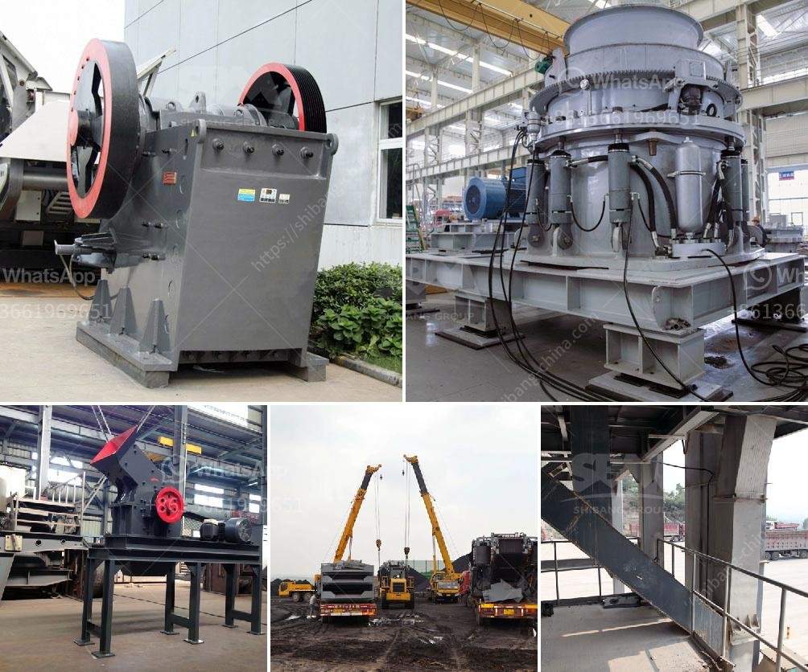

<h3>مصنع دوامة للبيع لخام الكروم</h3>
تعتبر صناعة التعدين من أهم القطاعات الاقتصادية في العديد من البلدان، وتلعب خامات المعادن دورًا حيويًا في الصناعات المختلفة. من بين هذه الخامات يأتي خام الكروم الذي يستخدم في عدة منتجات مثل الصلب، السيراميك، البطاريات وغيرها. ولتلبية الطلب المتزايد على هذا الخام، يعتبر مصنع دوامة واحدًا من المصانع الرائدة في إنتاج وتصنيع خام الكروم.

مصنع دوامة للبيع لخام الكروم هو منشأة تعد من بين أكبر المصانع في هذه الصناعة، حيث يمتلك قدرة إنتاجية عالية تتراوح بين 200 إلى 400 طن في الساعة. يتميز المصنع بتقنية حديثة لاستخلاص الكروم من الصخور، مما يضمن جودة عالية للمنتج النهائي. 

يتألف المصنع من عدة مراحل ومعدات تكنولوجية متخصصة تستخدم لفصل خام الكروم عن الرمال والأتربة الأخرى. تشمل هذه المعدات سلسلة من الكسارات والغرابيل ومعدات الغسيل والفصل المغناطيسي، بالإضافة إلى فرن صهر حديث يتيح إنتاج الألواح الصلبة من الكروم.

إن مصنع دوامة للبيع يتميز بموقعه المتميز، حيث يقع قرب مناطق غنية بمصدر الكروم مما يضمن توفر المادة الخام بشكل منتظم وبأسعار تنافسية. بالإضافة إلى ذلك، فإن المصنع يوفر فرص عمل للعديد من العاملين في هذا القطاع ويسهم في تنمية الاقتصاد المحلي.

تعتبر فاعلية المصنع في توفير منتجات عالية الجودة هي ميزة أخرى تجذب العديد من العملاء والشركات التي تعتمد على خام الكروم في صناعتها. يتم تفتيت الصخور الكرومية بواسطة الكسارات المتعددة، مما يضمن قطع صغيرة من الصخور لزيادة فعالية عملية استخلاص الكروم. بالإضافة إلى ذلك، يتم الحفاظ على جودة المنتج النهائي من خلال عمليات التنقية والتصفية.

بالنظر إلى فوائد المصنع وإمكانية الاستفادة منها في كافة الصناعات التي تحتاج إلى الكروم، يعد مصنع دوامة للبيع فرصة رائعة للمستثمرين ورجال الأعمال. فبجانب العائد المالي المرتفع الذي يمكن تحقيقه، يتيح المصنع أيضًا فرصة للمساهمة في التنمية الاقتصادية للمنطقة وتوفير فرص عمل للسكان المحليين.

في النهاية، يعد مصنع دوامة للبيع لخام الكروم فرصة استثمارية جيدة في قطاع التعدين، نظرًا لاستدامة الطلب على خام الكروم وأهمية استخدامه في الصناعات المختلفة. من خلال توفير منتج عالي الجودة وتقديم فرص عمل وتعزيز التنمية المحلية، يمكن أن يحقق المستثمرون نجاحًا كبيرًا في هذا القطاع.
<h3>Contact us</h3><ul><li><strong>Whatsapp:&nbsp;<a href="https://wa.me/8613661969651">+8613661969651</a></strong></li><li><a href="https://swt.shibang-china.com/?git&amp;zhl&amp;مصنع دوامة للبيع لخام الكروم"><strong>Online Service(chat now)</strong></a></li></ul><h3>Related</h3><ul><li><a href='آلات محجر كاملة للبيع في الصين.md'>آلات محجر كاملة للبيع في الصين</a></li><li><a href='مطحنة هامر لطحن البولي إيثيلين منخفض الكثافة.md'>مطحنة هامر لطحن البولي إيثيلين منخفض الكثافة</a></li><li><a href='كسارة مستعملة في الولايات المتحدة من طراز SSI 34.md'>كسارة مستعملة في الولايات المتحدة من طراز SSI 34</a></li><li><a href='معدات فحص الرمال للبيع في جنوب أفريقيا.md'>معدات فحص الرمال للبيع في جنوب أفريقيا</a></li><li><a href='كسارة مخروطية غير مستخدمة في إثيوبيا للبيع.md'>كسارة مخروطية غير مستخدمة في إثيوبيا للبيع</a></li></ul>