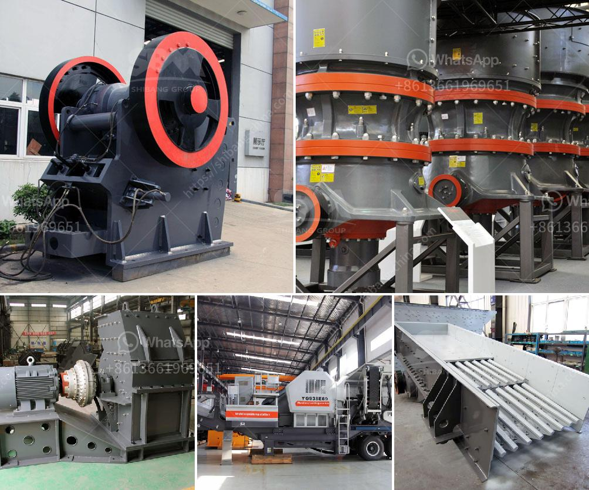

<h3>مصنع سحق الحجر الجيري</h3>
يعد مصنع سحق الحجر الجيري أحد المصانع الحديثة والمتقدمة التي تستخدم في صناعة البناء والمواد الإنشائية. يهدف هذا المصنع إلى سحق الحجر الجيري إلى أحجام صغيرة تناسب الاستخدامات المختلفة في البناء والإنشاءات.

يحتوي المصنع على معدات متطورة وآليات قوية تساهم في سحق الحجر الجيري بكفاءة عالية. تشمل المعدات الأساسية في المصنع كسارة الفك، كسارة المخروط والكسارة الصدمية وغربال الاهتزاز وناقل الحزام. تعمل هذه المعدات بشكل متكامل لضمان تحقيق أعلى كفاءة في سحق الحجر الجيري.

يتم استخدام المصنع في عملية سحق الحجر الجيري لإنتاج الركام الصغير اللازم في مجال البناء والإنشاءات. يتم استخدام هذا الركام في تعبئة الأساسات والطرق والمباني، وكذلك في صناعة الخرسانة. كما يمكن استخدامه في صنع الألبان والأسمدة والزجاج.

تعتبر عملية سحق الحجر الجيري في المصنع سهلة وفعالة. يتم تغذية الحجر الجيري إلى كسارة الفك أولاً، حيث يتم سحقه إلى قطع صغيرة. ثم يتم نقل الحجر الجيري المسحوق إلى كسارة المخروط والكسارة الصدمية لمزيد من السحق حتى يتم الحصول على الحجم المطلوب. يتم تقصير الركام ثم في غربال الاهتزاز لفصل الجزيئات المختلفة حسب الحجم.

يعد مصنع سحق الحجر الجيري خيارًا مثاليًا للشركات البنائية والمقاولين الذين يحتاجون إلى مواد بناء ذات جودة عالية. يوفر هذا المصنع الحجر الجيري المسحوق الذي يتميز بخصائص متميزة، مثل الصلابة، والمقاومة للتآكل والقوة العالية.

علاوة على ذلك، يساهم هذا المصنع في حماية البيئة. فعملية سحق الحجر الجيري بطريقة فعالة تقلل من تلوث الهواء والمياه. كما يتم معالجة المخلفات الناتجة عن عملية السحق بشكل صحيح وفعال.

بشكل عام، يعد مصنع سحق الحجر الجيري موردًا مهمًا للركام الصغير والمواد الإنشائية. يتميز بالكفاءة والجودة والاهتمام بالبيئة. يساهم في تطوير قطاع البناء وتلبية احتياجات المشاريع الكبيرة والصغيرة على حد سواء.
<h3>Contact us</h3><ul><li><strong>Whatsapp:&nbsp;<a href="https://wa.me/8613661969651">+8613661969651</a></strong></li><li><a href="https://swt.shibang-china.com/?git&amp;zhl&amp;مصنع سحق الحجر الجيري"><strong>Online Service(chat now)</strong></a></li></ul><h3>Related</h3><ul><li><a href='كسارة الحديد الخام الفاصلة.md'>كسارة الحديد الخام الفاصلة</a></li><li><a href='مطحنة الضغط العالي.md'>مطحنة الضغط العالي</a></li><li><a href='كسارات مخروط هيدروليكية.md'>كسارات مخروط هيدروليكية</a></li><li><a href='مصنع غسيل الفحم المتنقل في جنوب أفريقيا.md'>مصنع غسيل الفحم المتنقل في جنوب أفريقيا</a></li><li><a href='مكونات مصنع معالجة الفحم المتنقل.md'>مكونات مصنع معالجة الفحم المتنقل</a></li></ul>