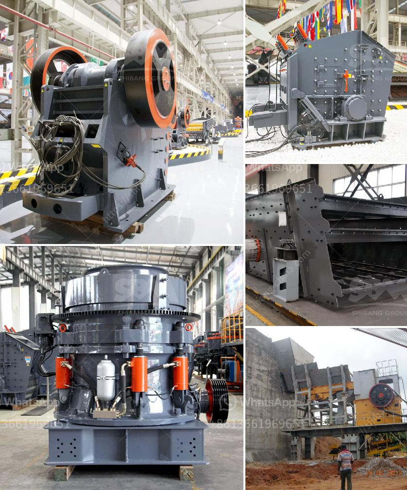

<h3>مصنع سحق الحجر في ألمانيا</h3>
تقدم ألمانيا واحدة من أكبر صناعات التعدين والبناء في العالم. ويعد مصنع سحق الحجر واحدًا من العناصر الرئيسية في هذا القطاع. يتم استخدام مصنع سحق الحجر لسحق الصخور والأحجار الكبيرة إلى قطع أصغر تستخدم في البناء والتشييد.

المصنع مجهز بمعدات حديثة تستخدم أحدث التقنيات في هذا المجال. تبدأ عملية السحق بوضع الصخور أو الأحجار الكبيرة في الجزء العلوي من المصنع. يتم حمل هذه الصخور عبر السير الناقل إلى آلة السحق الأولية.

تعمل آلة السحق الأولية على تقسية الصخور وتحطيمها إلى قطع أصغر. تسمى هذه القطع المحطمة "الكسارات". يتم إزالة الكسارات من آلة السحق الأولية وتحميلها في سير نقل آخر ينقلها إلى الكسارة الثانوية.

الكسارة الثانوية تعمل على تقسية الكسارات الأصغر وتحطيمها إلى قطع أصغر بحجم أكبر. ويتم استخدام الكسارة الثانوية لإنشاء المواد الخام التي تتطلبها صناعة البناء والتشييد.

بعد مرحلة الكسارات الثانوية، تنتقل القطع إلى جهاز فرز حيث يتم فصل القطع بناءً على حجمها واستخدامها المستقبلي. يتم تصنيف القطع المفصولة في مجموعات مختلفة، مثل الرمل والحصى، وفقًا لاحتياجات العملاء المختلفة.

تتم مرحلة الفرز في المصنع باستخدام أنظمة تحكم حديثة وأتمتة. تقوم هذه الأنظمة بتسريع وتيسير عملية الفرز، وتزيد من الإنتاجية وجودة المنتج النهائي.

يتم تعليب المنتج النهائي الذي تم فرزه وتكوينه في إحاطات مغلقة قبل إرساله للعملاء. تعتمد ألمانيا على شبكة نقل فعالة لتوزيع المنتجات بسرعة وفعالية.

يعد مصنع سحق الحجر في ألمانيا من البنية التحتية المهمة للدولة، حيث يقدم الدعم المطلوب لصناعة البناء والتشييد في البلاد. يضمن وجود هذه المنشأة التي تعتمد على أحدث التقنيات توفير منتجات ذات جودة عالية تفي بمتطلبات العملاء المختلفة.
<h3>Contact us</h3><ul><li><strong>Whatsapp:&nbsp;<a href="https://wa.me/8613661969651">+8613661969651</a></strong></li><li><a href="https://swt.shibang-china.com/?git&amp;zhl&amp;مصنع سحق الحجر في ألمانيا"><strong>Online Service(chat now)</strong></a></li></ul><h3>Related</h3><ul><li><a href='حجر الحجر الجيري المسحوق بحجم 34 بوصة.md'>حجر الحجر الجيري المسحوق بحجم 3/4 بوصة</a></li><li><a href='آلة صنع البليت الصغيرة للبيع في كينيا.md'>آلة صنع البليت الصغيرة للبيع في كينيا</a></li><li><a href='تكلفة إنشاء مصنع للأسمنت.md'>تكلفة إنشاء مصنع للأسمنت</a></li><li><a href='سعات مطحنة الأسطوانة العمودية.md'>سعات مطحنة الأسطوانة العمودية</a></li><li><a href='مصنع المعادن سحق خام البوكسيت.md'>مصنع المعادن سحق خام البوكسيت</a></li></ul>