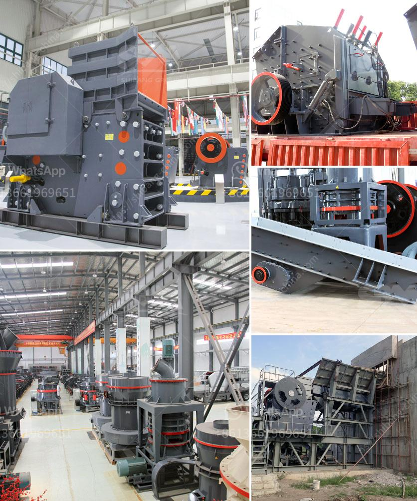

<h3>مصنع سحق حجر كامل بسعة 300 طن</h3>
يعتبر مصنع سحق الحجر بسعة 300 طن من أهم الوحدات الصناعية في مجال التعدين والبناء. فهو يعمل على تحويل الحجر الخام إلى أحجام أصغر تناسب استخدامات مختلفة وذلك بواسطة عملية سحق وغربلة تقوم بها المعدات المتخصصة في هذا المصنع.

يتألف هذا المصنع من عدة أجزاء أساسية تتضمن جهاز التغذية الاهتزازية، وكسارة الفك، وكسارة المخروط والغربال الاهتزازي. تتم عملية سحق الحجر بواسطة الكسارة الفكية الأولية، حيث يتم تحطيم الحجر إلى أجزاء أصغر تتراوح بين 20-60 ملم. بعد ذلك، يتم نقل الحجم الأصغر إلى كسارة المخروط للحصول على حجم أصغر وأدق. تلي ذلك عملية تصنيف الأحجار وفصلها بواسطة الغربال الاهتزازي.

تعتبر سعة المصنع المذكورة أعلاه بسعة 300 طن مناسبة لتلبية الطلب المحلي والإقليمي. ويعود نجاح الشركة المصنعة في تصميم وإنتاج هذا المصنع الكامل إلى الاستخدام الفعال للتكنولوجيا المتقدمة وتحسين آليات العمل لضمان كفاءة ودقة العمليات.

يعتبر هذا المصنع بمثابة حلا مثالياً للمقاولين وأصحاب المشاريع الضخمة في صناعة البناء والتشييد. فهو يتمتع بالقدرة على توفير كميات كبيرة من الأحجار المكسرة بشكل سريع وفعال، مما يسهل عمليات البناء والتطوير.

تؤثر هذه المصانع بشكل كبير على قطاع التعدين والبناء، حيث أنها تحسن من عملية استغلال الموارد الطبيعية وتقليل التكاليف. بالإضافة إلى ذلك، تساهم هذه المصانع في تقليل الانبعاثات الضارة والحد من تلوث البيئة عن طريق تجهيزها بأجهزة تنقية الغبار ونظم التحكم في الضوضاء.

باختصار، مصنع سحق الحجر بسعة 300 طن يعتبر أحدث التطورات التكنولوجية في صناعة التعدين والبناء. إنه يلبي الاحتياجات المتزايدة للبنية التحتية ويسهل عمليات البناء بشكل كبير. كما يعمل على تحسين الكفاءة والاستدامة في هذا القطاع الحيوي، مما يساهم في نمو الاقتصاد وتحقيق التنمية المستدامة.
<h3>Contact us</h3><ul><li><strong>Whatsapp:&nbsp;<a href="https://wa.me/8613661969651">+8613661969651</a></strong></li><li><a href="https://swt.shibang-china.com/?git&amp;zhl&amp;مصنع سحق حجر كامل بسعة 300 طن"><strong>Online Service(chat now)</strong></a></li></ul><h3>Related</h3><ul><li><a href='كم تكلفة مطحنة الكرة.md'>كم تكلفة مطحنة الكرة</a></li><li><a href='مطحنة الكرة في كازاخستان.md'>مطحنة الكرة في كازاخستان</a></li><li><a href='آلة غسيل الرمل السيليكا في جنوب أفريقيا.md'>آلة غسيل الرمل السيليكا في جنوب أفريقيا</a></li><li><a href='كسارة مخروطية قياسية دليل الإصلاح.md'>كسارة مخروطية قياسية دليل الإصلاح</a></li><li><a href='آلة تكسير الحجر للبيع.md'>آلة تكسير الحجر للبيع</a></li></ul>