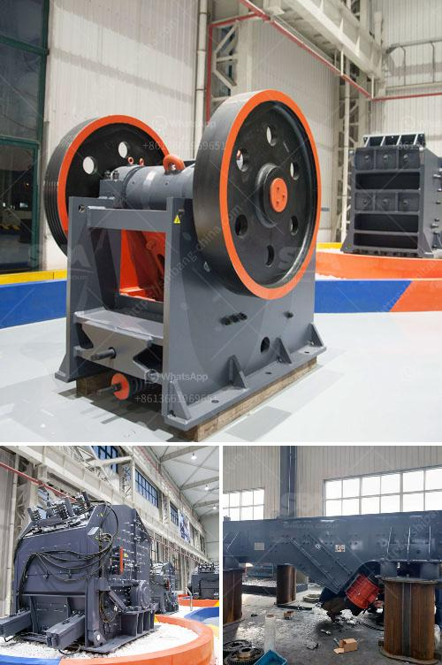

<h3>مصنع سحق صغير بسعة 5 طن في الساعة</h3>
تعتبر صناعة السحق جزءًا هامًا في عملية تكسير وتحضير المواد الطبيعية للاستخدام في الصناعات المختلفة مثل البناء والتشييد وصناعة الأسمنت والزجاج وصناعات أخرى. يعد وجود مصنع سحق صغير بسعة 5 طن في الساعة من الأمور المهمة للشركات الصغيرة والمتوسطة التي تحتاج إلى تحضير هذه المواد بنفسها وتحقيق الاستدامة والربحية. 

يتكون مصنع السحق الصغير من عدة مكونات رئيسية تشمل الكسارة الأساسية، وناقل الحزام، والغربال الاهتزازي وأنظمة التحكم والكهرباء. توفر هذه المكونات عملية تكسير آمنة وفعالة للمواد الخام المراد سحقها.

تعد الكسارة الأساسية أكثر المكونات أهمية في المصنع، حيث يتم فيها سحق المواد الخام إلى حجم مطلوب. تعتمد قدرة السحق على حجم الكسارة وتصميمها، وتختلف السعات لكل نوع من الكسارات. تتوفر الكسارات بعدة أنواع مثل المطرقة والفكية والصدمية والمخروطية. يتم اختيار الكسارة المناسبة وفقًا لنوع المواد الخام وحجمها وطلبات التكسير.

بعد سحق المواد الخام، يتم نقلها عبر ناقل الحزام إلى الغربال الاهتزازي. يستخدم الغربال لفصل المواد المكسورة حسب حجمها. يعمل الغربال الاهتزازي عن طريق اهتزازه بشكل مستمر لفصل المواد المسحوقة ذات الأحجام المختلفة وفقًا لتصنيف الغربال. يعمل تصميم الغربال على تصفية المواد الصغيرة وفصلها عن المواد الكبيرة.

تعد أنظمة التحكم والكهرباء أيضًا جزءًا مهمًا من مصنع السحق. يساهم نظام التحكم في تنظيم تشغيل المصنع ومراقبة جودة المنتجات المصنعة. يتم استخدام الكهرباء لتشغيل المصنع بشكل آمن وفعال.

مصانع السحق الصغيرة بسعة 5 طن في الساعة تعتبر مثالية للشركات الصغيرة التي تحتاج إلى تحويل المواد الخام الخاصة بها إلى منتجات مصنعة جاهزة للبيع. تساعد هذه المصانع على توفير الوقت والجهد والتكاليف التي يتعين تحملها في حالة شراء المنتجات من موردين خارجيين. كما تساهم هذه المصانع في تحقيق الربحية، حيث يتم بيع المنتجات المصنعة بأسعار تلبي تكاليف الإنتاج وتحقق العائد المادي للشركة.

باختصار، يعد وجود مصنع سحق صغير بسعة 5 طن في الساعة أمرًا مهمًا للشركات الصغيرة والمتوسطة. يسهل هذا المصنع عملية تحويل المواد الخام إلى منتجات جاهزة للبيع ويساهم في تحسين الربحية والاستدامة للشركة.
<h3>Contact us</h3><ul><li><strong>Whatsapp:&nbsp;<a href="https://wa.me/8613661969651">+8613661969651</a></strong></li><li><a href="https://swt.shibang-china.com/?git&amp;zhl&amp;مصنع سحق صغير بسعة 5 طن في الساعة"><strong>Online Service(chat now)</strong></a></li></ul><h3>Related</h3><ul><li><a href='مطحنة عمودية للكالسيوم.md'>مطحنة عمودية للكالسيوم</a></li><li><a href='آلة طحن السليكات في الهند.md'>آلة طحن السليكات في الهند</a></li><li><a href='مصنع تكسير الحصى في جنوب أفريقيا.md'>مصنع تكسير الحصى في جنوب أفريقيا</a></li><li><a href='تكلفة معدات سحق الجرانيت.md'>تكلفة معدات سحق الجرانيت</a></li><li><a href='موردين معدات سحق السيليكا.md'>موردين معدات سحق السيليكا</a></li></ul>