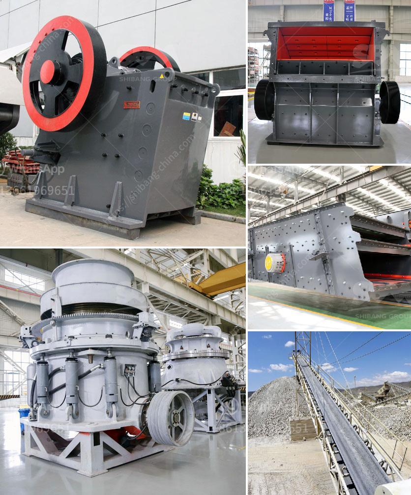

<h3>مصنع سحق في ماليزيا</h3>
يعتبر مصنع سحق في ماليزيا من أهم المشروعات الصناعية التي تسهم في تنمية الاقتصاد المحلي وزيادة فرص التوظيف. يشير مصطلح "سحق" إلى العملية التي تقوم بها الآلات الصناعية لتحويل المواد الخام إلى جزيئات صغيرة بحجم محدد. وتستخدم هذه الجزيئات في صناعات متنوعة مثل صناعة الأسمنت والطاقة والزجاج والمعادن.

تتميز ماليزيا بمواردها الطبيعية المتنوعة والغنية، مما يوفر فرصًا ممتازة لإنشاء مصنع سحق في البلاد. يتم استخدام مختلف المواد الخام مثل الحجر الجيري والجرانيت والحجر الكلسي في عمليات السحق. وبفضل قوة البنية التحتية المتطورة والتكنولوجيا المتقدمة، تستطيع ماليزيا أن توفر بيئة مناسبة لإقامة مصنع سحق عالي الجودة وفعال من حيث التكلفة.

من أبرز الفوائد الاقتصادية لإنشاء مصنع سحق في ماليزيا هو توفير فرص عمل للسكان المحليين. حيث يتطلب تشغيل مصنع سحق وجود فريق مؤهل من المهندسين والفنيين والعمال المدربين. يتم استفادة الشباب المحلي من هذه الفرصة لتحسين مستوى دخلهم وتوفير الحياة الكريمة لأسرهم. كما يعمل المصنع كمحفز للخدمات اللوجستية المحيطة به، ما يزيد من فرص التوظيف في القطاعات ذات الصلة مثل النقل والتخزين والتوزيع.

بالإضافة إلى الفوائد الاقتصادية، يسهم مصنع سحق في تنمية البنية التحتية وتعزيز التكنولوجيا المتقدمة في ماليزيا. حيث يتطلب تشغيل المصنع استخدام آلات ومعدات حديثة وتكنولوجيا متطورة. توجد في ماليزيا العديد من الشركات المحلية والعالمية المتخصصة في توريد وصيانة هذه الآلات، مما يعزز قطاع الصناعة التحويلية في البلاد ويسهم في نمو وتطور الاقتصاد المحلي.

ولضمان تحقيق النجاح والاستدامة لمصنع سحق في ماليزيا، يجب أيضًا الاهتمام بالتوجهات البيئية والاستدامة. يجب أن يتم تشغيل المصنع بطرق صديقة للبيئة والحد من الآثار البيئية السلبية. يجب أن يلتزم المصنع بتنفيذ إجراءات لمراقبة التلوث وإعادة التدوير وإدارة النفايات بشكل صحيح.

باختصار، يعد مصنع سحق في ماليزيا فرصة اقتصادية رائعة للبلاد. يساهم في تنمية الاقتصاد المحلي وتوفير فرص عمل، بالإضافة إلى تعزيز البنية التحتية والتكنولوجيا المتقدمة في البلاد. ومع التركيز على البيئة والاستدامة، يمكن تحقيق الاستفادة الكاملة من هذا الصناعة الواعدة في ماليزيا.
<h3>Contact us</h3><ul><li><strong>Whatsapp:&nbsp;<a href="https://wa.me/8613661969651">+8613661969651</a></strong></li><li><a href="https://swt.shibang-china.com/?git&amp;zhl&amp;مصنع سحق في ماليزيا"><strong>Online Service(chat now)</strong></a></li></ul><h3>Related</h3><ul><li><a href='سعر مصنع كسارة الحجر بسعة 200 طن في الساعة.md'>سعر مصنع كسارة الحجر بسعة 200 طن في الساعة</a></li><li><a href='مصنع مسحوق لوح الجبس في إثيوبيا.md'>مصنع مسحوق لوح الجبس في إثيوبيا</a></li><li><a href='السحق النبات هو.md'>السحق النبات هو</a></li><li><a href='حجم طحن البنتونيت.md'>حجم طحن البنتونيت</a></li><li><a href='كسارة عينة صغيرة.md'>كسارة عينة صغيرة</a></li></ul>