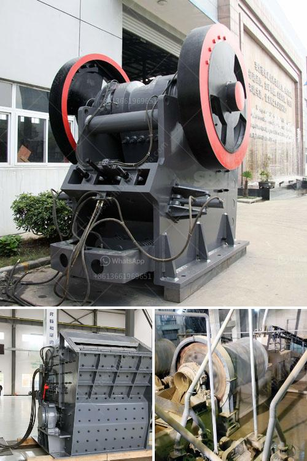

<h3>مصنع سحق محمول بدائرة مغلقة</h3>
تعد تكنولوجيا السحق المحمولة بدائرة مغلقة من أهم الابتكارات في صناعة التعدين والبناء. فالمصانع الساحقة المحمولة بدائرة مغلقة هي وحدات سحق متنقلة مكونة من معدات متكاملة للسحق والغربلة والنقل. يتم تصميم هذه المصانع بشكل مدمج لتلبية احتياجات العملاء في العديد من المشاريع المختلفة.

تعتبر المصانع المحمولة بدائرة مغلقة مثالية للعمل في ظروف الطرق الوعرة والمواقع البعيدة، حيث يكون من الصعب نقل المواد الخام إلى الموقع الذي سيتم فيه السحق. كما أنها مثالية للمشاريع ذات الحجم الصغير والمتوسط التي تتطلب سحق الصخور أو المواد الصلبة الأخرى في موقع البناء نفسه.

تحتوي هذه المصانع على العديد من المكونات المختلفة، بما في ذلك كسارة الفك، وكسارة الصدم، والغربال الهزاز، والناقلات، وأنظمة التحكم. كل هذه المكونات مجتمعة في وحدة واحدة مدمجة تعمل بكفاءة عالية وسهولة استخدام.

يتم استخدام مصانع السحق المحمولة بدائرة مغلقة في العديد من الصناعات، بما في ذلك صناعة التعدين وصناعة البناء وصناعة المواد الكيميائية وغيرها. يمكن استخدامها لسحق الصخور الطبيعية والخرسانة والأسفلت والركام والرمل والحصى والحجر الجيري والحجر الصلب ومواد أخرى.

تتميز هذه المصانع بعدة مزايا. أولاً، فهي قابلة للتكيف وسهلة النقل. يمكن نقلها بسهولة إلى المواقع المختلفة وتثبيتها بسرعة، مما يوفر الوقت والجهد في نقل المواد. ثانياً، فإنها تتمتع بكفاءة عالية في السحق والغربلة، مما يسمح بإنتاجية أعلى وجودة أفضل للمواد المسحوقة. ثالثاً، فإنها توفر تكاليف أقل عمومًا مقارنةً بتكاليف المصانع التقليدية، حيث يمكن استخدامها لفترة أقصر ولا تتطلب تكاليف البناء الدائم.

في الختام، تضيف المصانع المحمولة بدائرة مغلقة قيمة كبيرة لصناعة التعدين والبناء والعديد من الصناعات الأخرى. فهي توفر السهولة في العمل وتقلل من التكاليف وتحسن كفاءة الإنتاج. من المتوقع أن تستمر انتشار هذه التكنولوجيا وزيادة الطلب عليها في المستقبل، حيث توفر حلاً مرنًا وفعالًا لاحتياجات السحق المتنقلة.
<h3>Contact us</h3><ul><li><strong>Whatsapp:&nbsp;<a href="https://wa.me/8613661969651">+8613661969651</a></strong></li><li><a href="https://swt.shibang-china.com/?git&amp;zhl&amp;مصنع سحق محمول بدائرة مغلقة"><strong>Online Service(chat now)</strong></a></li></ul><h3>Related</h3><ul><li><a href='استفسار حول آلة السحق.md'>استفسار حول آلة السحق</a></li><li><a href='كسارة الصخور 250 طن في الساعة.md'>كسارة الصخور 250 طن في الساعة</a></li><li><a href='آلة تعبئة مسحوق التلك.md'>آلة تعبئة مسحوق التلك</a></li><li><a href='سؤال حول عملية الطحن بالكرات.md'>سؤال حول عملية الطحن بالكرات</a></li><li><a href='مصنع آلات في جنوب أفريقيا لسحق الحجر.md'>مصنع آلات في جنوب أفريقيا لسحق الحجر</a></li></ul>