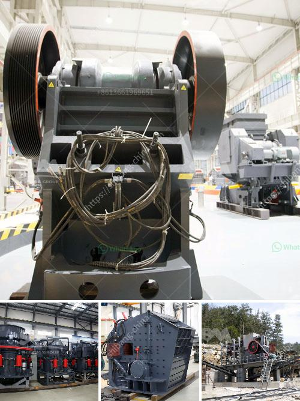

<h3>مصنع سحق وطحن</h3>
تعتبر عمليات سحق وطحن الصناعية من أهم العمليات التي تتطلبها صناعة تكسير المواد الصلبة. ومن بين أهم المنشآت التي تقوم بهذه العمليات هو مصنع سحق وطحن. يهدف هذا المصنع إلى تحويل المواد الكبيرة والهشة إلى قطع صغيرة وفعالة وجاهزة للاستخدام في صناعات مختلفة مثل التعدين والمعادن والبناء.

تتكون عملية السحق والطحن من عدة مراحل تتضمن التكسير الأولي والتكسير الثانوي والطحن النهائي. تعتمد هذه العمليات على استخدام معدات متخصصة مثل الكسارات والطواحين. يعتبر المصنع مكانًا حيويًا لهذه العمليات، حيث يتم تنظيف وتحضير المواد الخام قبل إدخالها للكسارات.

بالنسبة للمواد الكبيرة والهشة، تتم عملية السحق بواسطة كسارات التكسير الأولي، حيث تسحق المواد إلى قطع أصغر يمكن إدخالها للطحانة. هنا يتم استخدام كسارات الفك والكسارات الجيرية لتحقيق عملية السحق الأولية بفعالية ودقة.

بعد ذلك، تتم عملية التكسير الثانوي باستخدام المخرطة أو الكسارات الثانوية. تحتوي هذه المعدات على رؤوس مختلفة تسمح بسحق المواد إلى أقطار مختلفة حسب احتياجات المشروع النهائي. يعد التكسير الثانوي هامًا جدًا للتحكم في حجم الجسيمات وتحقيق القوام المطلوب.

فيما يتعلق بعملية الطحن النهائي، يتم استخدام الطواحين لطحن الجسيمات الصغيرة إلى أحجام أصغر وأكثر دقة. تتنوع أنواع الطواحين بناءً على نوع المادة المراد طحنها وحجم الجسيمات المطلوبة. يتيح استخدام الطواحين الحديثة نتيجة طحن نهائية ممتازة تتميز بتجانس الجسيمات ودقة الحجم.

يقوم مصنع سحق وطحن بعضائلة بتحسين جودة المواد الخام وتنقيتها وتجهيزها لمرحلة التكسير والطحن. تنتج هذه المراحل مواد نهائية تستخدم في العديد من الصناعات مثل البناء وإنتاج المعادن والزجاج والسيراميك.

بشكل عام، يلعب مصنع سحق وطحن دورًا حاسمًا في صناعة تكسير المواد الصلبة وتحويلها إلى مواد تستخدم في صناعات مختلفة. يضمن هذا المصنع جودة وكفاءة المواد النهائية، ويساهم في تقليل تكاليف الإنتاج وزيادة الإنتاجية. بوجود هذه المصانع، يمكن تلبية الاحتياجات المتنوعة للصناعات والتوسع في إمكانية التصنيع وتحقيق التطور الصناعي المستدام.
<h3>Contact us</h3><ul><li><strong>Whatsapp:&nbsp;<a href="https://wa.me/8613661969651">+8613661969651</a></strong></li><li><a href="https://swt.shibang-china.com/?git&amp;zhl&amp;مصنع سحق وطحن"><strong>Online Service(chat now)</strong></a></li></ul><h3>Related</h3><ul><li><a href='مصنع غسيل وفرز للتأجير في جنوب أفريقيا.md'>مصنع غسيل وفرز للتأجير في جنوب أفريقيا</a></li><li><a href='آلة معالجة البازلت.md'>آلة معالجة البازلت</a></li><li><a href='شركة تصنيع ختم الذهب في الصين.md'>شركة تصنيع ختم الذهب في الصين</a></li><li><a href='مصنع غسيل الماس في جنوب أفريقيا.md'>مصنع غسيل الماس في جنوب أفريقيا</a></li><li><a href='تقرير المشروع لمصنع تكسير الحجر.md'>تقرير المشروع لمصنع تكسير الحجر</a></li></ul>