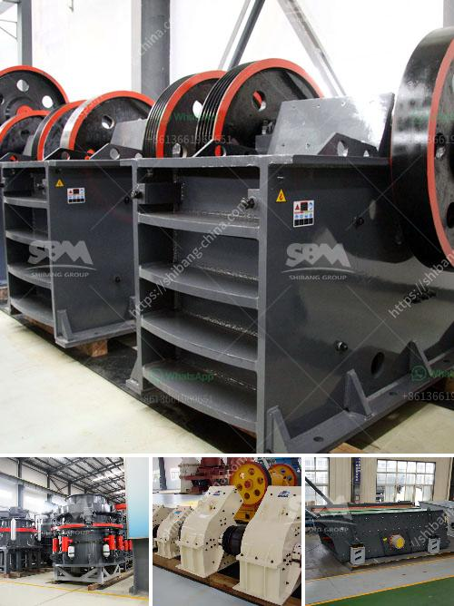

<h3>مصنع سلاغ السيليكو من الحديد في ألمانيا</h3>
يعتبر مصنع سلاغ السيليكو من الحديد في ألمانيا من أهم المصانع في هذا القطاع. يتمتع هذا المصنع بسمعة عالمية بفضل تكنولوجيته المتطورة وجودة منتجه.

يتم استخراج سلاغ السيليكو من الحديد عن طريق تحويل الحديد الزهر الخام إلى سلاغ بواسطة عملية الصب المتقطعة. هذا السلاغ ثري بالسيليكون ويحتوي على نسبة عالية من هذا المعدن الثمين. يتم استخدام سلاغ السيليكو في العديد من الصناعات مثل صناعة الفولاذ، الألمنيوم، ومواد البناء.

يعتبر مصنع سلاغ السيليكو في ألمانيا من أكبر المصانع في العالم من حيث القدرة الإنتاجية والتكنولوجيا المستخدمة. يبلغ إجمالي الطاقة الإنتاجية للمصنع حوالي عدة آلاف من الأطنان في السنة. يتم تصميم المصنع بطريقة تضمن التحكم الدقيق في عمليات التصنيع وجودة المنتج النهائي.

يوفر المصنع العديد من فرص العمل للمهندسين والفنيين في مجالات مثل الهندسة الكيميائية والميكانيكية والكهربائية. يتم تدريب الموظفين على أحدث التقنيات والعمليات الصناعية لضمان أعلى مستوى من الكفاءة والمهارة.

بالإضافة إلى ذلك، يلتزم المصنع بالاستدامة والحفاظ على البيئة. يتم اتباع أعلى معايير السلامة والتلوث للوفاء بالقوانين والتشريعات البيئية. يتم استخدام التقنيات والعمليات الحديثة لتقليل النفايات وتحسين كفاءة استهلاك الطاقة.

يساهم مصنع سلاغ السيليكو في الاقتصاد الوطني من خلال توفير وظائف وتنمية المجتمع المحلي. كما يساهم في تعزيز القدرة التنافسية للصناعات الأخرى في ألمانيا بتوفير مادة خام ذات جودة عالية وبأسعار تنافسية.

باختصار، يعد مصنع سلاغ السيليكو من الحديد في ألمانيا مثالًا رائعًا لجودة وتطور في صناعة الحديد والصلب. يعتبر محورًا أساسيًا في سلسلة التوريد العالمية ويساهم في تعزيز الاقتصاد الوطني والمحلي من خلال توفير فرص العمل وتطوير المجتمع.
<h3>Contact us</h3><ul><li><strong>Whatsapp:&nbsp;<a href="https://wa.me/8613661969651">+8613661969651</a></strong></li><li><a href="https://swt.shibang-china.com/?git&amp;zhl&amp;مصنع سلاغ السيليكو من الحديد في ألمانيا"><strong>Online Service(chat now)</strong></a></li></ul><h3>Related</h3><ul><li><a href='مطاحن المطرقة.md'>مطاحن المطرقة</a></li><li><a href='أسعار مطحنة الكرة في زيمبابوي.md'>أسعار مطحنة الكرة في زيمبابوي</a></li><li><a href='مصنع غسيل الفحم في جنوب أفريقيا الفلبين.md'>مصنع غسيل الفحم في جنوب أفريقيا الفلبين</a></li><li><a href='آلة غسيل الرمل للبيع في سريلانكا.md'>آلة غسيل الرمل للبيع في سريلانكا</a></li><li><a href='كسارة الحجر للبيع.md'>كسارة الحجر للبيع</a></li></ul>