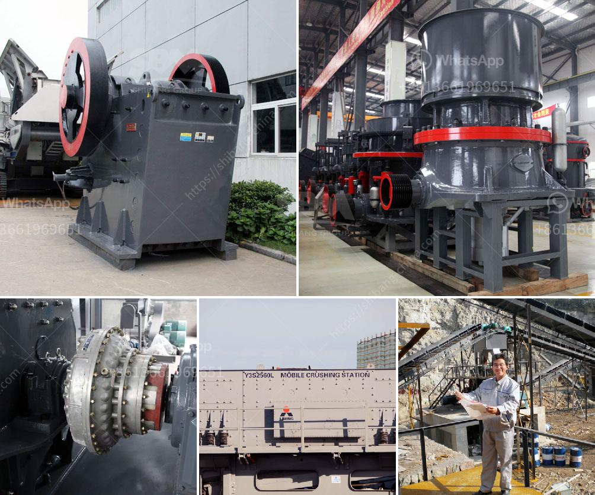

<h3>مصنع سيور الفحم في ألمانيا</h3>
تعتبر ألمانيا واحدة من الدول الرائدة في تصنيع واستخدام الفحم كمصدر للطاقة. وفي هذا السياق، يعد مصنع سيور الفحم في ألمانيا من المصانع المهمة التي تلعب دورًا حيويا في عملية توليد الكهرباء وتوفير الطاقة للصناعة والتدفئة.

يعمل هذا المصنع على إنتاج السيور المستخدمة في نقل الفحم من المناجم إلى محطات التوليد. تتكون هذه السيور من مواد عالية الجودة مثل المطاط والنايلون والفولاذ، مما يجعلها متينة وقادرة على تحمل الأوزان الثقيلة والاستخدام الطويل دون أي تأثير سلبي.

يتم تصميم وتصنيع هذه السيور حسب الاحتياجات الخاصة لكل مشروع، فهي تاتي بأشكال ومقاسات مختلفة وتكون مُجهزة بأحزمة ناقلة وأسطوانات دوارة تساعد في سهولة وسلاسة عملية النقل. تتميز هذه السيور بكفاءة عالية وقدرة على التحمل الشديد، مما يجعلها مثالية للاستخدام في صناعة التعدين والبناء والطاقة.

تعتمد عملية تصنيع سيور الفحم على تقنيات متقدمة وعمليات إنتاج دقيقة. يتم تصنيع السيور من خلال قطع وتشكيل المواد الخام، ثم تتم عملية التركيب والتجميع بدقة عالية. يتم اختبار جودة السيور قبل توزيعها، حيث يتم فحصها من حيث المتانة والقدرة على التحمل والأداء، لضمان تقديم منتج ذو جودة عالية ويمتاز بالمتانة والموثوقية.

لا يقتصر استخدام سيور الفحم في ألمانيا على نقل الفحم فقط، بل يمكن أيضا استخدامها في نقل مختلف المواد الجافة والسائلة في الصناعة العامة والزراعة والتعدين وغيرها. وبالتالي، فإن مصنع سيور الفحم في ألمانيا يساهم في دعم الاقتصاد المحلي وتوفير فرص العمل وتحقيق استدامة الصناعة في البلاد.

على الرغم من التطور التكنولوجي والانتقال إلى مصادر الطاقة المتجددة في ألمانيا، فإن استخدام الفحم لا يزال مستدامًا ولا يزال له دور هام في تغطية احتياجات الطاقة. وبفضل مصانع سيور الفحم المتطورة، يتم تسهيل وتحسين عملية نقل الفحم بكفاءة عالية، مما يؤدي إلى توفير الوقت والجهد وتحقيق أقصى استفادة من هذا المصدر الهام للطاقة.
<h3>Contact us</h3><ul><li><strong>Whatsapp:&nbsp;<a href="https://wa.me/8613661969651">+8613661969651</a></strong></li><li><a href="https://swt.shibang-china.com/?git&amp;zhl&amp;مصنع سيور الفحم في ألمانيا"><strong>Online Service(chat now)</strong></a></li></ul><h3>Related</h3><ul><li><a href='مطاحن رايموند في المكسيك.md'>مطاحن رايموند في المكسيك</a></li><li><a href='فاصل عالي التدرج في زينغتشو.md'>فاصل عالي التدرج في زينغتشو</a></li><li><a href='نظام مصنع البنتونيت.md'>نظام مصنع البنتونيت</a></li><li><a href='مطحنة المطرقة للبيع على إيباي.md'>مطحنة المطرقة للبيع على إيباي</a></li><li><a href='مصنع تكسير الحصى بمقياس كبير.md'>مصنع تكسير الحصى بمقياس كبير</a></li></ul>