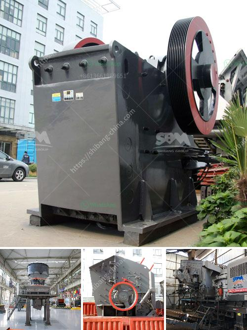

<h3>مصنع صنع مسحوق الجبس</h3>
تعتبر صناعة الجبس من الصناعات الهامة والمنتشرة في جميع أنحاء العالم. وتعود أهمية الجبس إلى استخداماته المتعددة في مجالات البناء والديكور والصناعات الأخرى. ومن أجل تلبية الاحتياجات المتزايدة لمسحوق الجبس، تم إنشاء مصنع لصناعة مسحوق الجبس.

يتم وضع مسحوق الجبس كمادة خام في مصنع الجبس، حيث يتم تحميله على حافلات خاصة ونقله إلى المصنع. عند وصوله إلى المصنع، يتم تفريغ المسحوق وتخزينه في مستودعات خاصة بالانتظار لمرحلة المعالجة. يتم تنظيف المسحوق وفحصه لضمان جودته وسلامته للاستخدام في صناعة الجبس.

بعد ذلك، يتم نقل المسحوق إلى الأفران الدوارة الموجودة في المصنع لعملية الكالسينيشن. تعد عملية الكالسينيشن أحد أهم خطوات صناعة مسحوق الجبس، حيث يتم تسخين المسحوق بدرجة حرارة تتراوح بين 170 و 190 درجة مئوية. عملية الكالسينيشن تجعل المسحوق يفقد الماء الموجود به ويتحول إلى مادة ثابتة وجاهزة للاستخدام.

بعد انتهاء عملية الكالسينيشن، يتم التخلص من الغازات المتبقية في أفران الكالسينيشن. يتم استخدام أنظمة الفلترة المتقدمة لتنقية الهواء وإزالة المواد العالقة والملوثات. يهدف ذلك إلى المحافظة على البيئة وضمان سلامة العاملين في المصنع.

بعد ذلك، يتم تحميل المسحوق المكتسب بعد عملية الكالسينيشن في شاحنات خاصة ونقله للتخزين في المستودعات النهائية. من هناك، يمكن تعبئة المسحوق في حاويات مختلفة وفقًا لمتطلبات العملاء واحتياجات السوق.

يجب الإشارة إلى أن مصانع صنع مسحوق الجبس تلتزم بمعايير الجودة العالمية في جميع العمليات والخطوات التصنيعية. وتهدف هذه المصانع إلى تلبية الطلب المتزايد على مسحوق الجبس وتوفيره بجودة عالية وبأسعار تنافسية.

في الختام، يعد مصنع صنع مسحوق الجبس مكانًا حيويًا لتلبية الطلب العالمي على الجبس. يتم فيه تحويل المسحوق إلى منتج يمكن استخدامه في البناء والديكور والصناعات الأخرى. كما تسهم هذه المصانع في دفع عجلة التنمية الاقتصادية وتوفير فرص عمل للعديد من الأفراد.
<h3>Contact us</h3><ul><li><strong>Whatsapp:&nbsp;<a href="https://wa.me/8613661969651">+8613661969651</a></strong></li><li><a href="https://swt.shibang-china.com/?git&amp;zhl&amp;مصنع صنع مسحوق الجبس"><strong>Online Service(chat now)</strong></a></li></ul><h3>Related</h3><ul><li><a href='سعر مطحنة الكسارة سعر الحجر.md'>سعر مطحنة الكسارة سعر الحجر</a></li><li><a href='كسارة التعدين في تنزانيا.md'>كسارة التعدين في تنزانيا</a></li><li><a href='كسارة الحجر المحجر.md'>كسارة الحجر المحجر</a></li><li><a href='مطحنة الكرة لخام الذهب للبيع في زيمبابوي.md'>مطحنة الكرة لخام الذهب للبيع في زيمبابوي</a></li><li><a href='تكلفة كسارة الفلسبار.md'>تكلفة كسارة الفلسبار</a></li></ul>