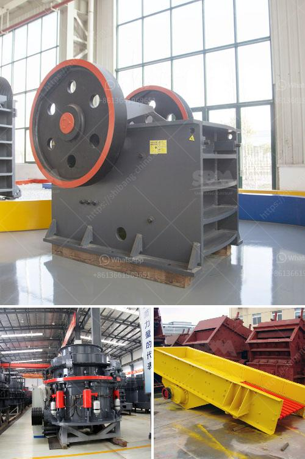

<h3>مصنع طحن الجبس المصنع في الهند</h3>
تعتبر الهند من الدول الرائدة في إنتاج وتصنيع الجبس، حيث تملك العديد من المصانع التي تقوم بتحويل الجبس الخام إلى منتجات جبسية مختلفة تستخدم في العديد من الصناعات. واحد من هذه المصانع هو مصنع طحن الجبس الموجود في الهند.

يشتهر مصنع طحن الجبس في الهند بتقديمه منتجات عالية الجودة وبأسعار تنافسية. يعمل المصنع بتقنيات حديثة لطحن الجبس الخام وتحويله إلى مسحوق الجبس. يتم استخدام هذا المسحوق في صناعات متعددة مثل صناعة الأسمنت والدهانات والجبس الطبي.

يبدأ عملية طحن الجبس بتجهيز الجبس الخام وتنقيته من الأوساخ والشوائب. ثم يتم وضع الجبس النقي في آلة طحن خاصة، حيث يتم سحقه إلى قطع صغيرة. تستخدم الآلة العديد من الأسطوانات الدوارة التي تقوم بطحن الجبس وتحويله إلى مسحوق ناعم.

بعد الانتهاء من عملية الطحن، يتم فحص المسحوق لضمان جودته وتناسقه. يتم إجراء عدة اختبارات على المسحوق للتحقق من مطابقته للمواصفات المطلوبة. يتم فرز الجبس الناعم وتعبئته في أكياس جاهزة للتسويق في الأسواق المحلية والدولية.

تعتبر صناعة طحن الجبس في الهند من أهم الصناعات البديلة التي توفر فرص عمل للعديد من العمال. يتمتع مصنع طحن الجبس بالكفاءة العالية والقدرة على تلبية الطلب المتزايد على منتجات الجبس في السوق. كما أنه يلتزم بمعايير الجودة ويتبع إجراءات صارمة في عملية الإنتاج والتصنيع.

لا يقتصر دور مصنع طحن الجبس على إنتاج المسحوق، بل يوفر أيضًا خدمات ما بعد البيع مثل التوصيل والتركيب والصيانة. يقوم فريق خبير من المهندسين بتقديم الدعم الفني للعملاء وتقديم الاستشارات والتوجيهات في استخدام منتجات الجبس بشكل صحيح وفعال.

باختصار، فإن مصنع طحن الجبس في الهند يلعب دورًا مهمًا في إنتاج وتصنيع منتجات الجبس العالية الجودة التي تستخدم في العديد من الصناعات. يعمل بكفاءة عالية ويمتاز بالدقة والتناسق في عملية الطحن. يلتزم بأعلى معايير الجودة ويقدم خدمات تميزه عن الآخرين، مما يجعله من الخيارات المفضلة للعملاء المحليين والعالميين.
<h3>Contact us</h3><ul><li><strong>Whatsapp:&nbsp;<a href="https://wa.me/8613661969651">+8613661969651</a></strong></li><li><a href="https://swt.shibang-china.com/?git&amp;zhl&amp;مصنع طحن الجبس المصنع في الهند"><strong>Online Service(chat now)</strong></a></li></ul><h3>Related</h3><ul><li><a href='غربال الحصى للبيع كريغزليست.md'>غربال الحصى للبيع كريغزليست</a></li><li><a href='مطحنة الكرات المطحنة في الهند.md'>مطحنة الكرات المطحنة في الهند</a></li><li><a href='شركة كسارة الحجر.md'>شركة كسارة الحجر</a></li><li><a href='آلة مطحنة الدولوميت.md'>آلة مطحنة الدولوميت</a></li><li><a href='تصميم آلة سحق الجبس بتنسيق PDF.md'>تصميم آلة سحق الجبس بتنسيق PDF</a></li></ul>