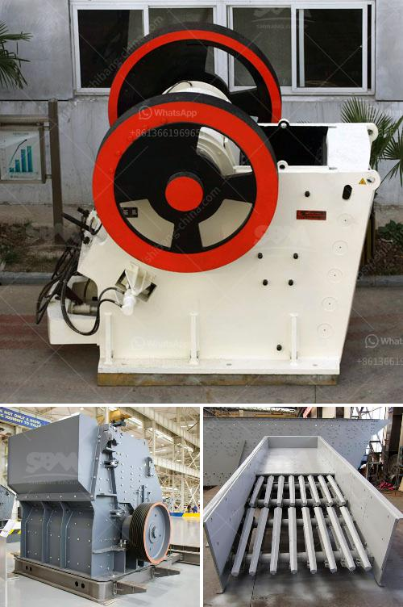

<h3>مصنع طحن الحجر الألماني</h3>
يعد مصنع طحن الحجر الألماني واحدًا من أهم المصانع في صناعة الحجر الطبيعي. يتخصص هذا المصنع في طحن وتصنيع الحجر الألماني الذي يُعرف بجودته العالية وخواصه الممتازة. يستخدم هذا الحجر في العديد من التطبيقات مثل الأرضيات والجدران الداخلية والخارجية وأرصفة الشوارع والتماثيل والممرات والمصاعد والسلالم وغيرها.

يتميز هذا المصنع بالعديد من العمليات المتطورة في إنتاج الحجر الألماني. يبدأ العمل بتحديد المناطق التي يتم استخراج الحجر منها والتأكد من جودته قبل استخدامه في الإنتاج. بعد ذلك، يتم وضع الحجر في آلة الطحن حيث يخضع لعملية طحن دقيقة وتتم مراقبتها باستخدام التكنولوجيا المتقدمة لضمان الدقة والجودة. عندما يتم طحن الحجر، يتم فحصه مرة أخرى للتأكد من جودته والتخلص من أي عيوب قد تكون ظهرت خلال العملية.

بعد ذلك، يتم تجهيز المنتج النهائي وإعداده للتسويق. يتم ذلك من خلال قطع قطع الحجر وتشكيلها ومعالجتها بواسطة الآلات الحديثة والأدوات المتخصصة. يتم تلميع الحجر ومعالجته بالمواد الكيميائية المناسبة لمنحه منظرًا جماليًا وتحسين متانته. بعد ذلك، يتم التحكم في جودة المنتج النهائي من خلال اختباره ومراقبته قبل تسليمه للعميل.

يعتبر مصنع طحن الحجر الألماني من الشركات المتخصصة في هذا المجال والمعروفة بجودة منتجاتها. يمتلك المصنع فريقًا متخصصًا من الفنيين والمهندسين المدربين تدريبًا عاليًا، الذين يعملون على تحسين عملية الإنتاج والابتكار في تصنيع منتجات جديدة. يضم المصنع أيضًا معدات متطورة تسهم في تحقيق الكفاءة والدقة في العمل.

في الختام، يمثل مصنع طحن الحجر الألماني رمزًا للجودة والاحترافية في صناعة الحجر الطبيعي. يمتلك المصنع الخبرة والمهارات اللازمة لتحقيق توقعات العملاء وتزويدهم بالمنتجات عالية الجودة. تعتبر منتجات المصنع استثمارًا جيدًا للعملاء الذين يبحثون عن المتانة والأناقة والتصميم الفريد في حلول الحجر الطبيعي.
<h3>Contact us</h3><ul><li><strong>Whatsapp:&nbsp;<a href="https://wa.me/8613661969651">+8613661969651</a></strong></li><li><a href="https://swt.shibang-china.com/?git&amp;zhl&amp;مصنع طحن الحجر الألماني"><strong>Online Service(chat now)</strong></a></li></ul><h3>Related</h3><ul><li><a href='سعر فحص الرمل بسعة كبيرة للبيع.md'>سعر فحص الرمل بسعة كبيرة للبيع</a></li><li><a href='كسارات مخروط هيدروليكية.md'>كسارات مخروط هيدروليكية</a></li><li><a href='علامات مصنع كسارة المحجر مطحنة الكرة.md'>علامات مصنع كسارة المحجر مطحنة الكرة</a></li><li><a href='مطاحن الكرة في زابوبان.md'>مطاحن الكرة في زابوبان</a></li><li><a href='تكلفة الحزام الناقل لكل متر.md'>تكلفة الحزام الناقل لكل متر</a></li></ul>