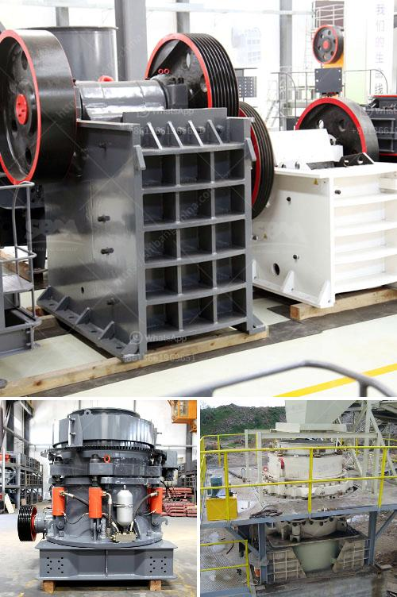

<h3>مصنع طحن الحجر</h3>
تعد عملية طحن الحجر من الأنشطة الهامة في قطاع البناء والمناجم. يتم في هذا المجال استخدام الحجر المكسّر المستخلص من المناجم وتحويله إلى مسحوق ناعم يستخدم في إنتاج الخرسانة والأسمنت والحجارة الصناعية ومواد البناء الأخرى.

يتألف مصنع طحن الحجر من مجموعة من المعدات والآلات التي تؤدي عمليات متتالية لتحويل الحجر إلى مسحوق. أحد المعدات الرئيسية في هذا المصنع هو الكسارة، حيث يتم استخدامها لكسر الحجر الكبير إلى قطع أصغر تسهل دخولها في عملية الطحن. يستخدم بعدها الحزام الناقل لنقل الحجر المكسّر إلى المطحنة.

المطحنة هي المعدة الأساسية في مصنع طحن الحجر، حيث يتم فيها طحن قطع الحجر المكسّر إلى مسحوق. تتألف المطحنة من جزأين رئيسيين، وهما الحلقة الدوارة والحلقة الثابتة. عند تشغيل المطحنة، تتحرك الحلقة الدوارة بسرعة عالية وتؤدي إلى طحن الحجر المكسّر بفعل الاحتكاك بين الحلقتين. يتم بعدها استخدام السُلطانات لفصل المسحوق المطحون حسب حجمه ونقاوته.

بالإضافة إلى ذلك، تحتوي مصانع طحن الحجر على أجهزة طحن متقدمة تساعد في تنقية المسحوق وتجفيفه. يتم استخدام فاصل الهواء في التخلص من الشوائب المتناثرة في المسحوق وتحقيق درجة عالية من النقاء. بعد ذلك، يتم إرسال المسحوق إلى آلة التجفيف التي تقوم بتجفيف المسحوق وإزالة الرطوبة منه قبل تعبئته وتسويقه.

تعد مصانع طحن الحجر أماكن عمل ذات تقنية متقدمة وهي ذات أهمية كبيرة في إنتاج العديد من المنتجات في قطاع البناء والمناجم. تحتاج هذه الصناعة إلى مهارات عالية في إدارة العمليات وضبط الجودة لضمان تحقيق أفضل النتائج الممكنة. وتشكل هذه المصانع جزءًا أساسيًا من دورة الإنتاج في صناعة البناء، حيث تؤثر بشكل مباشر على جودة ومواصفات المنتجات النهائية.

من الجدير بالذكر أن مصانع طحن الحجر تعتمد على تقنيات متقدمة ومعايير صارمة في عمليات الإنتاج والسلامة المهنية لضمان سلامة العمال وحماية البيئة. تلعب هذه المصانع دورًا مهمًا في تلبية احتياجات سوق البناء المحلية والعالمية، وتسهم في توفير موارد بناء أكثر استدامة وجودة.

في الختام، يعد مصنع طحن الحجر واحدًا من المرافق الأساسية في صناعة البناء والمناجم. يقوم بدور هام في تحويل الحجر المكسّر إلى مسحوق ناعم يستخدم في العديد من التطبيقات الصناعية المختلفة. تعتبر هذه المصانع من الصناعات التقنية العالية وتحتاج إلى اتباع إجراءات السلامة والجودة لضمان نتائج عالية الجودة بشكل مطرد.
<h3>Contact us</h3><ul><li><strong>Whatsapp:&nbsp;<a href="https://wa.me/8613661969651">+8613661969651</a></strong></li><li><a href="https://swt.shibang-china.com/?git&amp;zhl&amp;مصنع طحن الحجر"><strong>Online Service(chat now)</strong></a></li></ul><h3>Related</h3><ul><li><a href='مورد مصنع الكسارة.md'>مورد مصنع الكسارة</a></li><li><a href='استفسار حول الكسارة.md'>استفسار حول الكسارة</a></li><li><a href='مصنع طحن الذهب في زيمبابوي.md'>مصنع طحن الذهب في زيمبابوي</a></li><li><a href='موردين لمعدات التعدين في جنوب أفريقيا.md'>موردين لمعدات التعدين في جنوب أفريقيا</a></li><li><a href='أرض متاحة لمحجر الحجر.md'>أرض متاحة لمحجر الحجر</a></li></ul>