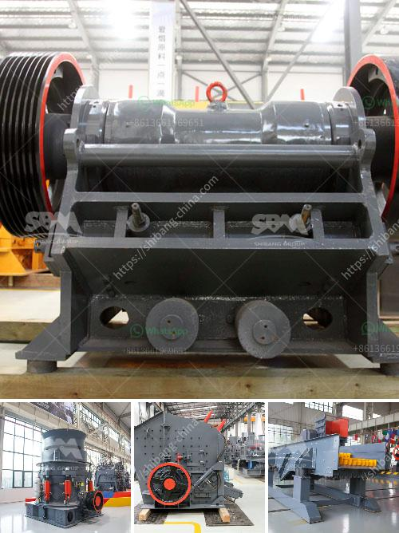

<h3>مصنع طحن الذهب في زيمبابوي</h3>
تعد زيمبابوي واحدة من أهم الدول في إفريقيا في مجال تعدين الذهب. يحتوي هذا البلد على العديد من المصانع الحديثة لتكرير وطحن الذهب، والتي تساهم في تحويل المنجم إلى منتج نهائي.

من بين هذه المصانع، يتميز مصنع طحن الذهب في زيمبابوي بقدرته الهائلة على معالجة المواد الخام بكفاءة عالية وإنتاج الذهب عالي الجودة. يقع المصنع في منطقة ذات غنى طبيعي في البلاد ويستخدم أحدث التقنيات والمعدات لتسهيل عملية الطحن واستخلاص الذهب من الصخور.

نظرًا لأهمية التعدين في زيمبابوي، يضم المصنع فرقًا محترفة وخبراء في صناعة التعدين الذين يعملون على الحفاظ على تشغيل المصنع والإشراف على كل مرحلة من مراحل العملية. تعتمد عملية الطحن على معالجة الصخور وسحقها إلى أحجام صغيرة، ومن ثم يتم فصل الذهب باستخدام الأجهزة المتخصصة.

تعد عملية طحن الذهب مرحلة هامة في سلسلة إنتاج الذهب، حيث يتم تحويل الصخور ذات الكميات المعدنية المنخفضة إلى مواد متناهية الصغر. وبعد ذلك يتم تصفية الذهب من الجسيمات الأخرى الموجودة في المادة المطحونة.

يتم تصنيع الذهب المستخرج في المصنع وإضافته إلى قوالب أو قرص أو خواتم ومن ثم يتم بيعه في الأسواق المحلية والدولية. يتوفر الذهب المنتج في العديد من المتاجر والمؤسسات المصرفية في البلاد، حيث يتم تداوله واستخدامه كاحتياطي نقدي واستثمار آمن.

بفضل مصانع طحن الذهب في زيمبابوي، تستطيع البلاد تحقيق العائد الاقتصادي من تعدين الذهب وزيادة توظيف العمالة المحلية. وتقدم هذه المصانع أيضًا فرصًا للمستثمرين المشاركة في هذه الصناعة وتعزيز النمو الاقتصادي للبلاد.

يتعامل مصنع طحن الذهب في زيمبابوي مع كميات كبيرة من الصخور المحمولة من المناجم القريبة، ويتم طحنها ومعالجتها على نحو فعال لاستخلاص الذهب. وبفضل تقنيات المعالجة المتقدمة، يتم تحقيق أعلى مستويات الجودة والكفاءة في إنتاج الذهب.

باختصار، يعد مصنع طحن الذهب في زيمبابوي مثالاً يحتذى به في صناعة تعدين الذهب. يلعب هذا المصنع دورًا مهمًا في إعداد الذهب وتحويله إلى منتج منتهي عالي الجودة. يساعد المصنع في توفير فرص العمل وتعزيز النمو الاقتصادي في البلاد، مما يعزز مكانة زيمبابوي كإحدى أبرز الدول المنتجة للذهب في العالم.
<h3>Contact us</h3><ul><li><strong>Whatsapp:&nbsp;<a href="https://wa.me/8613661969651">+8613661969651</a></strong></li><li><a href="https://swt.shibang-china.com/?git&amp;zhl&amp;مصنع طحن الذهب في زيمبابوي"><strong>Online Service(chat now)</strong></a></li></ul><h3>Related</h3><ul><li><a href='معدات كسارة المحجر للبيع.md'>معدات كسارة المحجر للبيع</a></li><li><a href='تقرير مشروع مصنع الكرة الصغيرة بتنسيق PDF.md'>تقرير مشروع مصنع الكرة الصغيرة بتنسيق PDF</a></li><li><a href='كسارة محمولة في المملكة العربية السعودية.md'>كسارة محمولة في المملكة العربية السعودية</a></li><li><a href='موردي مطاحن الأسطوانة في المكسيك.md'>موردي مطاحن الأسطوانة في المكسيك</a></li><li><a href='استفسار حول كسارة الصدم.md'>استفسار حول كسارة الصدم</a></li></ul>