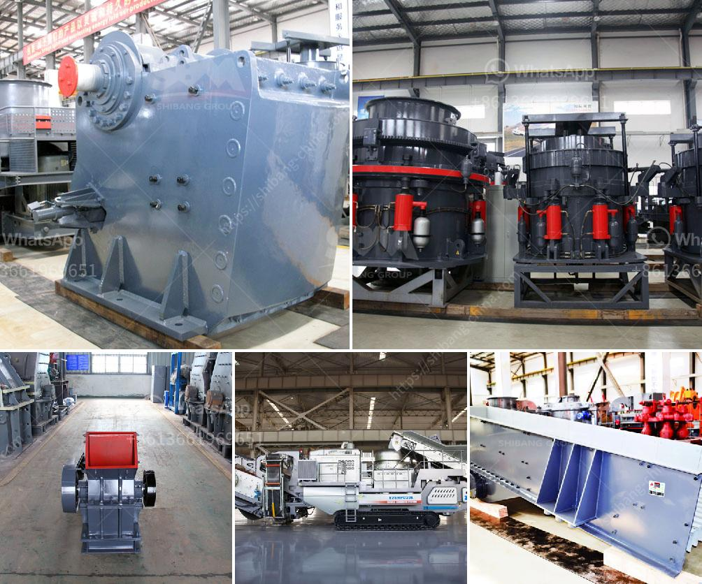

<h3>مصنع طحن الفحم من النوع الأسطواني</h3>
تواجه العالم تحديات كبيرة في مجال الطاقة، حيث يتطلب تلبية الاحتياجات المتزايدة للكهرباء والوقود مصادر طاقة فعالة ومستدامة. وفي هذا السياق، يأتي دور مصانع طحن الفحم من النوع الأسطواني كبديل واعد للاستفادة من مورد طاقة هائل وغني مثل الفحم.

تعتبر مصانع طحن الفحم من النوع الأسطواني تقنية حديثة ومتطورة تستخدم لتجهيز الفحم الخام وتحويله إلى مسحوق دقيق قابل للاستخدام في صناعة الطاقة والمواد الكيماوية. يتم طحن الفحم في مطحنة ذات أسطوانتين تدوران في نفس الاتجاه بواسطة محرك كهربائي، ما يساعد على تحويل الفحم إلى شكل ناعم ومنتظم.

تعتبر مصانع طحن الفحم الأسطوانية أكثر كفاءة من حيث استخراج القدرة الحرارية والتقليل من انبعاثات الملوثات بسبب العملية المتقدمة للتحبيب. فعملية طحن الفحم بواسطة المطحنة الأسطوانية تؤدي إلى زيادة كفاءة الاحتراق وتقليل الفاقد في استخدام الفحم كوقود. بالإضافة إلى ذلك، فإن هذه المصانع مصممة بطريقة تقلل من انبعاث غازات الدخان السامة بشكل كبير.

كما أن مصانع طحن الفحم الأسطوانية تتميز بسرعة الإنتاج والأمان، بفضل التحكم الآلي في العملية وتصميم المطحنة القوي. يمكن أن تعمل هذه المصانع لفترات طويلة دون انقطاع أو ضرورة التدخل البشري المستمر، مما يزيد من كفاءة العمل وتوفير الوقت والجهد للمشغلين.

بالاعتماد على مصنع طحن الفحم الأسطواني، يمكن توليد الكهرباء بطرق أكثر اقتصادية وبيئية من حيث توفير الوقود وتقليل انبعاثات الكربون. وبفضل عمليات التصنيع البسيطة والتشغيل الآلي الموزع، فإن استثمار تلك المصانع يمكن أن يؤدي إلى تخفيض تكاليف التشغيل وتحقيق أرباح مالية قابلة للاستثمار في مشاريع تنموية أخرى.

في الختام، يعد مصنع طحن الفحم من النوع الأسطواني خيارًا واعدًا لاستخدام مورد طاقة هائل وغني مثل الفحم بطريقة فعالة ومستدامة. توازن تلك المصانع بين الأداء والبيئة يعزز استدامة الصناعة وتلبية الطلب المتزايد على الكهرباء والوقود بشكل فعال وموثوق.
<h3>Contact us</h3><ul><li><strong>Whatsapp:&nbsp;<a href="https://wa.me/8613661969651">+8613661969651</a></strong></li><li><a href="https://swt.shibang-china.com/?git&amp;zhl&amp;مصنع طحن الفحم من النوع الأسطواني"><strong>Online Service(chat now)</strong></a></li></ul><h3>Related</h3><ul><li><a href='كيفية جعل مسحوق الحجر الجيري.md'>كيفية جعل مسحوق الحجر الجيري</a></li><li><a href='آلة طحن الحجر الجيري في بنغلاديش.md'>آلة طحن الحجر الجيري في بنغلاديش</a></li><li><a href='كسارة مخروطية غير مستخدمة في إثيوبيا للبيع.md'>كسارة مخروطية غير مستخدمة في إثيوبيا للبيع</a></li><li><a href='آلة تصنيع الجبس.md'>آلة تصنيع الجبس</a></li><li><a href='عمليات كسارة وغسل الحجر.md'>عمليات كسارة وغسل الحجر</a></li></ul>