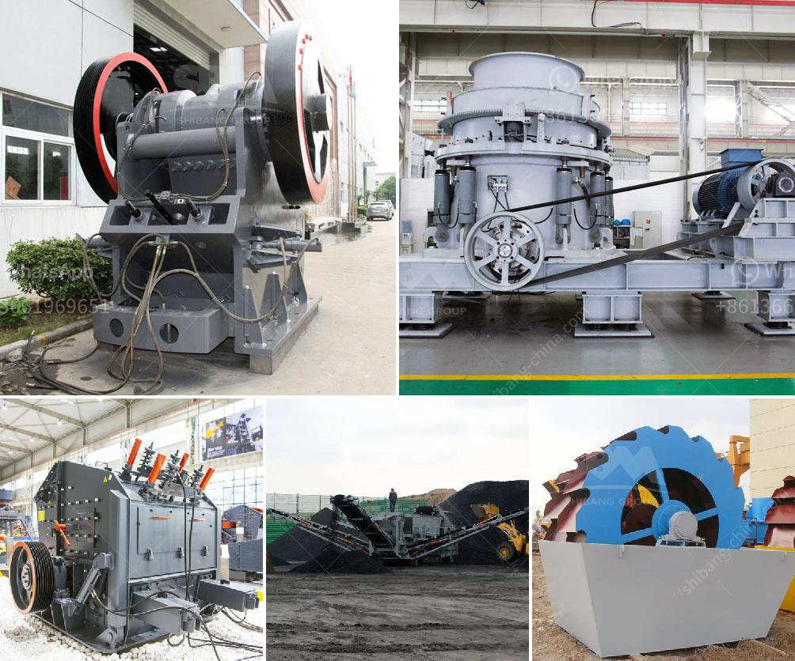

<h3>مصنع طحن كلنكر الإسمنت في الهند</h3>
تعتبر الهند واحدة من أكبر الدول المنتجة للأسمنت في العالم، حيث تزايدت الطلبات المحلية والعالمية على الإسمنت في السنوات الأخيرة. ومن بين العوامل التي أسهمت في تحقيق النجاح الكبير للهند في صناعة الإسمنت هو تطور مصانع طحن كلنكر الإسمنت.

يعتبر الكلنكر هو المادة الأساسية التي تتكون منها الأسمنت، ويتم استخراجها من الفرن الدوار المستخدم في عملية تصنيع الإسمنت. وعند الانتهاء من العملية المعقدة لصناعة الكلنكر، يتم نقله إلى مصنع طحن الكلنكر، حيث يتم طحنه وخلطه مع مواد أخرى مثل الجبس لإنتاج الأسمنت النهائي.

مصنع طحن الكلنكر في الهند هو المكان الذي يتم فيه إعداد الكلنكر المطحون لتحويله إلى الأسمنت النهائي. يتم تجهيز المصنع بأحدث التقنيات والمعدات التي تضمن جودة الإنتاج وتلبية الاحتياجات الصارمة للسوق. كما يتم توظيف فريق من المتخصصين والفنيين ذوي الخبرة العالية لضمان سير العملية بسلاسة وفعالية.

يتم طحن الكلنكر عن طريق الدوران والإضافة تدريجياً لمواد أخرى مثل الجبس والابتعاد والأفضلية. يتم التحكم في عملية الطحن بدقة للحصول على حبيبات الكلنكر المطلوبة التي تعتبر أهم عامل في تحديد نوعية الأسمنت النهائي.

من أهم المزايا التي يوفرها مصنع طحن الكلنكر في الهند هي قدرته على تلبية احتياجات السوق المتنوعة. حيث يمكن إنتاج الأسمنت بمواصفات مختلفة كما يتم تلبية متطلبات العملاء وتقديم حلول مخصصة وفقًا لاحتياجاتهم الفردية.

بالإضافة إلى ذلك، يسهم مصنع طحن الكلنكر في الهند في توفير فرص عمل للعديد من العمال والمهندسين والفنيين، مما يساهم في تعزيز الاقتصاد المحلي ورفع مستوى المعيشة للعديد من الأفراد.

يستخدم الأسمنت في العديد من الصناعات مثل البناء والهندسة المدنية، وبالتالي تزيد الحاجة إلى مصانع طحن الكلنكر في الهند لتلبية هذه الاحتياجات. ومع تطور التكنولوجيا وتحسين جودة الإنتاج، من المتوقع أن تستمر صناعة الإسمنت في الهند في النمو والازدهار في المستقبل.

باختصار، مصنع طحن الكلنكر في الهند هو مكون أساسي في صناعة الأسمنت، حيث يتم فيه تحويل الكلنكر إلى الأسمنت النهائي. يحقق هذا المصنع الجودة والكفاءة وتلبية الاحتياجات المختلفة للسوق، ويسهم في تعزيز الاقتصاد المحلي وإيجاد فرص عمل للعديد من الأفراد.
<h3>Contact us</h3><ul><li><strong>Whatsapp:&nbsp;<a href="https://wa.me/8613661969651">+8613661969651</a></strong></li><li><a href="https://swt.shibang-china.com/?git&amp;zhl&amp;مصنع طحن كلنكر الإسمنت في الهند"><strong>Online Service(chat now)</strong></a></li></ul><h3>Related</h3><ul><li><a href='سعر خط إنتاج الجبس.md'>سعر خط إنتاج الجبس</a></li><li><a href='البحث عن معدات تجهيز الفحم الصغيرة.md'>البحث عن معدات تجهيز الفحم الصغيرة</a></li><li><a href='مصنع كسارة الكاولين في أوزبكستان.md'>مصنع كسارة الكاولين في أوزبكستان</a></li><li><a href='سعة آلة الكسارة 5 أطنان في الساعة.md'>سعة آلة الكسارة 5 أطنان في الساعة</a></li><li><a href='معدات معالجة الحجر الكاملة محطم 100 طن.md'>معدات معالجة الحجر الكاملة محطم 100 طن</a></li></ul>