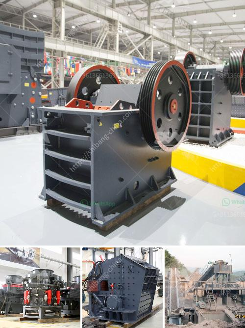

<h3>مصنع غسل الحجارة الكوارتز</h3>
يُعد الحجر الكوارتز أحد المواد الطبيعية الشائعة المستخدمة في العديد من الصناعات، مثل صناعة الزجاج والسيراميك والإلكترونيات. ولكن قبل أن يتم استخدامه في هذه الصناعات يجب أن يتم تنقيته وتنظيفه بشكل جيد. وهنا يأتي دور مصنع غسل الحجارة الكوارتز.

يقوم مصنع غسل الحجارة الكوارتز بعملية تنظيف شاملة لهذا النوع من الحجر، وذلك بإزالة الشوائب والشوائب العضوية التي تعترض عملية التصنيع. يستخدم المصنع مجموعة من العمليات من أجل تحقيق ذلك، مثل الغسل بالماء والفرز والطحن.

أولاً، يتم وضع الحجارة الكوارتز في ماء نظيف ويتم تحريكها بواسطة مضخات لفترة زمنية محددة. هذا الغسل بالماء يساعد في إزالة الأتربة والأوساخ المتراكمة على الحجر. ثم يتم تصفية الماء وإعادته للاستخدام مرة أخرى. هذه العملية تساهم في تحقيق استدامة المصنع وتقليل استهلاك المياه.

بعد ذلك، يتم فرز الحجارة وفقًا لحجمها ونوعها. فهناك حجارة بحجم صغير وأخرى بحجم كبير، وكل منها قد يستخدم في التطبيقات المختلفة. يتم تصنيف الحجارة للتأكد من أن الحجم والتركيبة الكيميائية تتوافق مع متطلبات الصناعات المستهدفة.

ثم، يتم طحن الحجارة الكوارتز للحصول على حجم جسيمات موحد ومناسب. يستخدم المصنع المعدات المتقدمة في هذه العملية، مثل المطاحن والكسارات، لتحقيق أعلى جودة ممكنة والحصول على حجم جسيمات مطلوب.

في النهاية، يتم التحقق من جودة الحجارة الكوارتز المغسولة والمطحونة. ويتم ذلك من خلال إجراء اختبارات مختلفة، مثل اختبارات المقايسة وتحليل الكيمياء. يتم التأكد من أن النتائج تفي بمتطلبات الصناعات الهدف ومعايير الجودة.

يمثل مصنع غسل الحجارة الكوارتز جزءًا أساسيًا من سلسلة إنتاج هذه المادة المهمة. إنه يساهم في تحسين جودة الحجارة الكوارتز وتنقيتها من الشوائب والشوائب العضوية، وبالتالي يضمن استخدامها بكفاءة في الصناعات المختلفة. بفضل مثل هذه المصانع المتخصصة، نتمكن من الاستفادة القصوى من الحجارة الكوارتز والاستدامة في الإنتاج الصناعي.
<h3>Contact us</h3><ul><li><strong>Whatsapp:&nbsp;<a href="https://wa.me/8613661969651">+8613661969651</a></strong></li><li><a href="https://swt.shibang-china.com/?git&amp;zhl&amp;مصنع غسل الحجارة الكوارتز"><strong>Online Service(chat now)</strong></a></li></ul><h3>Related</h3><ul><li><a href='لكن كسارات الخرسانة نيجيريا.md'>لكن كسارات الخرسانة نيجيريا</a></li><li><a href='آلة مسحوق الدولوميت في سريلانكا.md'>آلة مسحوق الدولوميت في سريلانكا</a></li><li><a href='عملية سحق الكسارة.md'>عملية سحق الكسارة</a></li><li><a href='حجم وقدرة كسارة الفك النموذجية.md'>حجم وقدرة كسارة الفك النموذجية</a></li><li><a href='معدات الطحن والفرز للرمل والحصى.md'>معدات الطحن والفرز للرمل والحصى</a></li></ul>