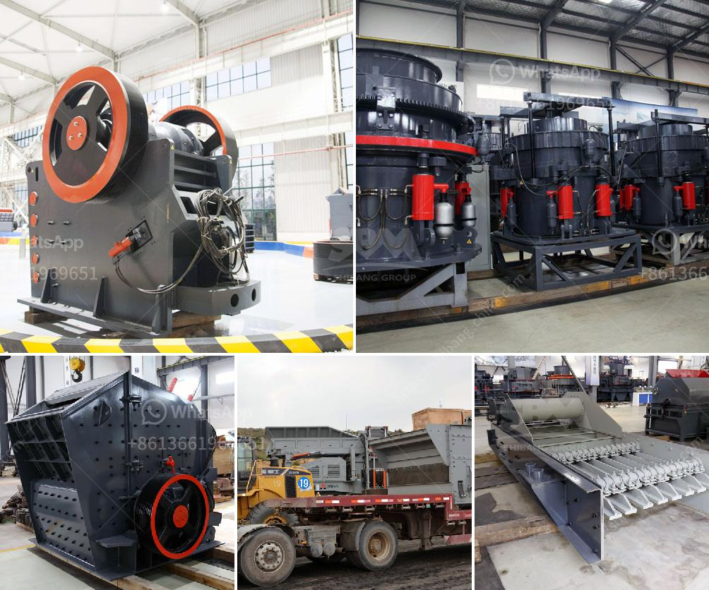

<h3>مصنع غسل الرمل المستعمل للبيع</h3>
تعد صناعة الرمل من أهم الصناعات في قطاع البناء والتشييد. ولتلبية الطلب المتزايد على الرمل، أصبحت هناك حاجة ملحة للمعدات المتطورة والمبتكرة لغسل وفصل الرمل، وهو ما يوفره مصنع غسل الرمل المستعمل.

يعتبر مصنع غسل الرمل المستعمل خيارًا ممتازًا للشركات التي تبحث عن معدات عالية الجودة وبأسعار مناسبة لتنظيف الرمال المستخدمة في مشاريعها القائمة. يعمل المصنع على فصل الرمل عن المواد العضوية والشوائب الأخرى الموجودة فيه.

تتوفر معدات غسل الرمل المستعملة بأحجام وموديلات مختلفة حسب احتياجات المشروع. تتضمن هذه المعدات جهاز غسل الرمل الذي يعمل على غسل وتنظيف الرمل بشكل فعال، بالإضافة إلى نظام فصل الماء والرمال المتطور الذي يقوم بإزالة الرواسب والشوائب من الرمل، مما يجعله جاهزًا للاستخدام في الأعمال الإنشائية.

إذا كنت تفكر في شراء مصنع غسل الرمل المستعمل، فمن الأفضل أن تبحث عن مورد موثوق به وذو سمعة جيدة في هذا المجال. تأكد من أن المعدات قد خضعت للفحوصات والاختبارات اللازمة لضمان أدائها الجيد والمتانة.

بالنسبة للسعر، يمكن أن يتراوح سعر مصنع غسل الرمل المستعمل بين 200 و 400 دولار، حسب حجم وحالة المعدات. يمكن أن يكون السعر أقل من السعر الأصلي للمعدات الجديدة، ولكن يجب أن تتأكد من حالة المعدات وقدرتها على تلبية احتياجاتك المحددة.

إذا استخدمت المعدات بشكل صحيح وأجريت الصيانة الدورية لها، يمكن أن تعمل لفترة طويلة وبفعالية كبيرة. بالإضافة إلى ذلك، يمكنك تحقيق توفير كبير في تكاليف المشروع التي تتعلق بشراء معدات جديدة.

في الختام، يمكن القول إن مصنع غسل الرمل المستعمل يوفر حلاً اقتصاديًا وفعالًا لشركات البناء التي تبحث عن طرق لتخفيف التكاليف والحفاظ على جودة الرمال التي تستخدمها في مشاريعها. من خلال البحث عن مورد موثوق به والاهتمام بصيانة المعدات، يمكنك الاستفادة من هذه الفرصة وتحقيق النجاح في مجال البناء.
<h3>Contact us</h3><ul><li><strong>Whatsapp:&nbsp;<a href="https://wa.me/8613661969651">+8613661969651</a></strong></li><li><a href="https://swt.shibang-china.com/?git&amp;zhl&amp;مصنع غسل الرمل المستعمل للبيع"><strong>Online Service(chat now)</strong></a></li></ul><h3>Related</h3><ul><li><a href='طحن معدات الطحن الطحن.md'>طحن معدات الطحن الطحن</a></li><li><a href='مطحنة الهامر في جوهانسبرغ.md'>مطحنة الهامر في جوهانسبرغ</a></li><li><a href='معدات كسارة قشر الجوز.md'>معدات كسارة قشر الجوز</a></li><li><a href='سعر كسارة حجر البازلت.md'>سعر كسارة حجر البازلت</a></li><li><a href='الفارق بين الرمل ومسحوق الحجر المكسر.md'>الفارق بين الرمل ومسحوق الحجر المكسر</a></li></ul>