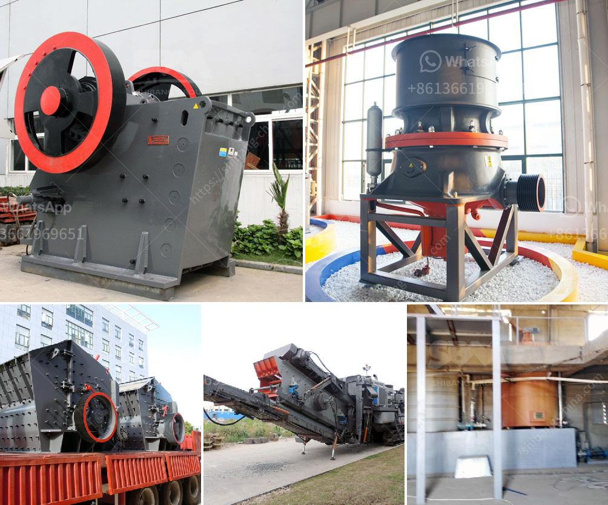

<h3>مصنع غسيل الذهب الصغير</h3>
يعد مصنع غسيل الذهب الصغير واحدًا من الوسائل الفعالة في استخراج الذهب من حجر الكوارتز والصخور الصلبة الأخرى. يتألف مصنع غسيل الذهب الصغير من مجموعة من الآلات والمعدات المتطورة، والتي تشتمل على الجهاز الهزاز، والتراكم الجاذب للذهب، والذاكرة المغناطيسية، وخزان النقل، وجدول الهزاز، والعديد من الأجزاء الأخرى.

يعمل مصنع غسيل الذهب الصغير على تجهيز الجيولوجيا الشائعة التي تحتوي على متوسط ​​أكسيد الحديد والذهب بنسبة عالية. تبدأ عملية استخلاص الذهب بتحطيم حجر الكوارتز أو الصخور الصلبة باستخدام الكسارة، حيث يتم تقليل حجم المواد ليتمكن المصنع من معالجة الأحجام الأصغر بشكل أسرع وأكثر كفاءة.

تمر عملية تصنيع المصنع الصغير مراحل مختلفة، حيث يتم فصل الذهب عن بقية المواد الموجودة في الصخور الصلبة. واحدة من أهم المراحل هي عملية التعويم، حيث يتم تجهيز الصخور المكسورة بمواد كيميائية خاصة لتعويم الجسيمات الناعمة من الذهب. يتم تركيز الذهب باستخدام الغازات المعدنية المتعددة الحديد التي تجذب الذهب بفعالية. هذه المرحلة تسمى عملية التركيز وتسهم في زيادة تركيز الذهب واستخلاصه بشكل أكبر.

بعد عملية التعويم والتركيز، يتم تخزين الماء واستخدامه لاستخدامه في عمليات المعالجة اللاحقة. يتم نقل الذهب المركز إلى جدول هزاز يعمل على فصل الذهب عن باقي المواد الغير ثقيلة باستخدام حركة هزازة متكررة. يتم تعيين هذا الجدل بحيث يسمح للذهب بالاستقرار في الجدول بينما تنطلق باقي المواد بعيدًا.

بعد هذه الخطوة، يتم نقل الذهب المركز إلى مرحلة التنظيف الأخيرة، حيث يتم استخدام منتج كيميائي مع تطبيق الجهاز المغناطيسي لفصل الأجسام الغريبة والشوائب الأخرى المتبقية عن الذهب. يتم تنظيف الذهب باستخدام محلول كيميائي وأنواع أخرى من المعادن الغريبة الرملية.

باستخدام هذه الطرق الحديثة، يستطيع مصنع غسيل الذهب الصغير استخلاص الذهب بشكل كبير وفعال من حجر الكوارتز والصخور الصلبة الأخرى. يؤدي حجم المصنع الصغير إلى توفير مساحة وتكاليف أقل، وبالتالي يجذب المستثمرين المهتمين بتعدين الذهب بكميات صغيرة. علاوة على ذلك، يمكن استخدام المصنع الصغير كمرحلة مبدئية لمصانع أكبر، حيث يتم تكييف تقنياته لزيادة القدرة الإنتاجية وتنظيف الذهب بكفاءة أكبر.

لذا، فإن مصنع غسيل الذهب الصغير يُعتبر خيارًا مثاليًا للمستثمرين الذين يسعون للاستفادة من احتياطي الذهب والحصول على عائد استثماري مربح بشكل مستدام.
<h3>Contact us</h3><ul><li><strong>Whatsapp:&nbsp;<a href="https://wa.me/8613661969651">+8613661969651</a></strong></li><li><a href="https://swt.shibang-china.com/?git&amp;zhl&amp;مصنع غسيل الذهب الصغير"><strong>Online Service(chat now)</strong></a></li></ul><h3>Related</h3><ul><li><a href='صور شاشات الاهتزاز.md'>صور شاشات الاهتزاز</a></li><li><a href='سيور ناقلة في فرنسا.md'>سيور ناقلة في فرنسا</a></li><li><a href='تعدين المحاجر ومعدات البناء.md'>تعدين المحاجر ومعدات البناء</a></li><li><a href='ناقل البناء للبيع.md'>ناقل البناء للبيع</a></li><li><a href='معدات تعدين الصغيرة مصنعين في جنوب أفريقيا.md'>معدات تعدين الصغيرة مصنعين في جنوب أفريقيا</a></li></ul>