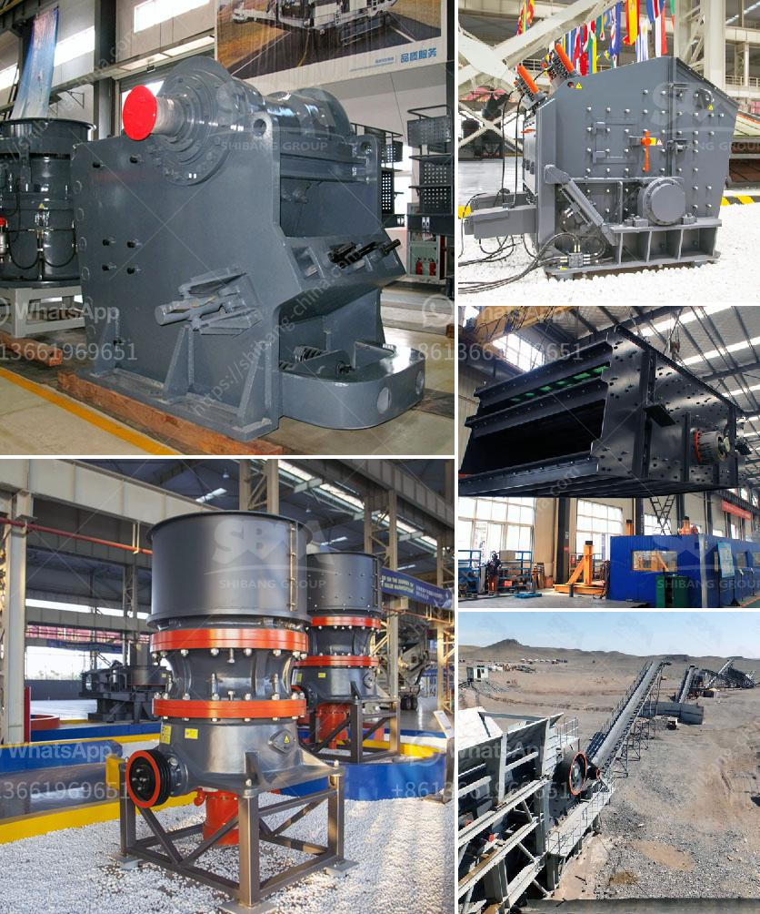

<h3>مصنع غسيل الذهب المتنقل</h3>
تعد عملية غسل الذهب من العمليات الحاسمة التي تستخدم في استخراج المعدن الثمين من الصخور والتربة. وفي السنوات الأخيرة، ظهرت تقنيات جديدة ومبتكرة لمعالجة الذهب، بما في ذلك مصانع غسيل الذهب المتنقلة.

يعتبر مصنع غسيل الذهب المتنقل واحدًا من التقنيات الحديثة في مجال التعدين ومعالجة الذهب. يستخدم هذا النوع من المصانع في الأماكن التي يكون فيها وجود الذهب محدودًا أو غير مستدام للتعدين التقليدي.

يوفر مصنع غسيل الذهب المتنقل بيئة عمل فعالة وفعالة من حيث التكلفة لاستخراج الذهب. يتحرك المصنع على عجلات، وبالتالي يمكن نقله بسهولة من موقع لآخر. يتكون المصنع من عدة وحدات متكاملة تتضمن معدات مثل الكسارات والشاشات وأنظمة التعويم والأمشاط ومعدات فصل الذهب.

تعتمد عملية غسل الذهب المتنقلة على عدة خطوات. في البداية، يتم استخراج خام الذهب من الموقع باستخدام الحفارات أو المعدات الأخرى. ثم يتم نقله إلى المصنع المتنقل حيث تتم معالجته باستخدام المعدات المذكورة سابقًا. يتم تكسير الخام بواسطة الكسارات، وتفصل الشاشات الأجزاء غير المرغوب فيها من الذهب وتنقيه. بعد ذلك، يتم فصل جسيمات الذهب عن الركام باستخدام أنظمة التعويم والأمشاط. وفي النهاية، يتم جمع الذهب النقي وتصفيته للحصول على المنتج النهائي.

مصانع غسيل الذهب المتنقلة تعتبر ذات فوائد عديدة. أولاً، توفر مرونة للشركات التي تقوم بعمليات التنقيب عن الذهب في عدة مناطق مختلفة. يمكن نقل المصنع بسهولة وسرعة، مما يوفر الوقت والمال اللازمين لبناء مصانع ثابتة. ثانيًا، تقلل المصانع المتنقلة من تأثير التعدين على البيئة، حيث يمكن إعادة استخدام المياه وتقليل التلوث الذي يسببه العمليات التقليدية.

وباختصار، يعتبر مصنع غسيل الذهب المتنقل تقنية مبتكرة ومتطورة لاستخراج الذهب بكفاءة وباستخدام وسائل فعالة. يمنح هذا المصنع الشركات المنجمية مزيدًا من المرونة والقدرة على العمل في مناطق تعدين ذهب محدودة الموارد أو في مناطق يكون العمل التقليدي غير مستدام. وبذلك، يساهم المصنع في دعم عمليات استخراج الذهب بشكل فعال ومستدام.
<h3>Contact us</h3><ul><li><strong>Whatsapp:&nbsp;<a href="https://wa.me/8613661969651">+8613661969651</a></strong></li><li><a href="https://swt.shibang-china.com/?git&amp;zhl&amp;مصنع غسيل الذهب المتنقل"><strong>Online Service(chat now)</strong></a></li></ul><h3>Related</h3><ul><li><a href='مطحنة الكرة ماركاسيت.md'>مطحنة الكرة ماركاسيت</a></li><li><a href='مصانع الكسارات الصينية.md'>مصانع الكسارات الصينية</a></li><li><a href='سعر كسارة الحجر في نيجيريا.md'>سعر كسارة الحجر في نيجيريا</a></li><li><a href='سعر آلات كسارة المحجر.md'>سعر آلات كسارة المحجر</a></li><li><a href='سعر كسارة الطين.md'>سعر كسارة الطين</a></li></ul>