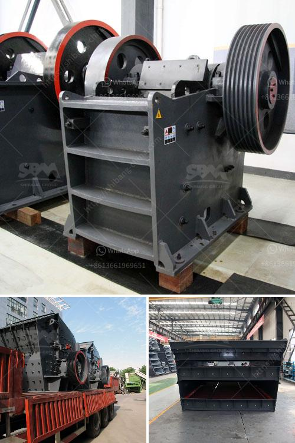

<h3>مصنع غسيل الذهب المستخدمة</h3>
يعتبر مصنع غسيل الذهب من المصانع الحديثة والمهمة في صناعة التعدين واستخلاص الذهب. يقوم هذا المصنع بتجهيز الصخور والركام الذهبي من الألغام أو الرواسب لاستخلاص الذهب منها. يتم ذلك عن طريق عملية تعدين متطورة تسمى غسيل الذهب.

في بداية العملية، يتم جمع الألغام وتكسيرها للحصول على قطاعات صغيرة من الصخور والأحجار الكبيرة. ثم يتم وضع هذه القطاعات في الآلات الغسيل لفصل الصخور عن الذهب. يعمل المصنع بواسطة معدات ثقيلة مثل الكسارات والأنفاق والمنخل الصغير الذي يقوم بفصل الحصى الأكبر.

تعتمد عملية غسيل الذهب على قدرة الماء على طي الصخور ونقل الأوساخ والشوائب بعيدًا. احتياج المصنع للمياه يتباين حسب حجم المصنع وكمية الرواسب التي يتم معالجتها. قد يتم أخذ المياه من الأنهار القريبة أو من مصادر مائية أخرى.

بعد فصل الصخور عن الذهب، يتم وضع الذهب في محاليل كيميائية خاصة تسمى محاليل سيانيد لفصل الذهب عن الشوائب الأخرى. تعتبر هذه العملية حساسة وتتطلب مراعاة إجراءات السلامة والبيئة.

بعد التنقية، يتم تشكيل الذهب في أشكال مختلفة مثل الأقراط والخواتم والمجوهرات الأخرى. يُمكن بيع هذه المنتجات المصنعة إلى أسواق الذهب أو للزبائن الذين يتطلعون لشراء الذهب المصنع.

من الجوانب الإيجابية للمصنع، يتم تحقيق استخلاص أمثل للذهب وبطريقة فعالة. كما تؤدي هذه العملية إلى تقليل الإرهاب المرتبط بتعدين الذهب غير القانوني والتعدين البدائي. تعد صناعة الذهب من الصناعات الهامة اقتصاديا وقد توفر فرص عمل محلية للعديد من العمال، بما في ذلك الفنيين والمهندسين المتخصصين.

على النقيض، قد يؤدي تحميل المصنع على المياه الجوفية إلى ندرتها، وقد تتسبب الترسيبات الناتجة عن عملية الغسيل في تلوث المياه. لذا يجب اتباع إجراءات صارمة لمعالجة المياه المستخدمة في المصنع وتأكيد أنها آمنة للاستخدام بعد ذلك.

في الختام، يلعب مصنع غسيل الذهب دوراً هاماً في صناعة التعدين واستخراج الذهب. يتم استخدام التكنولوجيا المتقدمة والعمليات الكيميائية لفصل الذهب عن الرواسب. بفضل هذه العملية، يتم تحويل الذهب الخام إلى منتج قابل للتسويق في صورة مجوهرات وقطع ثمينة. ومع اتباع إجراءات السلامة وحماية البيئة، يمكن أن تكون صناعة غسيل الذهب أكثر استدامة وفائدة بشكل عام.
<h3>Contact us</h3><ul><li><strong>Whatsapp:&nbsp;<a href="https://wa.me/8613661969651">+8613661969651</a></strong></li><li><a href="https://swt.shibang-china.com/?git&amp;zhl&amp;مصنع غسيل الذهب المستخدمة"><strong>Online Service(chat now)</strong></a></li></ul><h3>Related</h3><ul><li><a href='كسارة الفك sp 60x100.md'>كسارة الفك sp 60x100</a></li><li><a href='كسارة للبيع في بيرو.md'>كسارة للبيع في بيرو</a></li><li><a href='مصنع معالجة الذهب المحمول مع السعر.md'>مصنع معالجة الذهب المحمول مع السعر</a></li><li><a href='آلة حبيبات الجبس في الهند.md'>آلة حبيبات الجبس في الهند</a></li><li><a href='مطحنة طحن رايموند في باكستان.md'>مطحنة طحن رايموند في باكستان</a></li></ul>