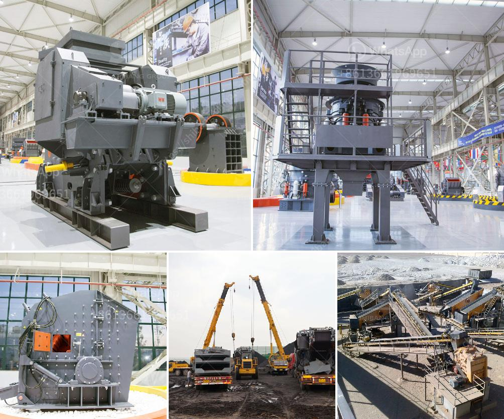

<h3>مصنع غسيل الذهب بسعة ١٠٠ طن في الساعة</h3>
يعتبر مصنع غسيل الذهب بسعة 100 طن في الساعة من أهم المصانع في صناعة التعدين. يتم استخدام هذا المصنع لغسيل الذهب من الصخور والرمال باستخدام الماء والمبيدات الكيميائية لفصل الذهب عن المواد الأخرى.

يتكون هذا المصنع من عدة مراحل، حيث يتم نقل المواد الخام من المنجم إلى المصنع عن طريق الشاحنات أو الحزام الناقل. ثم يتم سحق المواد الخام باستخدام كسارات وطواحين للحد من حجم الصخور والرمال.

بعد ذلك، يتم نقل المواد المسحوقة إلى حوض كبير يحتوي على الماء والمبيدات الكيميائية. يتم خلط المواد بالماء لتشكيل معلقة تحتوي على الذهب والشوائب. ثم يتم نقل المعلقة إلى حوض آخر يحتوي على أقراص معدنية صغيرة تعمل على فصل الشوائب عن الذهب. تقوم الأقراص بحركة دائرية سريعة، مما يساهم في تغيير ثقل الذهب والشوائب وفصلهما.

بعد ذلك، يتم نقل الذهب من الحوض إلى حوض آخر يحتوي على زئبق فيها. يعمل الزئبق على امتصاص الذهب وتجميعه في نقاط التقاء الزئبق. ثم يتم استخدام أساليب أخرى لغسيل الذهب من الزئبق وتجهيزه للبيع والتصدير.

يعتبر مصنع غسيل الذهب بسعة 100 طن في الساعة مناسبًا للشركات الكبيرة والمناجم الكبيرة التي تحتاج إلى معالجة كميات هائلة من الذهب. يقدم هذا المصنع الفوائد التالية:

1. زيادة الإنتاجية: باستخدام هذا المصنع، يتمكن المنجمون من غسل كميات كبيرة من الذهب في وقت قصير، مما يزيد من إنتاجيتهم بشكل كبير.

2. توفير الوقت والجهد: تعتبر عملية غسيل الذهب التقليدية مكلفة وتستغرق وقتًا طويلاً. لكن باستخدام هذا المصنع، يتم تحسين العملية بشكل كبير وتوفير الوقت والجهد المهدرين.

3. تكاليف منخفضة: يعجز الحلول التقليدية عن مواجهة الطلب المتزايد على الذهب. ومع ذلك، يوفر هذا المصنع تقنيات حديثة وفعالة من حيث التكلفة لتلبية هذا الطلب بشكل اقتصادي.

مصنع غسيل الذهب بسعة 100 طن في الساعة يعد أحدث التطورات التقنية في صناعة التعدين. يساهم في تحسين عمليات استخراج الذهب وزيادة الإنتاجية. يعتبر هذا المصنع الخيار الأمثل للشركات التي ترغب في تحقيق أقصى استفادة من مناجم الذهب وتحقيق الربحية العالية في هذه الصناعة المهمة.
<h3>Contact us</h3><ul><li><strong>Whatsapp:&nbsp;<a href="https://wa.me/8613661969651">+8613661969651</a></strong></li><li><a href="https://swt.shibang-china.com/?git&amp;zhl&amp;مصنع غسيل الذهب بسعة ١٠٠ طن في الساعة"><strong>Online Service(chat now)</strong></a></li></ul><h3>Related</h3><ul><li><a href='كسارات محمولة جنوب أفريقيا.md'>كسارات محمولة جنوب أفريقيا</a></li><li><a href='كسارات متنقلة في أبوجا.md'>كسارات متنقلة في أبوجا</a></li><li><a href='آلة صنع الرمل VSI.md'>آلة صنع الرمل VSI.</a></li><li><a href='كسارات مخروط للبيع.md'>كسارات مخروط للبيع</a></li><li><a href='مصنع غسيل الماس في جنوب أفريقيا.md'>مصنع غسيل الماس في جنوب أفريقيا</a></li></ul>