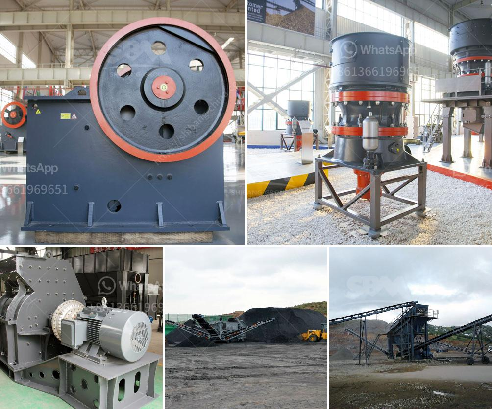

<h3>مصنع غسيل الذهب للبيع</h3>
يُعد عالم التعدين والذهب من أكثر الصناعات رواجًا واقبالًا في العديد من الدول حول العالم، حيث يعتبر الذهب من المعادن الثمينة التي تُستخدم في صناعة المجوهرات والعملات النقدية والتراث الثقافي العالمي. ولتلبية نمو الطلب على الذهب، ازداد اهتمام المستثمرين بشراء وتشغيل مصانع غسل الذهب.

مصنع غسيل الذهب هو مصنع مُخصص لاستخلاص الذهب من الصخور والرمال المحتوية على خام الذهب. تعد عملية الغسيل هي أحد الطرق التقليدية والمهمة في تصفية المعادن الثمينة من الحصى والأتربة. ويتمثل الهدف الرئيسي لمصنع غسيل الذهب في الحصول على الذهب بأكبر كمية ممكنة وبأعلى جودة ممكنة.

تشمل عملية الغسيل عدة مراحل مهمة، حيث يتم تكسير الصخور وطحنها إلى قطع صغيرة، ثم يتم غسلها بالماء ليتم فصل الذهب عن غيره من الشوائب. ولا بد من استخدام معدات احترافية خاصة تضمن زيادة كفاءة عملية الغسل وحصول على النتائج المرجوة.

إذا كنت مهتمًا بصناعة التعدين والذهب وترغب في سرعة العمل والحصول على عوائد مالية مربحة، فإن شراء مصنع غسيل الذهب قد يكون الخيار المثالي بالنسبة لك. يمكنك شراء مصنع غسيل الذهب الجاهز والبدء في استخلاص الذهب وتحقيق أرباح مالية مجزية.

قبل شراء مصنع غسيل الذهب، يجب عليك النظر في العديد من العوامل المهمة مثل حجم وقوة المصنع وإمكانية توسعته في المستقبل، وكذلك مصداقية المصنع وجودة المعدات المستخدمة. قد يكون من المفيد أيضًا التعاون مع خبراء في المجال للحصول على استشارة مهنية وتحليل للسوق والاحتمالات.

يتوفر مصنع غسيل الذهب للبيع بأسعار تتراوح بين 200-400 ألف دولار، حسب حجم وتجهيزات المصنع. ومن الممكن أن يتضمن السعر أيضًا الدروس التدريبية والدعم الفني للمشتري.

في الختام، إذا كنت تبحث عن فرصة استثمار مربحة في صناعة التعدين والذهب، فقد يكون شراء مصنع غسيل الذهب هو الخيار المثالي لك. سيسمح لك هذا الاستثمار بإدخال نفسك في سوق الذهب العالمي، وتحقيق أرباح مالية مجزية، والمساهمة في إثراء احتياطيات الذهب العالمية
<h3>Contact us</h3><ul><li><strong>Whatsapp:&nbsp;<a href="https://wa.me/8613661969651">+8613661969651</a></strong></li><li><a href="https://swt.shibang-china.com/?git&amp;zhl&amp;مصنع غسيل الذهب للبيع"><strong>Online Service(chat now)</strong></a></li></ul><h3>Related</h3><ul><li><a href='تصميم آلة تكسير الحجر.md'>تصميم آلة تكسير الحجر</a></li><li><a href='مصنع معالجة الكالسيوم.md'>مصنع معالجة الكالسيوم</a></li><li><a href='كسارة لفة مسننة جاجيد.md'>كسارة لفة مسننة جاجيد</a></li><li><a href='مصنع عملية التصنيع في جنوب أفريقيا.md'>مصنع عملية التصنيع في جنوب أفريقيا</a></li><li><a href='قائمة أسعار إعادة تدوير زجاج كونسول للطن.md'>قائمة أسعار إعادة تدوير زجاج كونسول للطن</a></li></ul>