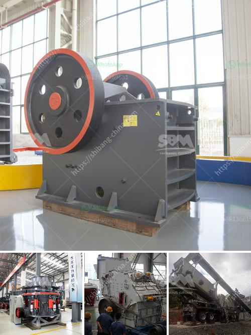

<h3>مصنع غسيل الرمال بسعة 50 طن في اليوم</h3>
يعتبر مصنع غسيل الرمال بسعة 50 طن في اليوم من أهم المصانع التي تستخدم في صناعة البناء والإنشاءات. يهدف هذا المصنع إلى تنظيف الرمال من الشوائب والأتربة والأجسام الغريبة، وتحسين جودتها بحيث تصلح للاستخدام في البناء والإنشاءات.

تتكون عملية غسيل الرمال في هذا المصنع من عدة مراحل. في البداية، يتم تحميل الرمال في الجزء العلوي من المصنع حيث تتم إزالة الشوائب الأكبر والأجسام الغريبة مثل الحجارة والقطع الخشبية باستخدام آلة فاصلة. ثم يتم نقل الرمال إلى مجموعة من الأحواض المائية حيث تتم إزالة الطين والأوساخ الأخرى باستخدام الماء. بعد ذلك، يتم نقل الرمال المنظفة إلى حوض تجفيف حيث يتم طمس الماء بواسطة الهواء الساخن. وأخيراً، يتم تحميل الرمال المنظفة في شاحنات أو حاويات جاهزة للنقل والاستخدام في مشاريع البناء.

تعتبر سعة المصنع البالغة 50 طن في اليوم مؤشراً على كفاءته، حيث يمكنه تحويل كميات كبيرة من الرمال الخام إلى رمال نقية، مما يؤدي إلى توفير الوقت والجهد والموارد. كما أن هذا المصنع يتوفر على تكنولوجيا حديثة ومعدات متطورة تساعد في تحقيق أعلى مستويات الجودة والأداء.

من الآثار الإيجابية لوجود مصنع غسيل الرمال بسعة 50 طن في اليوم، يمكن الإشارة إلى تلبية احتياجات سوق البناء والإنشاءات المحلي، وتوفير فرص عمل للعديد من العمال، وتعزيز النشاط الاقتصادي في المنطقة. بالإضافة إلى ذلك، يساهم هذا المصنع في التنمية المستدامة والحفاظ على البيئة من خلال تنظيف الرمال وتجهيزها بطريقة صحية ومستدامة.

لكن من الآثار السلبية يمكن أن يتسبب المصنع بإزاحة التربة واستنزاف الموارد المائية القريبة، ويمكن أن يكون له تأثير على النظام البيئي المحلي والتنوع البيولوجي. لذا، يجب أن يتم تصميم وتشغيل المصنع بطريقة تضمن الحد الأدنى من التأثير البيئي واستدامته على المدى الطويل.

باختصار، يعتبر مصنع غسيل الرمال بسعة 50 طن في اليوم من المصانع المهمة في صناعة البناء والإنشاءات. يساهم بشكل كبير في تحسين جودة الرمال وتوفيرها للاستخدام في المشاريع العامة والتجارية والسكنية. وباستخدام تكنولوجيا حديثة ومعدات متطورة، يمكن لهذا المصنع تحقيق أعلى مستويات الجودة والكفاءة في غسيل الرمال.
<h3>Contact us</h3><ul><li><strong>Whatsapp:&nbsp;<a href="https://wa.me/8613661969651">+8613661969651</a></strong></li><li><a href="https://swt.shibang-china.com/?git&amp;zhl&amp;مصنع غسيل الرمال بسعة 50 طن في اليوم"><strong>Online Service(chat now)</strong></a></li></ul><h3>Related</h3><ul><li><a href='تحسين مصنع التكسير.md'>تحسين مصنع التكسير</a></li><li><a href='آلة كسارة الحجر الصغيرة.md'>آلة كسارة الحجر الصغيرة</a></li><li><a href='مطحنة الكرة لخام الذهب للبيع في زيمبابوي.md'>مطحنة الكرة لخام الذهب للبيع في زيمبابوي</a></li><li><a href='مطحنة المطرقة ستال ميستر للبيع.md'>مطحنة المطرقة ستال ميستر للبيع</a></li><li><a href='مطحنة ريموند في باكستان.md'>مطحنة ريموند في باكستان</a></li></ul>