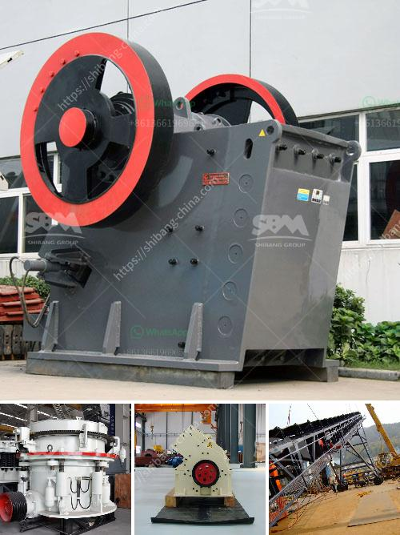

<h3>مصنع غسيل الرمال للبيع في الإمارات</h3>
تعتبر صناعة غسيل الرمال من الصناعات الحيوية والمهمة في الإمارات، حيث تستخدم الرمال في العديد من القطاعات مثل البناء والبنية التحتية وصناعة الزجاج والأسمنت والخرسانة. ولذلك، فإن وجود مصنع غسيل الرمال يعتبر ضرورياً ومهماً في تلبية الاحتياجات المتنامية للمواد الخام عالية الجودة.

يعتبر مصنع غسيل الرمال في الإمارات فرصة رائعة للاستثمار والربح، حيث يتم توفير الفرصة للحصول على كميات كبيرة من الرمال النقية والمنظفة والمطابقة للمواصفات الفنية المطلوبة. يعمل المصنع على غسيل وتنقية الرمال من الشوائب والأوساخ والمواد العضوية للحصول على منتج نهائي يلبي متطلبات السوق.

تتكون عملية غسيل الرمال من عدة خطوات، حيث يتم استخدام معدات حديثة وتقنيات متقدمة للتأكد من حصول المصنع على أعلى جودة ونقاء للمنتج النهائي. يتم البدء بغسل الرمل بالماء للتخلص من الأوساخ والشوائب السطحية، ثم يتم إزالة الأوساخ والمواد العضوية الأخرى بواسطة المعدات المتخصصة. بعد ذلك، يتم فصل الرمال عن الماء، وتجفيفها وتصنيفها حسب حجمها والمواصفات المطلوبة.

يعتبر المصنع وسيلة فعالة للاستفادة من الموارد الطبيعية الموجودة في الإمارات وتشجيع الاقتصاد المحلي. كما يوفر المصنع فرص عمل للمواطنين والمقيمين ويساهم في تطوير القطاع الصناعي المحلي.

من الجوانب المهمة في مصنع غسيل الرمال هو احترام بيئته، حيث يتم اتخاذ التدابير اللازمة للحفاظ على البيئة وتقليل التأثير البيئي الناتج عن العملية الصناعية. يتم معالجة ومراقبة المياه المستخدمة في عملية الغسيل وإعادة استخدامها بطرق آمنة وبيئية. كما يتم مراقبة وتحسين نوعية الهواء والتأكد من عدم تلوث الأرض المحيطة بالمصنع.

في الختام، يمثل مصنع غسيل الرمال فرصة مثالية للاستثمار في الإمارات، حيث يشتهر البلد بوجود مصادر غنية من الرمال عالية الجودة. يعتبر المصنع حلاً صناعياً فعالاً لتلبية الطلب المتزايد على الرمال النقية والخالية من الشوائب، ويساهم في تطوير وتحسين البنية التحتية والقطاع الصناعي للدولة.
<h3>Contact us</h3><ul><li><strong>Whatsapp:&nbsp;<a href="https://wa.me/8613661969651">+8613661969651</a></strong></li><li><a href="https://swt.shibang-china.com/?git&amp;zhl&amp;مصنع غسيل الرمال للبيع في الإمارات"><strong>Online Service(chat now)</strong></a></li></ul><h3>Related</h3><ul><li><a href='حجر الحجر الجيري المسحوق بحجم 34 بوصة.md'>حجر الحجر الجيري المسحوق بحجم 3/4 بوصة</a></li><li><a href='مسحوق الطين لصنع غانيشا.md'>مسحوق الطين لصنع غانيشا</a></li><li><a href='كسارة للبيع في ماليزيا.md'>كسارة للبيع في ماليزيا</a></li><li><a href='تقرير مشروع مصنع كسارة الحجر بتنسيق PDF.md'>تقرير مشروع مصنع كسارة الحجر بتنسيق PDF</a></li><li><a href='مصنع كبير للكسارة بسعة ١٠٠٠ حجر.md'>مصنع كبير للكسارة بسعة ١٠٠٠ حجر</a></li></ul>