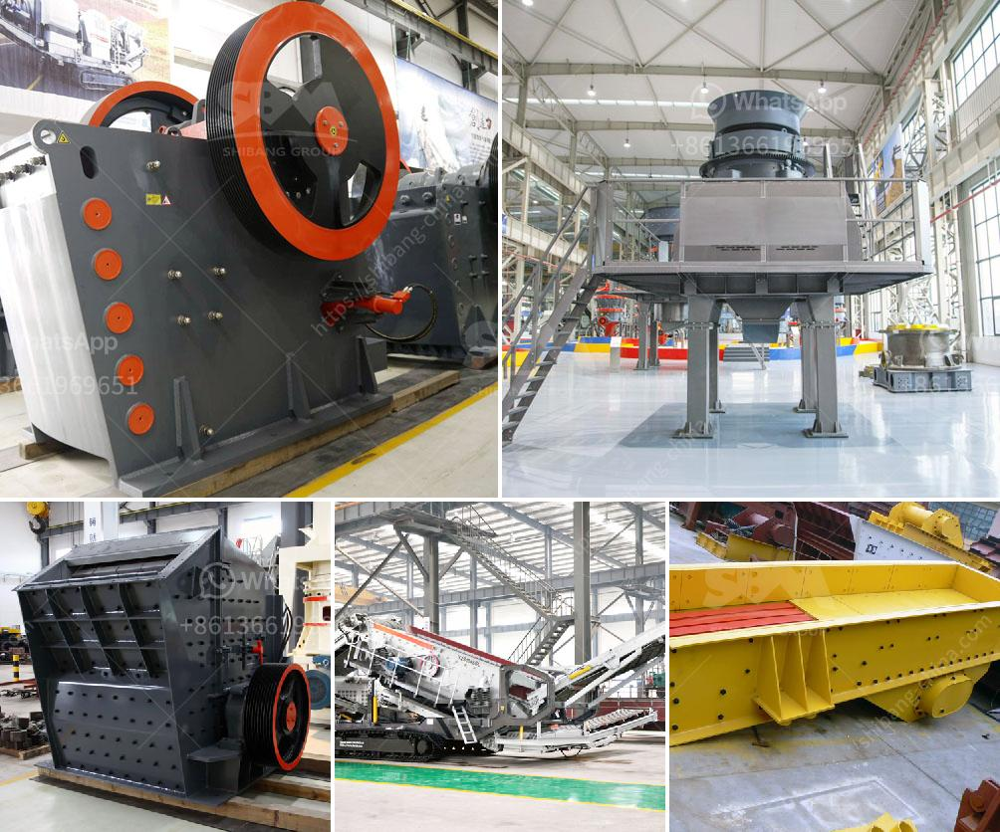

<h3>مصنع غسيل الرمل 50 طن في الساعة</h3>
يعتبر مصنع غسيل الرمل بقدرته البالغة 50 طن في الساعة من المصانع الحديثة والفعالة في تحضير الرمل المسحوق. يتم استخدام هذا المصنع في عمليات تنقية الرمال الموجودة في المحاجر والأنهار والمواقع الأخرى.

يتم تشغيل مصنع غسيل الرمل بواسطة محطة تحكم تلقائية يتم التحكم بها من خلال حاسوب يتم برمجته بشكل مسبق. تتمثل وظيفة هذا المصنع في إزالة الشوائب والشوائب الموجودة في الرمل وتنقيته لاستخدامه في مختلف الأغراض الإنشائية والصناعية.

تتكون عملية غسل الرمل في المصنع من عدة مراحل. يتم تحميل الرمل في الجزء العلوي من المصنع حيث يتم تفريغه في مغذي للرمل. يتم ضبط سرعة دخول الرمل في المغذي بواسطة جهاز تحكم أوتوماتيكي.

ثم يتم توجيه الرمل إلى الجزء الأسفل من المصنع حيث يتم غسله وتنقيته. تتم عملية الغسيل بواسطة مجموعة من المرشات والفواصل المائية التي تعمل على إزالة الرمل الملون والشوائب الأخرى الموجودة في الرمل الخام.

يتم بعد ذلك نقل الرمل المغسول إلى مجفف حيث يتم تجفيفه من الماء المتبقي. تتم هذه العملية بفضل طرق تسخين متقدمة للهواء المستخدم في عملية التجفيف.

بعد التجفيف، يتم نقل الرمل المستخلص إلى مستودعات التخزين حيث يتم تخزينه حتى يتم توزيعه واستخدامه في مشاريع البناء والتشييد.

يوفر مصنع غسيل الرمل بسعته الكبيرة العديد من المزايا. فعلى سبيل المثال، يساهم في زيادة الإنتاجية وتوفير الوقت والجهد. كما أنه يقلل من تكاليف التشغيل بشكل ملحوظ نظرًا لتوفير الطاقة والعمالة. يعد هذا المصنع حلاً عمليًا وفعالًا للشركات والمؤسسات التي تعمل في مجال استخدام الرمل.

باختصار، مصنع غسيل الرمل بسعته الكبيرة هو تقنية حديثة تساعد في تحقيق عملية فعالة ومستدامة لتحضير الرمال. إن الاستثمار في مثل هذه المصانع يمكن أن يكون فعالًا للغاية للشركات والمنظمات التي تحتاج إلى كميات كبيرة من الرمل المستخدم في عملياتها.
<h3>Contact us</h3><ul><li><strong>Whatsapp:&nbsp;<a href="https://wa.me/8613661969651">+8613661969651</a></strong></li><li><a href="https://swt.shibang-china.com/?git&amp;zhl&amp;مصنع غسيل الرمل 50 طن في الساعة"><strong>Online Service(chat now)</strong></a></li></ul><h3>Related</h3><ul><li><a href='سعر مطحنة رايموند للكاولين.md'>سعر مطحنة رايموند للكاولين</a></li><li><a href='سعر معدات التعدين المستخدمة.md'>سعر معدات التعدين المستخدمة</a></li><li><a href='مطحنة الكرة للصبغة.md'>مطحنة الكرة للصبغة</a></li><li><a href='مطاحن المطرقة.md'>مطاحن المطرقة</a></li><li><a href='خط إنتاج الحجر الجيري.md'>خط إنتاج الحجر الجيري</a></li></ul>