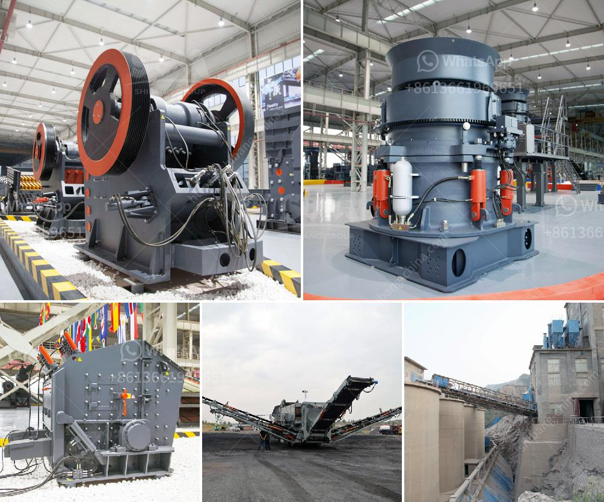

<h3>مصنع غسيل الرمل المستخدم للبيع في تكساس</h3>
يعد مصنع غسيل الرمل أحد المصانع الهامة في صناعة التعدين والبناء. وتعتبر ولاية تكساس واحدة من المناطق الرائدة في هذا المجال، حيث تتوفر فيها عدة محاجر رملية تنتج كميات كبيرة من الرمل المستخدم في البناء والإنشاءات.

تنتج مصانع غسيل الرمل في تكساس رمالًا متنوعة تناسب احتياجات العملاء المختلفة. يتم الحصول على الرمل من المحاجر ويتم نقله إلى المصنع لعملية الغسيل. يتم غسل الرمل لإزالة الشوائب والأتربة والطمي الموجودة فيه، وبالتالي يتم تحسين جودة ونقاء الرمل.

يسهم مصنع غسيل الرمل في تكساس بشكل كبير في دعم قطاع البناء، حيث يوفر الرمل بجودة عالية للاستخدام في مشاريع البنية التحتية والمباني السكنية والتجارية والصناعية. ومن المميزات المهمة للرمال المغسولة المنتجة في هذه المصانع هي قدرتها على تحمل الضغط والتأثيرات الخارجية ومقاومتها للتآكل، مما يجعلها مثالية للاستخدام في الأعمال الإنشائية الثقيلة.

بالإضافة إلى ذلك، تعمل هذه المصانع على الاستدامة البيئية وتحسين جودة البيئة المحيطة بها. فعملية غسيل الرمل تساهم في إزالة الشوائب والمواد الضارة من الرمل، ما يساعد في تقليل التلوث البيئي وتحسين جودة المياه الجوفية وحماية البيئة المحيطة بالمصنع.

وفي الختام، يمكن القول إن مصنع غسيل الرمل المستخدم للبيع في تكساس يلعب دورًا حيويًا في صناعة التعدين والبناء في الولاية. فهو يوفر الرمل عالي الجودة للتحسين والبناء، ويعمل على الاستدامة البيئية وحماية البيئة المحيطة به. ومن المتوقع أن يستمر الاستخدام المتزايد للرمل في السنوات القادمة، مما يعزز أهمية هذه المصانع ويجعلها جزءًا أساسيًا من قطاع التعدين والبناء في تكساس.
<h3>Contact us</h3><ul><li><strong>Whatsapp:&nbsp;<a href="https://wa.me/8613661969651">+8613661969651</a></strong></li><li><a href="https://swt.shibang-china.com/?git&amp;zhl&amp;مصنع غسيل الرمل المستخدم للبيع في تكساس"><strong>Online Service(chat now)</strong></a></li></ul><h3>Related</h3><ul><li><a href='مطحنة أسطوانية الكالسيوم.md'>مطحنة أسطوانية الكالسيوم</a></li><li><a href='مطحنة أسطوانية للمعادن.md'>مطحنة أسطوانية للمعادن</a></li><li><a href='استئجار سير ناقل.md'>استئجار سير ناقل</a></li><li><a href='سعر كسارة الحجر في إيران.md'>سعر كسارة الحجر في إيران</a></li><li><a href='طاحونة الكرة 800 طن يومياً.md'>طاحونة الكرة 800 طن يومياً</a></li></ul>