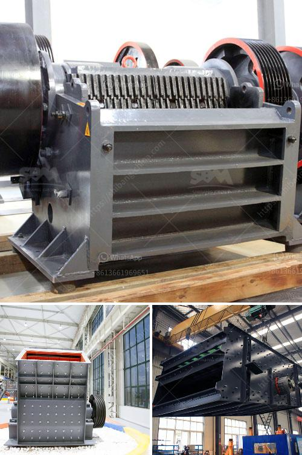

<h3>مصنع غسيل الرمل للبيع</h3>
تُعتبر عملية غسيل الرمل أمرًا حيويًا في صناعة البناء والبناء، حيث يتم استخدام الرمل على نطاق واسع في صناعة الخرسانة والزجاج والسيراميك والسباكة وغيرها من الصناعات. ومع ذلك، فإن الرمل الطبيعي المستخدم غالبًا ملوثًا بالشوائب مثل الطمي والعفن والطحالب. لحل هذه المشكلة، تأتي أهمية مصانع غسيل الرمل.

يعمل مصنع غسيل الرمل على إزالة الشوائب والأوساخ من الرمل باستخدام عمليات ميكانيكية وكيميائية متقدمة. يتكون المصنع عادةً من معدات متعددة تعمل معًا لضمان حصول العميل على رمل نقي عالي الجودة.

أولاً، يتم وضع الرمل الملوث في قسم التغذية، حيث يتم دفعه عبر الحزام الناقل إلى وحدة غسيل الرمل. يتم استخدام الماء المجهز مسبقًا في وحدة غسيل الرمل لإزالة الشوائب السطحية. ثم يتم نقل الرمل المغسول إلى وحدة غسيل ثانوية لإزالة الشوائب الدقيقة التي تعلق بالحبيبات. يتم التخلص من الشوائب بفضل استخدام خلايا تهتز ومصافي وأنظمة الترشيح.

تحتوي مصانع غسيل الرمل أيضًا على وحدات لتجفيف الرمل بعد عملية الغسيل. يتم استخدام أجهزة تجفيف حراري لتجفيف الرمل بفعالية، والتأكد من أن الرطوبة قد تمت إزالتها بشكل كافٍ.

بالإضافة إلى ذلك، تتكون المصانع من نظام مراقبة الجودة الذي يضمن أن الرمل المنتج يتوافق مع المواصفات المطلوبة. يتم اختبار الرمل لفحص محتواه من الشوائب وفحص حبيبات الرمل للتأكد من أنها ذات حجم موحد وتلبي المعايير المطلوبة.

في نهاية العملية، يتم تعبئة الرمل النقي وتخزينه في حاويات أو أكياس جاهزة للشحن والتوزيع. يتم تسويق المنتجات إما محليًا أو عالميًا للشركات المهتمة بشراء الرمل النقي عالي الجودة.

في الاعتبارات العملية، يعتبر شراء مصنع غسيل الرمل استثمارًا جيدًا. فهو يوفر فرصة لتطوير عملية إنتاج الرمل النقي، وتحسين الجودة، وزيادة الكفاءة وتحقيق الأرباح. وبالتالي، قد يبدو ثمن الشراء مغريًا بين 200-400، لكن يجب مراعاة تكاليف التشغيل المستقبلية والحفاظ على المعدات واحتياجات الصيانة.

في النهاية، يُعَدّ مصنع غسيل الرمل إجراءً حيويًا ومهمًا في صناعة البناء، حيث يساهم في توفير رمل نقي عالي الجودة للاستخدام في العديد من التطبيقات. قد يكون شراء مصنع غسيل الرمل استثمارًا جيدًا للشركات التي ترغب في تصنيع الرمل بجودة عالية وتحقيق المزيد من النجاح والتنافسية في السوق.
<h3>Contact us</h3><ul><li><strong>Whatsapp:&nbsp;<a href="https://wa.me/8613661969651">+8613661969651</a></strong></li><li><a href="https://swt.shibang-china.com/?git&amp;zhl&amp;مصنع غسيل الرمل للبيع"><strong>Online Service(chat now)</strong></a></li></ul><h3>Related</h3><ul><li><a href='تاجر آلة كسارة الحجر نيبال.md'>تاجر آلة كسارة الحجر نيبال</a></li><li><a href='شركة تصنيع آلة طحن لمسحوق ٣٠٠ شبكة.md'>شركة تصنيع آلة طحن لمسحوق ٣٠٠ شبكة</a></li><li><a href='آلة حفر الحجر الجرانيت في الهند.md'>آلة حفر الحجر الجرانيت في الهند</a></li><li><a href='مصنع كسارة المطرقة.md'>مصنع كسارة المطرقة</a></li><li><a href='مطاحن الكرة للتعدين.md'>مطاحن الكرة للتعدين</a></li></ul>