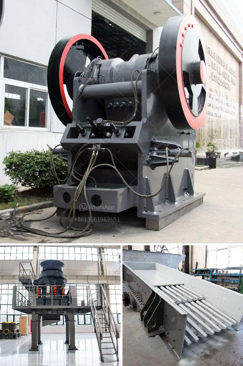

<h3>مصنع غسيل الطين الجيري</h3>
مصنع غسيل الطين الجيري هو مصنع يقوم بتنقية وغسل الطين الجيري الخام، وتحويله إلى منتج نهائي قابل للاستخدام في مختلف الصناعات. يتم استخدام الطين الجيري النقي في العديد من الصناعات مثل الصناعات الزجاجية والإسمنتية والسيراميك والصناعات الكيماوية.

يتكون مصنع غسيل الطين الجيري من عدة مراحل. في المرحلة الأولى، يتم جمع الطين الجيري الخام من المناجم وتفتيته بواسطة الكسارات والمطرقة أو الكسارات المخروطية. بعد ذلك، يتم نقل الطين الجيري المفتت إلى الغربال الاهتزازي لفصل الحجارة الكبيرة عن الحصى والرمل.

في المرحلة التالية، يتم وضع الطين الجيري المنقى في برك كبيرة مملوءة بالماء لمدة قصيرة. يتم هذا لغسل المواد الأخرى مثل الأتربة والشوائب من الطين الجيري والحصص الدقيقة من الأحجار. يتم السماح للعناصر الأخرى أن تستقر قاع البركة بينما يتم جمع الطين الجيري المنقى وتجفيفه باستخدام عمليات إعصارية وتجفيف بالهواء.

في المرحلة النهائية، يتم إجراء عمليات تصنيف وتعبئة الطين الجيري المنقى وتجفيفه بواسطة أفران خاصة لتحقيق النقاوة والجودة المطلوبة. يتم تكديس المنتج النهائي في حقائب أو حاويات للتوزيع والشحن إلى العملاء.

فوائد استخدام الطين الجيري المغسول في الصناعات متعددة. يمتاز الطين الجيري بأنه مادة غنية بالكالسيوم والمغنيسيوم وقلوالية منخفضة. بالإضافة إلى ذلك، يحتوي الطين الجيري على خصائص تمتص السوائل وتحتفظ بها، مما يجعله مادة ملائمة للاستخدام في صناعة الأعلاف وصناعة الورق.

تعتبر صناعة غسيل الطين الجيري عملية معقدة ومتطلبة. يجب على المصانع أن تلتزم بمعايير الجودة العالية لضمان أداء المنتجات وسلامة العاملين في المصنع. من المهم أيضًا أن يتم استخدام التكنولوجيا الحديثة والمعدات المتطورة لتحقيق أقصى كفاءة وجودة في إنتاج الطين الجيري المنقى.

باختصار، مصنع غسيل الطين الجيري يلعب دورًا حيويًا في تنقية وتحويل الطين الجيري الخام إلى منتج نهائي قابل للتوزيع والاستخدام في مختلف الصناعات. يعتبر الطين الجيري المغسول مادة أساسية في الصناعات الزجاجية والإسمنتية والكيماوية، ويتم استخدامه أيضًا في صناعة الورق والأعلاف.
<h3>Contact us</h3><ul><li><strong>Whatsapp:&nbsp;<a href="https://wa.me/8613661969651">+8613661969651</a></strong></li><li><a href="https://swt.shibang-china.com/?git&amp;zhl&amp;مصنع غسيل الطين الجيري"><strong>Online Service(chat now)</strong></a></li></ul><h3>Related</h3><ul><li><a href='تكلفة تشغيل الكسارة في لاس فيغاس.md'>تكلفة تشغيل الكسارة في لاس فيغاس</a></li><li><a href='أصغر كسارة فك محمولة للبيع في جنوب أفريقيا.md'>أصغر كسارة فك محمولة للبيع في جنوب أفريقيا</a></li><li><a href='تأجير حزام الناقل في أيرلندا.md'>تأجير حزام الناقل في أيرلندا</a></li><li><a href='مصانع غسيل صغيرة للبيع.md'>مصانع غسيل صغيرة للبيع</a></li><li><a href='تكنولوجيا معالجة خام الباريت.md'>تكنولوجيا معالجة خام الباريت</a></li></ul>