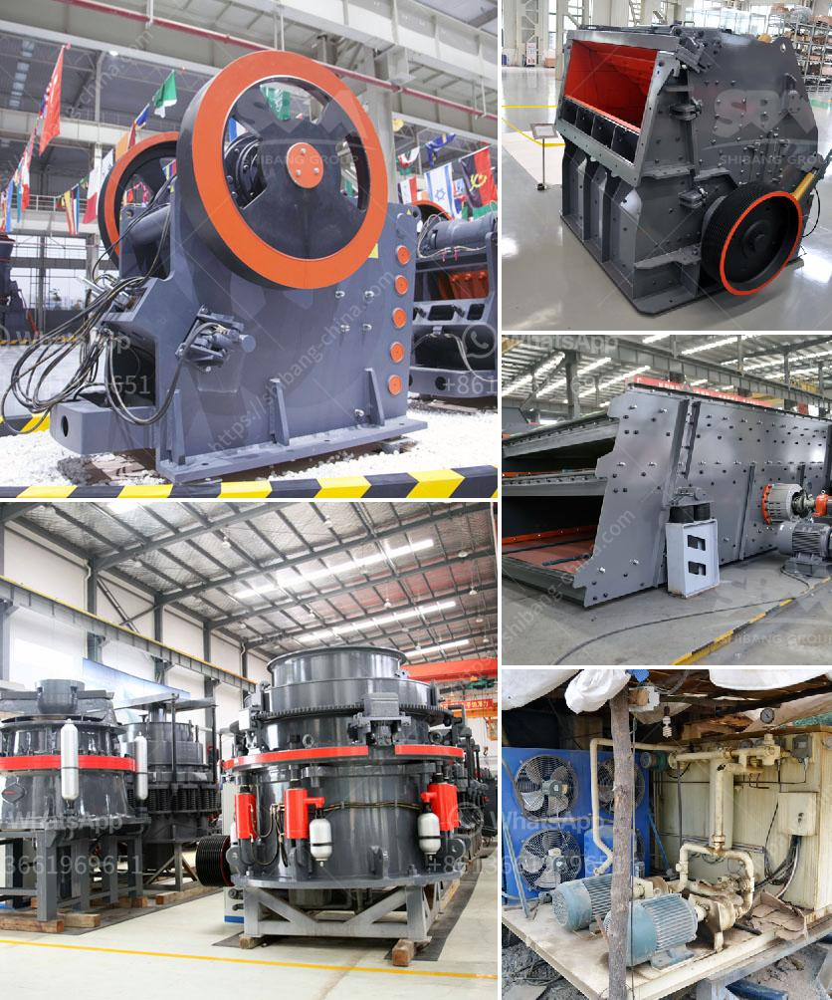

<h3>مصنع غسيل الفحم المتنقل في جنوب أفريقيا</h3>
في جنوب أفريقيا، يعتبر الفحم مصدرًا رئيسيًا للطاقة، حيث يتم اكتشاف متواجدًا بكميات كبيرة في عدة مناطق هناك. ومن أجل استغلال هذه الموارد الثمينة بكفاءة واقتصادية، تم تطوير مصنع غسيل الفحم المتنقل.

يعتبر مصنع غسيل الفحم المتنقل مشروعًا هندسيًا مبتكرًا، حيث يتم نقل المصنع بين المناطق المختلفة لمعالجة الفحم المستخرج. يتم تنقية الفحم من الشوائب والأوساخ التي قد تحتوي عليها، مما يزيد من جودته وقيمته الاقتصادية. كما أن هذا المصنع يعمل على تقليل التأثير الضار لعمليات استخراج الفحم على البيئة، حيث يتم معالجة المياه واستخدامها بطرق مستدامة.

واحدة من أهم المزايا لمصنع غسيل الفحم المتنقل هي قدرته على التكيف مع ظروف العمل المختلفة. يمكن استخدام هذا المصنع في المناطق النائية والمناطق الصحراوية في جنوب أفريقيا والتعامل مع الفحم الخام المستخرج منها. بالإضافة إلى ذلك، يعتبر هذا المصنع مرنًا للغاية وقابلًا للتعديل، مما يجعله مناسبًا لمختلف أنواع الفحم والشوائب التي قد تحتوي عليها.

عملية غسيل الفحم تتضمن عدة مراحل، بدءًا من سحق الفحم وطحنه، ومن ثم تنقيته وغسله بالماء أو المواد الكيميائية المناسبة لاستخلاص الشوائب المختلفة. يتم جمع المواد الصلبة المنفصلة عن الفحم والتعامل معها بشكل صحيح للحد من تداولها في البيئة.

بفضل المصانع المتنقلة، يمكن توسيع عمليات غسيل الفحم وتعزيز إنتاجها في جنوب أفريقيا. كما أن هذا النوع من المصانع يزيد من القدرة على الاستجابة للطلب والمتغيرات في سوق الفحم المحلية والعالمية.

في الختام، يعد مصنع غسيل الفحم المتنقل في جنوب أفريقيا إنجازًا هندسيًا مبتكرًا يسمح بتحسين عملية استخراج الفحم وتنقيةه بكفاءة واقتصادية. ومن خلال تطوير هذه التكنولوجيا المتنقلة، يمكن تعزيز صناعة الفحم وتحقيق التنمية المستدامة في جنوب أفريقيا.
<h3>Contact us</h3><ul><li><strong>Whatsapp:&nbsp;<a href="https://wa.me/8613661969651">+8613661969651</a></strong></li><li><a href="https://swt.shibang-china.com/?git&amp;zhl&amp;مصنع غسيل الفحم المتنقل في جنوب أفريقيا"><strong>Online Service(chat now)</strong></a></li></ul><h3>Related</h3><ul><li><a href='إنتاج خام الحديد حسب الولاية في الهند.md'>إنتاج خام الحديد حسب الولاية في الهند</a></li><li><a href='مصنعي آلات سحق النحاس في الصين.md'>مصنعي آلات سحق النحاس في الصين</a></li><li><a href='سعر مطحنة الكرة في نيجيريا.md'>سعر مطحنة الكرة في نيجيريا</a></li><li><a href='كسارات الحجر من السويد.md'>كسارات الحجر من السويد</a></li><li><a href='نوع من مطحنة الكرة.md'>نوع من مطحنة الكرة</a></li></ul>