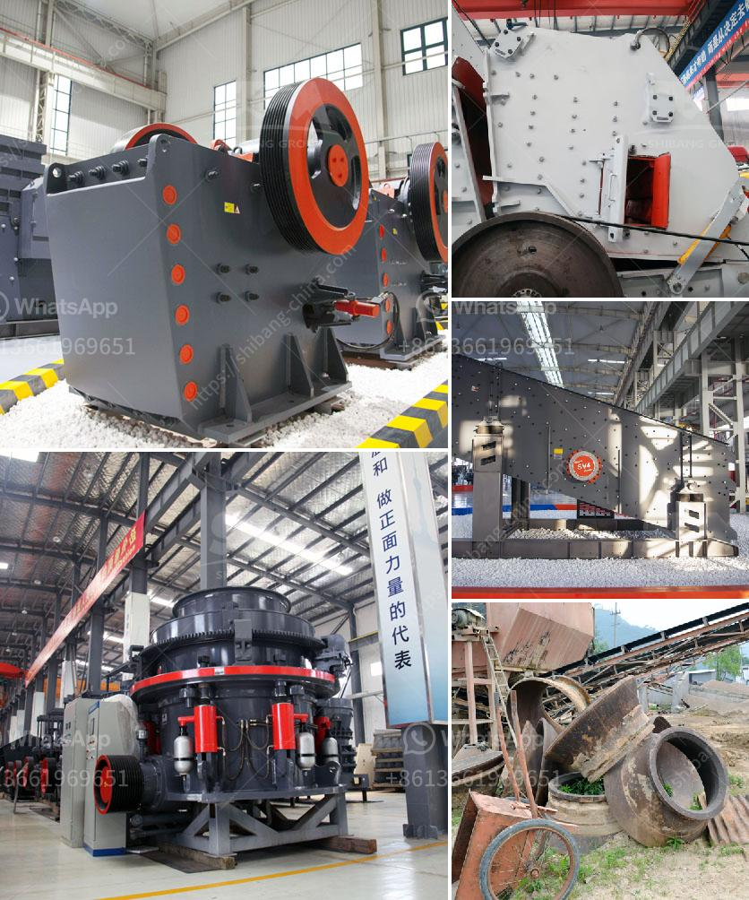

<h3>مصنع غسيل الفحم في جنوب أفريقيا الفلبين</h3>
عند النظر إلى قطاع الطاقة في جنوب أفريقيا، لا يمكن تجاهل دور الفحم الهام في توليد الكهرباء. تعتبر جنوب أفريقيا منتجًا رئيسيًا للفحم في العالم، وبالتالي فإن مصانع غسيل الفحم تلعب دورًا حاسمًا في إعداد الفحم للاستخدام الصناعي والتجاري.

تقع الفلبين بجنوب شرقي آسيا وتعتبر الآن منتجًا ومصدرًا للفحم المعد للتصدير. يجري استخراج الفحم في العديد من المواقع في الفلبين، ويتطلب إعداده للتصدير تنقيته وغسيله. لذا، تم إنشاء مصنع غسيل فحم في الفلبين لتلبية الطلب المحلي وكذلك لتصدير الفحم إلى الدول الأخرى.

تعتبر مصانع غسيل الفحم في جنوب أفريقيا والفلبين ضرورية لتنقية الفحم من الشوائب والمواد العالقة. يتم تنظيف الفحم من خلال تكرار عملية الغسيل الميكانيكي باستخدام الماء والفصل الميكانيكي للفحم عن الرواسب الصخرية والمعادن الأخرى. عملية الغسيل تؤدي إلى زيادة جودة الفحم وتحسين القدرة على الاحتراق، مما يزيد من كفاءة استخدامه في توليد الكهرباء.

في جنوب أفريقيا، تستخدم مصانع غسيل الفحم تقنيات حديثة لمعالجة الفحم. يتم نقل الفحم إلى المصنع بواسطة شاحنات النقل أو السكك الحديدية، ويرسل إلى الغسيل حيث يتم طحنه وخلطه قبل أن يتم وضعه في المغسلة. يتم استخدام الماء والمواد الكيميائية المخصصة للغسيل، حيث يتم تشغيل الفحم في الماء لإزالة الوساخة والرواسب. يتم تصفية الفحم المغسول وتجفيفه قبل نقله إلى مكان التخزين.

من المهم أيضًا الإشارة إلى أن مصانع غسيل الفحم تلتزم بمعايير السلامة وحماية البيئة. تحتوي مصانع غسيل الفحم على أنظمة لمعالجة ومراقبة مياه الصرف الصناعي ومعالجة الغازات المنبعثة. يتم تنفيذ إجراءات السلامة المشددة لضمان سلامة العمال وحماية البيئة من التلوث.

إن وجود مصانع غسيل الفحم في جنوب أفريقيا والفلبين يعزز الاقتصادات المحلية بتوفير فرص عمل للعديد من الأشخاص وزيادة الإيرادات المحلية من صادرات الفحم. كما يحسن إعداد الفحم للاستخدام ويقلل من انبعاثات الكربون الناتجة عن حرق الوقود الأحفوري. وبالتالي، تلعب مصانع غسيل الفحم في جنوب أفريقيا والفلبين دورًا هامًا في تلبية احتياجات الكهرباء المتزايدة والمساهمة في تحقيق أهداف تنويع مصادر الطاقة وتقليل التلوث.
<h3>Contact us</h3><ul><li><strong>Whatsapp:&nbsp;<a href="https://wa.me/8613661969651">+8613661969651</a></strong></li><li><a href="https://swt.shibang-china.com/?git&amp;zhl&amp;مصنع غسيل الفحم في جنوب أفريقيا الفلبين"><strong>Online Service(chat now)</strong></a></li></ul><h3>Related</h3><ul><li><a href='خدمات آلة التكسير.md'>خدمات آلة التكسير</a></li><li><a href='مصنع طحن كلنكر الإسمنت في الهند.md'>مصنع طحن كلنكر الإسمنت في الهند</a></li><li><a href='صيانة مطحنة ريموند.md'>صيانة مطحنة ريموند</a></li><li><a href='استثمار مصنع كسارة الحجر.md'>استثمار مصنع كسارة الحجر</a></li><li><a href='آلة غسيل الرمل في المملكة العربية السعودية.md'>آلة غسيل الرمل في المملكة العربية السعودية</a></li></ul>