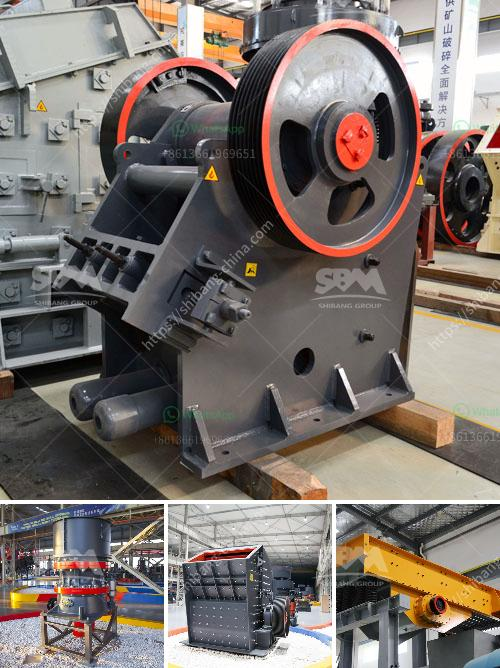

<h3>مصنع غسيل الكروم الطبيعي</h3>
يعتبر غسيل الكروم الطبيعي عملية تستخدم لتغطية الأسطح المعدنية بطبقة من الكروم، وتقوم به بشكل رئيسي المصانع وورش التصنيع لتحسين المظهر الخارجي وحماية المعدن من التآكل والتآكل.

يعد غسيل الكروم الطبيعي هو أحد أنواع تقنيات التصفيح الكيميائي، حيث يتم إضافة الكروم إلى السطح المعدني لتحسين خصائصه الفيزيائية والكيميائية. يتم تنفيذ عملية غسيل الكروم الطبيعي عن طريق غمر القطعة المعدنية في حوض يحتوي على محلول يحتوي على مركبات الكروم الثلاثية. عملية الغسيل تتطلب ضبط تركيز المحلول ودرجة الحرارة ووقت الانغماس وذلك للحصول على نتائج مثلى.

تتميز عملية غسيل الكروم الطبيعي بالعديد من الفوائد. أولاً وقبل كل شيء، توفر هذه العملية طبقة حماية فائقة للمعدن عن طريق تحسين قوة الالتصاق ومقاومة التآكل والتآكل. كما أنها تعزز من القدرة على التحمل للتأثيرات الجوية القاسية مثل التغيرات في درجات الحرارة والرطوبة. 

بالإضافة إلى ذلك، غسيل الكروم الطبيعي يعطي السطح المعدني مظهرًا جذابًا ولامعًا، مما يزيد من قيمته التجارية ويجعله يبدو أكثر أناقة وروعة. تستخدم غالبًا في تطبيقات صناعية مثل التجهيزات الصناعية والسيارات والدراجات النارية والأجهزة المنزلية والأدوات الكهربائية.

من الأمور التي يجب مراعاتها عند استخدام غسيل الكروم الطبيعي هي ضرورة اتباع إرشادات السلامة المناسبة. حيث يعتبر المحلول المستخدم سامًا، وبالتالي يتطلب اتخاذ تدابير أمان مثل ارتداء الملابس الواقية والقفازات والاحتفاظ به في أماكن آمنة.

في الختام، يُعد غسيل الكروم الطبيعي عملية مهمة في صناعة التصنيع والتشطيب المعدني. إنها تعزز مظهر المعدن وتحميه من التآكل، مما يساهم في زيادة عمر القطعة المعدنية وقيمتها التجارية. كما أنها تشكل الخيار الأمثل للعديد من التطبيقات الصناعية التي تتطلب مظهرًا لامعًا ومقاومة فائقة للتآكل والتآكل.
<h3>Contact us</h3><ul><li><strong>Whatsapp:&nbsp;<a href="https://wa.me/8613661969651">+8613661969651</a></strong></li><li><a href="https://swt.shibang-china.com/?git&amp;zhl&amp;مصنع غسيل الكروم الطبيعي"><strong>Online Service(chat now)</strong></a></li></ul><h3>Related</h3><ul><li><a href='آلات إنتاج مسحوق كربونات الكالسيوم.md'>آلات إنتاج مسحوق كربونات الكالسيوم</a></li><li><a href='معدات تعدين الذهب.md'>معدات تعدين الذهب</a></li><li><a href='آلة طحن السليكات في الهند.md'>آلة طحن السليكات في الهند</a></li><li><a href='كسارة مخروطية بسعة 100 طن في الساعة.md'>كسارة مخروطية بسعة 100 طن في الساعة</a></li><li><a href='التكسير الصخور للبيع.md'>التكسير الصخور للبيع</a></li></ul>