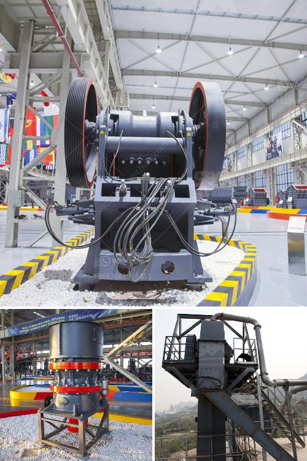

<h3>مصنع غسيل الكروم للبيع في جنوب أفريقيا</h3>
في جنوب أفريقيا، يُعتبر مصنع غسيل الكروم من أبرز المصانع الصناعية التي توفرت للبيع. وهو يعتبر فرصة مثيرة للمستثمرين الذين يبحثون عن فرص استثمارية مشوقة في صناعة التعدين والصناعات الثانوية المعدنية. توجد في جنوب أفريقيا كمية هائلة من مناجم الكروم، وهذا ما يجعل البلاد مكانًا مثاليًا لتأسيس مثل هذا المصنع.

يستخدم مصنع غسيل الكروم في جنوب أفريقيا لتصنيع معدن الكروم من خام الكروم الخام المستخرج من المناجم المحلية. يعد الكروم واحدًا من المعادن الأساسية التي تستخدم في عدة صناعات مختلفة، مثل صناعة الفولاذ، والسيارات، والطيران، والصناعات التكنولوجية. لذلك، يظل الطلب العالمي على الكروم مستمرًا ومزدهرًا، وهو ما يجعل هذا المصنع فرصة استثمارية مثالية.

يتضمن مصنع غسيل الكروم العديد من العمليات الرئيسية، مثل الغربلة، والتكسير، والطحن، والتخمير، وغسيل الرواسب، والترشيح. تهدف هذه العمليات إلى فصل الكروم عن خام الكروم الخام للحصول على منتج نهائي عالي الجودة. يتم استخدام الكيماويات والمذيبات في هذه العمليات، ويجب أن تتم باستخدام تقنيات آمنة وفعالة للتأكد من الحفاظ على سلامة الموظفين والحد من تأثيرها على البيئة المحيطة.

يمتاز مصنع غسيل الكروم في جنوب أفريقيا ببنيته التحتية القوية والمتطورة، وتوافر الوقود والمياه اللازمة لعمليات التشغيل. كما يتضمن المصنع معدات حديثة ومتخصصة لتحقيق أعلى كفاءة وجودة في العمليات. يجب أن يتم استثمار الوقت والجهد في صيانة وتشغيل المصنع بأعلى مستويات الأمان والأداء.

بالاضافة إلى ذلك، يجب أن يتم التركيز على توفير العمالة المهرة والمؤهلة لتشغيل المصنع بنجاح. يجب أن يكون لديهم المعرفة والخبرة في مجال صناعة الكروم وعمليات الغسيل. يمكن أن تسهم التدريبات المستمرة وتبادل المعرفة في تطوير وتحسين أداء العمالة.

في النهاية، يعد مصنع غسيل الكروم في جنوب أفريقيا فرصة مثيرة للمستثمرين الراغبين في الاستثمار في صناعة التعدين والصناعات الثانوية المعدنية. توفر البنية التحتية القوية والطلب المحلي والعالمي على الكروم، ويمكن أن يكون مصدرًا جيدًا للدخل المستدام. ومع العناية الجيدة بالناحية البيئية والاجتماعية، يمكن لمصنع غسيل الكروم في جنوب أفريقيا أن يكون فرصة استثمارية ناجحة ومستدامة.
<h3>Contact us</h3><ul><li><strong>Whatsapp:&nbsp;<a href="https://wa.me/8613661969651">+8613661969651</a></strong></li><li><a href="https://swt.shibang-china.com/?git&amp;zhl&amp;مصنع غسيل الكروم للبيع في جنوب أفريقيا"><strong>Online Service(chat now)</strong></a></li></ul><h3>Related</h3><ul><li><a href='مصنع غسيل الفحم في جنوب أفريقيا الفلبين.md'>مصنع غسيل الفحم في جنوب أفريقيا الفلبين</a></li><li><a href='خط إنتاج التلك.md'>خط إنتاج التلك</a></li><li><a href='كسارة الصدم PF لآلة تكسير الحجر للبيع.md'>كسارة الصدم PF لآلة تكسير الحجر للبيع</a></li><li><a href='مطحنة محمولة في أستراليا بيرث.md'>مطحنة محمولة في أستراليا بيرث</a></li><li><a href='شركة تصنيع معدات الجبس.md'>شركة تصنيع معدات الجبس</a></li></ul>