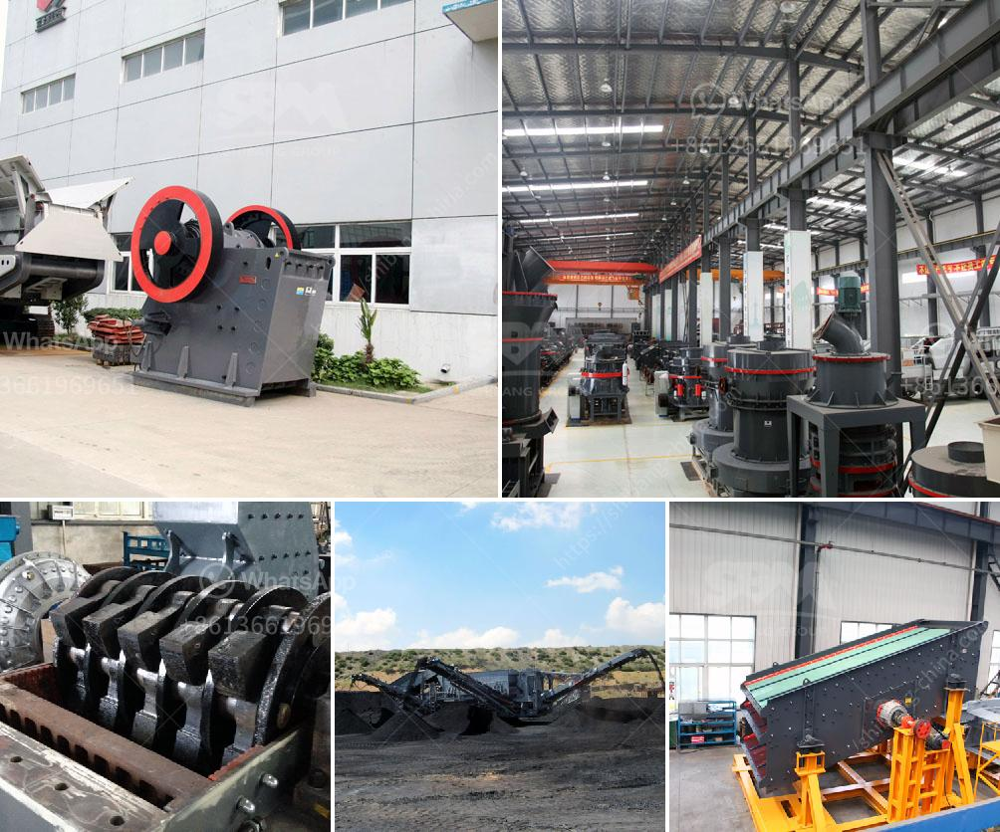

<h3>مصنع غسيل الماس في جنوب أفريقيا</h3>
يُعد مصنع غسيل الماس في جنوب أفريقيا من أبرز المصانع التي تقوم بتجهيز وتنقية الماس في العالم. تعد جنوب أفريقيا واحدة من أكبر منتجي ومصدّري الماس في العالم، ويُعزى ذلك إلى وفرة مواردها الطبيعية من الماس.

يعتبر غسيل الماس مرحلة مهمة في العملية التصنيعية للأحجار الكريمة، حيث يتم باستخدامه تجهيز وتنقية الماس المنقول من المناجم وإنتاج قطع ماسية جاهزة للبيع. وتعمل المصانع في جنوب أفريقيا على معالجة وتحويل الأحجار الخام إلى منتجات قيمة وذات جودة عالية.

يتم عادة استخراج الماس من الألغام باستخدام طرق تنقية تقليدية مثل الفرز اليدوي وفرز الغرابيل والفرز بالرياح. ومع ذلك، فإن تقنيات غسيل الماس الحديثة التي تستخدم في المصانع تعزز من كفاءة ودقة العملية وتضمن استخلاص كل حبيبات الماس القيمة.

على سبيل المثال، يتم استخدام تقنية الفرز بالأشعة السينية في بعض المصانع، حيث يتم استخدام الأشعة السينية لفصل الأحجار الكريمة عن الأحجار العادية ومعالجتها بالتصنيع الإلكتروني. هذه العملية تعتبر أكثر دقة وفعالية في تجهيز الماس، حيث يمكن تحديد جودة كل قطعة وفصلها بدقة عن الأحجار القلوية.

بالإضافة إلى ذلك، تقوم المصانع أيضًا بتلميع وتشكيل الأحجار الكريمة. يتم استخدام تقنيات التلميع المتقدمة والآلات المتطورة للوصول إلى الشكل المطلوب والحصول على سطح مثالي للماس. يعمل العاملون في المصانع على تحقيق جودة عالية ولمعة براقة للأحجار المصقولة، مما يعزز من قيمتها وجاذبيتها.

يمثل مصنع غسيل الماس في جنوب أفريقيا صناعة مهمة بالنسبة للبلاد، حيث يسهم في تعزيز الاقتصاد المحلي وتوفير فرص العمل للسكان المحليين. كما يساهم في تصدير منتجات ذات قيمة عالية إلى أسواق عالمية.

باختصار، يعتبر مصنع غسيل الماس في جنوب أفريقيا ركيزة أساسية في صناعة المجوهرات الفاخرة حول العالم. فهو يعكس التقدم التكنولوجي الحديث في تجهيز وتنقية الماس، ويعزز قيمة الأحجار الكريمة التي تُنتجها، ويدعم الاقتصاد المحلي بشكل كبير.
<h3>Contact us</h3><ul><li><strong>Whatsapp:&nbsp;<a href="https://wa.me/8613661969651">+8613661969651</a></strong></li><li><a href="https://swt.shibang-china.com/?git&amp;zhl&amp;مصنع غسيل الماس في جنوب أفريقيا"><strong>Online Service(chat now)</strong></a></li></ul><h3>Related</h3><ul><li><a href='كسارة الحجر للبيع في الإمارات.md'>كسارة الحجر للبيع في الإمارات</a></li><li><a href='سعر كسارة الصخور 8 مم.md'>سعر كسارة الصخور 8 مم</a></li><li><a href='خط إنتاج الرمل الاصطناعي.md'>خط إنتاج الرمل الاصطناعي</a></li><li><a href='السعر على مطحنة التعدين 10 طن في الساعة.md'>السعر على مطحنة التعدين 10 طن في الساعة</a></li><li><a href='تحسين الجرافيت.md'>تحسين الجرافيت</a></li></ul>