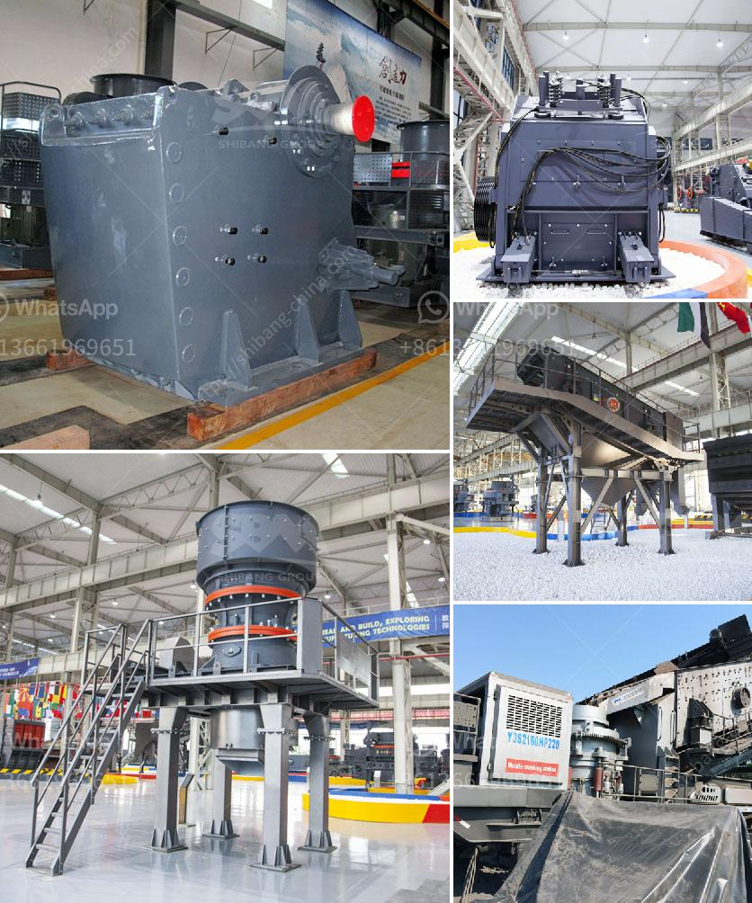

<h3>مصنع غسيل رمال الكروم بأسعار مناسبة</h3>
يعتبر مصنع غسيل رمال الكروم أحد المنشآت الصناعية الحديثة التي تقوم بتنقية الرمال من خام الكروم وتحويلها إلى منتجات جاهزة للاستخدام في عدة صناعات مختلفة. ويعد الكروم من المعادن القيمة التي تستخدم في صناعة الصلب والمعادن الأخرى، ولذلك يحظى باهتمام كبير في الصناعة.

يجمع مصنع غسيل رمال الكروم بين التكنولوجيا الحديثة والعمليات الذكية لضمان الحصول على منتج نهائي ذو جودة عالية. يتم استخدام أجهزة الفرز والفصل المغناطيسي والغربلة لفصل الرمال عن الشوائب والمواد الغير مرغوب فيها. يتم بعد ذلك غسيل الرمال لإزالة الطين والأتربة والأشوائب الأخرى، مما يؤدي إلى الحصول على منتج نهائي خالٍ من الشوائب.

تتمتع مصانع غسيل رمال الكروم بالقدرة على إنتاج كميات كبيرة من الرمال النقية في وقت قصير، مما يؤدي إلى توفير الوقت والجهد في عمليات الإنتاج. بالإضافة إلى ذلك، تتمتع هذه المصانع بالقدرة على تحقيق استدامة الإنتاج وحماية البيئة، حيث يتم استخدام تقنيات الغسيل المتقدمة التي تقلل من استهلاك المياه والطاقة والحد من الانبعاثات الضارة للبيئة.

يتوفر مصنع غسيل رمال الكروم بأسعار مناسبة للعملاء المهتمين. يتم توفير مجموعة متنوعة من المنتجات وفقًا لمتطلبات العملاء والمواصفات المطلوبة. يمكن أن تتراوح الأسعار بين 200 إلى 400 دولار للطن، وذلك يعتمد على حجم الطلب والجودة المطلوبة. يتم تحديد السعر النهائي بعد التفاوض مع العميل وتقييمه لمتطلباته والكمية المرغوبة.

بالاعتماد على الجودة العالية والأسعار المناسبة، يصبح مصنع غسيل رمال الكروم خيارًا مثاليًا للعملاء في صناعة الصلب والألومنيوم وغيرها من الصناعات. فهو يوفر منتجات عالية الجودة تلبي المعايير الصناعية العالمية بأسعار تنافسية. كما يساهم المصنع في دفع عجلة الاقتصاد المحلي وتوفير فرص العمل للعديد من العاملين المهرة في مجال صناعة الغسل والتنقية.

في الختام، فإن مصنع غسيل رمال الكروم يعتبر حلاً فعالاً واقتصادياً لتحويل الخامات الطبيعية إلى منتجات قيمة. كما يلبي متطلبات العملاء من حيث الجودة والكمية والأسعار المناسبة. يعتبر هذا المصنع رمزاً للتنمية الصناعية المستدامة والاستدامة البيئية في القطاع الصناعي.
<h3>Contact us</h3><ul><li><strong>Whatsapp:&nbsp;<a href="https://wa.me/8613661969651">+8613661969651</a></strong></li><li><a href="https://swt.shibang-china.com/?git&amp;zhl&amp;مصنع غسيل رمال الكروم بأسعار مناسبة"><strong>Online Service(chat now)</strong></a></li></ul><h3>Related</h3><ul><li><a href='شركة تصنيع معدات التعدين في الصين.md'>شركة تصنيع معدات التعدين في الصين</a></li><li><a href='كسارات صخور cec للبيع.md'>كسارات صخور cec للبيع</a></li><li><a href='كيف يعمل مطحنة الطحن.md'>كيف يعمل مطحنة الطحن</a></li><li><a href='مطاحن الكرة للبيع في كندا.md'>مطاحن الكرة للبيع في كندا</a></li><li><a href='كسارة صغيرة للبيع في المحجر.md'>كسارة صغيرة للبيع في المحجر</a></li></ul>