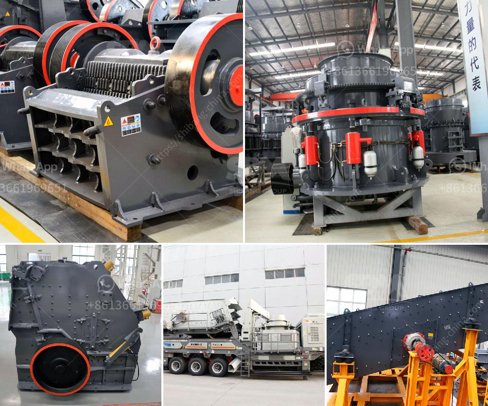

<h3>مصنع غسيل رمل الذهب</h3>
مصنع غسيل رمل الذهب هو مصنع يهدف إلى استخلاص الذهب من رمال الأنهار أو الوديان أو المناجم. يتم استخدام هذا النوع من المصانع بشكل واسع في صناعة التعدين للذهب، حيث يتم استخلاص الجسيمات الدهنية من الرمال والحصى وفصل الذهب عنها.

يعمل المصنع بطرق متنوعة، ولكن التقنيات الأكثر شيوعًا تتضمن استخدام الماء والأعاصير والهزازات الاهتزازية. يتم وضع الرمال والحصى في وعاء مائي حيث يتم إضافة الماء بلاستمرار لتكوين طبقة سطحية، وهذا يساعد في طمس الجسيمات الدهنية وفصلها عن الرمال. يتم استخلاص الذهب من الرمل باستخدام أدوات مثل الكويكسلوسين والكرايبلاندير وغيرها.

بعد فصل الجسيمات الدهنية، يتم فقد الذهب من خلال عملية التصفية والغسيل بالماء النقي. يتم تنظيف الرمال المستخدمة في المصنع وتجفيفها باستخدام مطاحن أو أفران خاصة، ويتم تخزين الذهب في صناديق آمنة حتى يتم تصنيعه أو بيعه.

مصانع غسيل رمل الذهب تمثل جزءًا مهمًا من صناعة التعدين، حيث تتيح استخراج الذهب بكميات كبيرة وبشكل فعال. تعتبر الألغام والمناجم التي تحتوي على نسب كبيرة من رمل الذهب مصدرًا أساسيًا للذهب في العالم، وتساهم هذه المصانع في تلبية احتياجات الأسواق المحلية والعالمية من الذهب.

وبصفة عامة، فإن مصانع غسيل رمل الذهب ليست فقط مفيدة من الناحية الاقتصادية، ولكن أيضًا بيئيًا. فهي تساعد على إزالة الملوثات والمخلفات الصلبة من الرمال والحصى وتحسين جودتها واستخلاص الذهب بشكل نظيف وآمن. وذلك بفضل استخدام التقنيات المتقدمة ومراقبة العمليات وتطبيق معايير السلامة العالمية.

باختصار، فإن مصنع غسيل رمل الذهب هو مصنع يستخدم لاستخلاص الذهب من رمال الأنهار والمناجم، ويعمل من خلال فصل الجسيمات الدهنية والجراثيم عن الذهب. يسهم في تلبية الطلب على الذهب وتحسين جودة الرمال والحصى بشكل نظيف وفعال. كما أنه يلعب دورًا مهمًا في صناعة التعدين والحفاظ على البيئة.
<h3>Contact us</h3><ul><li><strong>Whatsapp:&nbsp;<a href="https://wa.me/8613661969651">+8613661969651</a></strong></li><li><a href="https://swt.shibang-china.com/?git&amp;zhl&amp;مصنع غسيل رمل الذهب"><strong>Online Service(chat now)</strong></a></li></ul><h3>Related</h3><ul><li><a href='كسارة خام البوتاش.md'>كسارة خام البوتاش</a></li><li><a href='تكلفة إنشاء مصنع الأسمنت الصغير في الهند.md'>تكلفة إنشاء مصنع الأسمنت الصغير في الهند</a></li><li><a href='مناجم رمل السيليكا في الفلبين.md'>مناجم رمل السيليكا في الفلبين</a></li><li><a href='خطة عمل لكربونات الكالسيوم.md'>خطة عمل لكربونات الكالسيوم</a></li><li><a href='سعر مصنع التكسير.md'>سعر مصنع التكسير</a></li></ul>