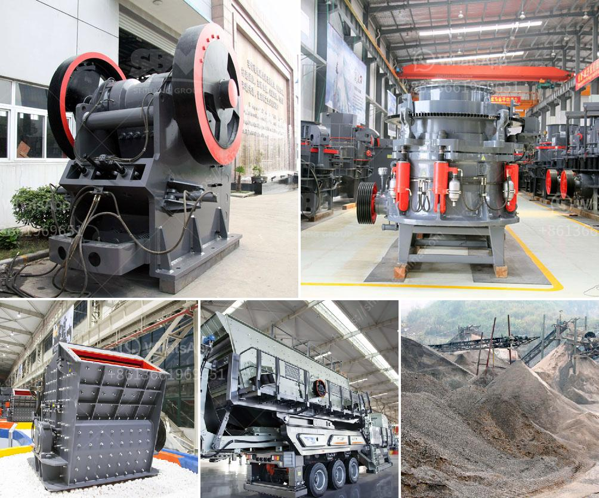

<h3>مصنع غسيل رمل السيليكا بالحمض</h3>
يعتبر رمل السيليكا مادة هامة في عدة صناعات مختلفة، مثل الزجاج، الإسمنت، السيراميك، والإلكترونيات. ومن أجل استخدامه في هذه الصناعات بشكل صحيح، يحتاج الرمل إلى أن يكون نقياً وخالياً من الشوائب. ولتحقيق ذلك، يتم غسل رمل السيليكا بالحمض.

يعمل مصنع غسيل الرمل بالحمض على إزالة الشوائب من الرمل المستخدم من خلال تفاعل الحمض مع تلك الشوائب وتحليلها. تستخدم الحموض الشائعة في عملية التنقية حمض الهيدروكلوريك أو حمض الكبريتيك. تعتمد طريقة العمل على إضافة الحمض إلى الماء، ثم دمج ذلك المحلول مع رمل السيليكا في حوض خاص.

في البداية، يتم وضع الرمل في مجرى الماء المعبأ بالحمض. يتفاعل الحمض مع الشوائب الموجودة في الرمل، مما يؤدي إلى تنشيط عملية إزالة الشوائب وتحليلها. بعد فترة من الزمن، يتم غسيل الرمل بالماء النقي للتخلص من الحمض والشوائب المذابة في الماء.

تحتاج عملية غسيل الرمل بالحمض إلى احترافية ورعاية من العاملين في المصنع. يجب التأكد من أن نسبة الحمض في الماء تكون مناسبة للإزالة الفعالة للشوائب دون الإضرار بحبيبات الرمل نفسها. لذا، يتم قياس نسبة الحمض في المحلول بشكل منتظم للتحكم في عملية الغسيل بشكل خاص.

يعمل مصنع غسيل رمل السيليكا بالحمض على ضمان إنتاج رمل نقي وخالٍ من الشوائب، مما يتيح استخدامه في صناعات مختلفة بجودة عالية. وبفضل تلك العملية، يمكن تحسين الأداء والمتانة للمنتجات التي تحتاج إلى استخدام الرمل النقي، مثل الزجاج ذو النقاء العالي أو الإلكترونيات الدقيقة.

باختصار، يعتبر مصنع غسيل رمل السيليكا بالحمض أحد العناصر الرئيسة في صناعات متعددة، حيث يسمح بإزالة وتنقية الشوائب الموجودة في رمل السيليكا. تتطلب هذه العملية الاحترافية والتأكد من تنظيف وتحلية الرمل بشكل صحيح لضمان جودة ومتانة المنتجات النهائية التي تعتمد على استخدام الرمل النقي.
<h3>Contact us</h3><ul><li><strong>Whatsapp:&nbsp;<a href="https://wa.me/8613661969651">+8613661969651</a></strong></li><li><a href="https://swt.shibang-china.com/?git&amp;zhl&amp;مصنع غسيل رمل السيليكا بالحمض"><strong>Online Service(chat now)</strong></a></li></ul><h3>Related</h3><ul><li><a href='حساب قطر كرة الطحن لمطحنة الكرة.md'>حساب قطر كرة الطحن لمطحنة الكرة</a></li><li><a href='كسارات الفك المستعملة في إسبانيا.md'>كسارات الفك المستعملة في إسبانيا</a></li><li><a href='كسارات الحجر المستعملة للبيع في ألمانيا.md'>كسارات الحجر المستعملة للبيع في ألمانيا</a></li><li><a href='موردين محمولين لكسارة الحجر.md'>موردين محمولين لكسارة الحجر</a></li><li><a href='مطحنة هامر في جنوب أفريقيا.md'>مطحنة هامر في جنوب أفريقيا</a></li></ul>