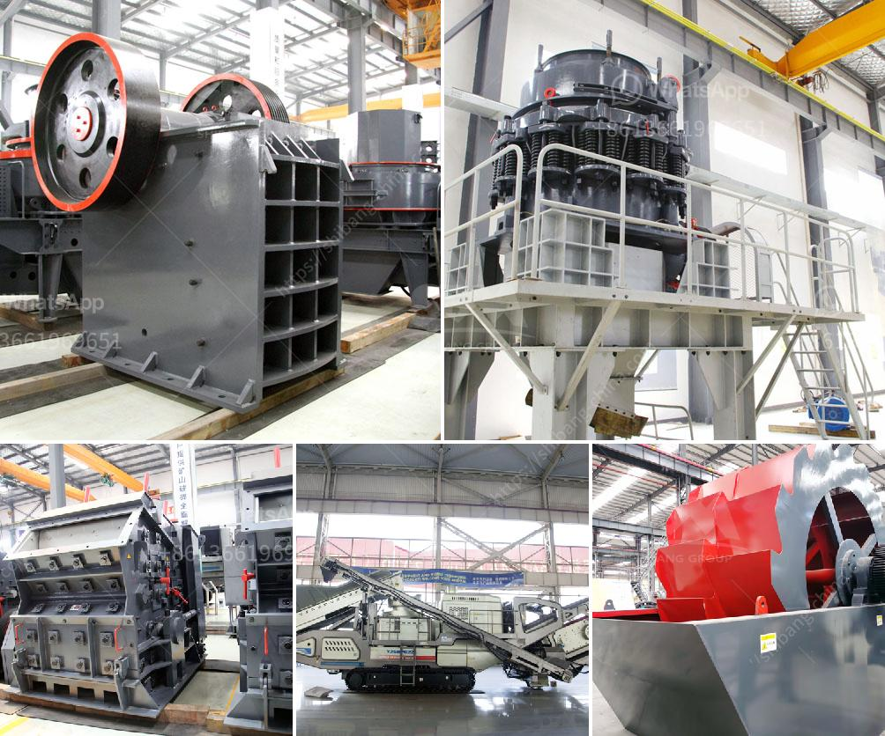

<h3>مصنع غسيل رمل السيليكا في الهند</h3>
يُعد رمل السيليكا من الموارد الهامة والقيّمة في صناعات البناء والصناعات الكيميائية والزجاجية. وتُعتبر الهند واحدة من أكبر منتجي رمل السيليكا في العالم، حيث تمتلك العديد من المصانع التي تقدم هذه المادة الحيوية وتعد مصنع غسيل رمل السيليكا في الهند من الأمثلة المشهورة.

يتخصص مصنع غسيل رمل السيليكا في التصنيع والتحضير والتجهيز لهذه المادة الخام. يتم معالجة الرمل عن طريق عملية الغسيل، حيث يتم فصل كافة الشوائب والشوائب العضوية، مما يؤدي إلى الحصول على رمل السيليكا ذي النقاء العالي والجودة المطلوبة.

تؤدي عملية غسيل الرمل إلى التخلص من الرمال الطينية والملوثات الأخرى التي يمكن أن تؤثر على جودة رمل السيليكا. يتم غسيل الرمل بواسطة الماء والمواد الكيميائية المناسبة للتخلص من الشوائب. وبعد عملية الغسيل، يتم تجفيف الرمل بواسطة الهواء الساخن أو التجفيف الطبيعي للحصول على منتج نهائي جاهز للاستخدام.

تحظى منتجات رمل السيليكا في الهند بشعبية كبيرة في السوق المحلية والعالمية، نظرًا لنقاوتها وجودتها العالية. يُستخدم رمل السيليكا في العديد من الصناعات مثل صناعة الزجاج وصناعة السيراميك وصناعة البناء. كما أنه يستخدم في صناعة المواد الكيميائية ومنتجات العناية بالبشرة والمنظفات.

تعتبر صناعة غسيل رمل السيليكا في الهند من الصناعات الحيوية والمهمة للاقتصاد الهندي. تعمل هذه المصانع على توفير فرص عمل للكثير من العاملين في هذا المجال، بالإضافة إلى تحقيق إيرادات مالية هامة للدولة.

ومن الجدير بالذكر أن هناك العديد من المصانع لغسيل رمل السيليكا في الهند تتبع المعايير العالمية لجودة المنتجات وتطبيق الممارسات البيئية المستدامة. تلتزم هذه المصانع بتقديم منتجات عالية الجودة وصديقة للبيئة تفي بمتطلبات السوق العالمية.

باختصار، يُعتبر مصنع غسيل رمل السيليكا في الهند من المصانع الرائدة في إنتاج رمل السيليكا عالي الجودة. يلتزم المصنع بتوفير منتجات ذات جودة عالية ومستدامة، مما يجعله موردًا موثوقًا به في السوق المحلية والعالمية.
<h3>Contact us</h3><ul><li><strong>Whatsapp:&nbsp;<a href="https://wa.me/8613661969651">+8613661969651</a></strong></li><li><a href="https://swt.shibang-china.com/?git&amp;zhl&amp;مصنع غسيل رمل السيليكا في الهند"><strong>Online Service(chat now)</strong></a></li></ul><h3>Related</h3><ul><li><a href='تكلفة مشروع نظام حزام الناقل.md'>تكلفة مشروع نظام حزام الناقل</a></li><li><a href='آلة سحق في الفلبين.md'>آلة سحق في الفلبين</a></li><li><a href='عملية تعدين الذهب.md'>عملية تعدين الذهب</a></li><li><a href='كسارات الحجر الرخيصة.md'>كسارات الحجر الرخيصة</a></li><li><a href='مطاحن الكرة للتعدين في الصين.md'>مطاحن الكرة للتعدين في الصين</a></li></ul>