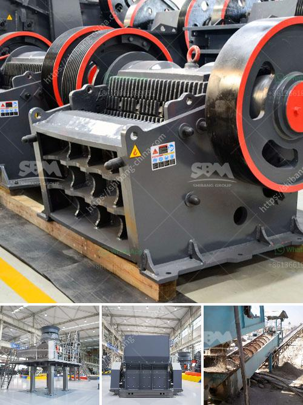

<h3>مصنع غسيل رمل الميكا</h3>
تعد صناعة تنقية رمل الميكا أمرًا ضروريًا للاستخدام الفعال للميكا في مجموعة متنوعة من التطبيقات الصناعية. يتطلب هذا تحويل الميكا التي تحتوي على العديد من الشوائب مثل الأتربة والمواد العضوية والمعادن الأخرى إلى رمل نقي وخالٍ من الشوائب.

عملية غسيل رمل الميكا تتم بواسطة مصانع خاصة تعتمد على عدة خطوات رئيسية. أولاً، يتم جمع الميكا من مناطق التعدين ونقلها إلى المصنع. يتم تفتيت الصخور الخام الميكا إلى قطع صغيرة باستخدام الكسارات والطواحين.

المرحلة التالية هي حجب وفصل الشوائب عن الرمل. يتم تدوير الرمل وفصل القطع الأكبر والشوائب الأخرى باستخدام فواصل الجاذبية والشاشات الاهتزازية. يتم تدوير القطع الأكبر بواسطة الناقلات إلى مكان التخلص المناسب، في حين يتم إزالة الشوائب الأخرى مثل الأتربة والمعادن باستخدام المياه والأدوات الخاصة.

بعد ذلك، يتم تجفيف الرمل المنقى باستخدام أفران تجفيف خاصة لاستخراج الرطوبة المتبقية. يتم تنظيم درجة الحرارة والضغط بعناية لضمان عدم تسبب أي تلف في الرمل الميكا.

وأخيرًا، يتم تخزين الرمل الميكا في مستودعات خاصة وفحصه للتأكد من نقاء وجودة المنتج النهائي. يتم التحقق من خلوه من الشوائب والحصول على حجم حبيبات موحد. بعد ذلك، يتم تعبئة الرمل في أكياس أو صوامع استعدادًا للتسويق والتوزيع في الصناعات التي تحتاج إلى الرمل الميكا كمادة خام.

يساهم وجود هذه المصانع في تلبية الطلب المستمر على الرمل الميكا ذو الجودة العالية في مختلف الصناعات. فهي توفر رملًا نقيًا يلبي معايير الجودة والمواصفات التي يتوقعها المستهلكون. من خلال إجراءاتها المتقدمة والتكنولوجيا المستخدمة، توفر هذه المصانع رمل الميكا بجودة عالية وبكميات كبيرة، مما يدعم تطور العديد من القطاعات الصناعية.
<h3>Contact us</h3><ul><li><strong>Whatsapp:&nbsp;<a href="https://wa.me/8613661969651">+8613661969651</a></strong></li><li><a href="https://swt.shibang-china.com/?git&amp;zhl&amp;مصنع غسيل رمل الميكا"><strong>Online Service(chat now)</strong></a></li></ul><h3>Related</h3><ul><li><a href='موقع إنتاج مطحنة المطرقة في نيجيريا.md'>موقع إنتاج مطحنة المطرقة في نيجيريا</a></li><li><a href='كسارة للذهب.md'>كسارة للذهب</a></li><li><a href='مطحنة للحجر الجيري في إيطاليا في بيرجامو.md'>مطحنة للحجر الجيري في إيطاليا في بيرجامو</a></li><li><a href='سعة آلة الكسارة 5 أطنان في الساعة.md'>سعة آلة الكسارة 5 أطنان في الساعة</a></li><li><a href='جميع نماذج كسارة البازلت.md'>جميع نماذج كسارة البازلت</a></li></ul>