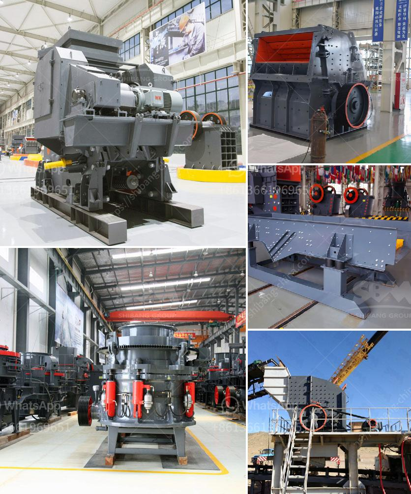

<h3>مصنع غسيل متنقل في جنوب أفريقيا</h3>
يعتبر مصنع غسيل متنقل في جنوب أفريقيا مفهومًا مبتكرًا يهدف إلى تلبية احتياجات السكان في المناطق النائية والمحرومة من الخدمات التقليدية لغسيل الملابس. يقدم هذا المصنع الخدمة للأفراد والأسر في منازلهم وأحياءهم من خلال وحدة متنقلة مجهزة تحتوي على معدات غسيل عالية الجودة.

من أهم المزايا التي يوفرها هذا النظام هي توفير الوقت والجهد للسكان، حيث لا يحتاجون للتنقل إلى محطات الغسيل التقليدية التي باعتبارها من الخيارات السائدة في المناطق الحضرية، لكنها قد تكون غير متوفرة في المناطق النائية. بالإضافة إلى ذلك، يساهم المصنع المتنقل في توفير التكاليف التي يتحملها الأفراد عند التنقل بحثًا عن خدمات غسيل الملابس البعيدة عنهم.

يعتمد عمل المصنع المتنقل على استخدام طاقة الشمس والطاقة المتجددة، مما يجعله صديقًا للبيئة ومستدامًا في الاستخدام. تستخدم القوة الشمسية لتشغيل المانحة الكهربائية والأجهزة الأخرى التي تعزز كفاءة وفاعلية العملية. بالإضافة إلى ذلك، يتم التركيز على استخدام المنتجات البيئية والمواد الخاضعة لعملية تدوير، مما يعزز الاهتمام بالبيئة وحمايتها.

يتميز المصنع المتنقل بالتنوع في الخدمات التي يوفرها، حيث يتم غسيل مختلف أنواع الملابس والأقمشة، بما في ذلك الملابس اليومية والبياضات والأغطية والستائر وغيرها. تتوفر خيارات مختلفة للعملاء، بما في ذلك خيارات التنظيف الجاف والغسيل بالماء البارد والغسيل بالماء الساخن. تعتمد عملية الغسيل على استخدام منظفات خاصة ومناسبة لكل نوع من الملابس، مما يضمن الحفاظ على نعومة وجودة القماش.

بصفة عامة، فإن مصنع الغسيل المتنقل في جنوب أفريقيا يمثل تقدمًا هائلًا في مجال الخدمات المنزلية، حيث يلبي احتياجات السكان في المناطق النائية والمحرومة. يساهم هذا المصنع في توفير الوقت والجهد والتكاليف، إلى جانب الاهتمام بالبيئة والحفاظ عليها. يجب دعم وتعزيز هذا النموذج المبتكر لتوسيع نطاق التوصيل وزيادة الوعي حول هذه الخدمة بين السكان في جميع أنحاء البلاد.
<h3>Contact us</h3><ul><li><strong>Whatsapp:&nbsp;<a href="https://wa.me/8613661969651">+8613661969651</a></strong></li><li><a href="https://swt.shibang-china.com/?git&amp;zhl&amp;مصنع غسيل متنقل في جنوب أفريقيا"><strong>Online Service(chat now)</strong></a></li></ul><h3>Related</h3><ul><li><a href='خط إنتاج الرمل الاصطناعي.md'>خط إنتاج الرمل الاصطناعي</a></li><li><a href='معدات تعدين مستخدمة.md'>معدات تعدين مستخدمة</a></li><li><a href='سعة آلة الكسارة 5 أطنان في الساعة.md'>سعة آلة الكسارة 5 أطنان في الساعة</a></li><li><a href='آلة معالجة الجبس بسعة طن واحد.md'>آلة معالجة الجبس بسعة طن واحد</a></li><li><a href='كيفية إنشاء شركة محجر.md'>كيفية إنشاء شركة محجر</a></li></ul>