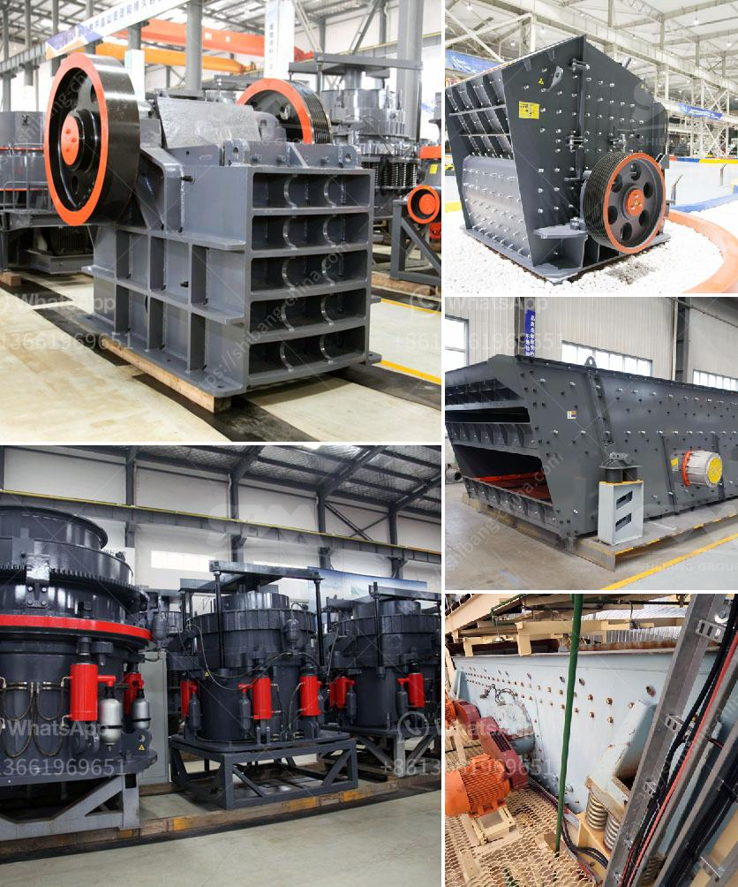

<h3>مصنع غسيل محمول للفحم</h3>
تعد عملية غسيل الفحم أحد الخطوات المهمة لتحسين جودة الفحم وتخفيض نسبة الشوائب والرواسب به. ومع ذلك، تُعتبر الأماكن التي تتوفر فيها مصانع الغسيل الثابتة غير مناسبة في بعض الأحيان، سواء بسبب مقدار الفحم المراد غسله أو بسبب الأماكن التي لا يمكن الوصول إليها بسهولة. لذا، يمكن أن يكون لدينا مصنع غسيل محمول للفحم الذي يعمل بكفاءة ويتناسب مع هذه الحاجة.

يتألف مصنع الغسيل المحمول للفحم من معدات قابلة للنقل ومتوافقة مع جميع متطلبات العملية. يتضمن المصنع العديد من المراحل الرئيسية لعملية غسيل الفحم بما في ذلك التكسير والغربلة والفصل والتجفيف. كما يحتوي على نظام متطور لمعالجة المياه المستخدمة في العملية مما يقلل من تأثيرها السلبي على البيئة.

يتميز المصنع المحمول بقدرته على التحرك بسهولة والعمل في أماكن متعددة، سواء على الأراضي الجافة أو الرطبة. هذا النوع من المصانع عملي للشركات التي تحتاج إلى غسل الفحم في مواقع متنوعة مثل المناجم المفتوحة أو المناطق النائية التي تفتقر إلى بنية تحتية قوية.

تتميز التقنية المستخدمة في المصنع المحمول أيضًا بكفاءتها وجودة العمل النهائية للفحم المغسول. فهي تتيح للشركات تنقية الفحم المستخدم في صناعات مثل توليد الكهرباء والصناعات الثقيلة. وفي ذات الوقت، يساعد غسل الفحم على حماية البيئة والمحافظة على الصحة العامة، حيث يقلل من انبعاثات الغازات الضارة للهواء وتلوث المياه.

باختصار، فإن مصنع غسيل الفحم المحمول هو حلاً عمليًا وفعالًا للشركات التي تحتاج إلى غسل كميات صغيرة إلى متوسطة من الفحم في مواقع مختلفة. يساهم هذا النوع من المصانع في تعزيز كفاءة العمل وتحسين جودة المنتج النهائي والحفاظ على البيئة بشكل عام.
<h3>Contact us</h3><ul><li><strong>Whatsapp:&nbsp;<a href="https://wa.me/8613661969651">+8613661969651</a></strong></li><li><a href="https://swt.shibang-china.com/?git&amp;zhl&amp;مصنع غسيل محمول للفحم"><strong>Online Service(chat now)</strong></a></li></ul><h3>Related</h3><ul><li><a href='كسارة الحجر الجيري مستعملة.md'>كسارة الحجر الجيري مستعملة</a></li><li><a href='مصنع سحق حجر كامل بسعة 300 طن.md'>مصنع سحق حجر كامل بسعة 300 طن</a></li><li><a href='تكلفة مصنع لوحات الجبس في الهند.md'>تكلفة مصنع لوحات الجبس في الهند</a></li><li><a href='محطات تكسير الطاقة.md'>محطات تكسير الطاقة</a></li><li><a href='تعدين المحاجر ومعدات البناء.md'>تعدين المحاجر ومعدات البناء</a></li></ul>