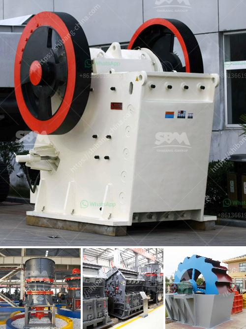

<h3>مصنع فصل وتركيز المعادن في نيجيريا</h3>
يعتبر فصل وتركيز المعادن من الصناعات الهامة التي تسهم في تعزيز الاقتصاد الوطني وتطوير البنية التحتية للدولة. و في هذا السياق، يتعدد المصانع المتخصصة في فصل وتركيز المعادن في العالم، ومن بينها المصانع الموجودة في نيجيريا.

تعتبر نيجيريا من الدول الغنية بالموارد المعدنية المختلفة مثل البترول والذهب والفحم والحديد والزنك والكاولين والرصاص والمنجنيز والطين والجبس وغيرها. وقد انطلقت جهود الحكومة النيجيرية لتعزيز صناعة فصل وتركيز المعادن، وتوليد فرص عمل للشباب والاستفادة من هذه الموارد الثمينة.

أحد المصانع المهمة في نيجيريا هو مصنع فصل وتركيز المعادن في ولاية كوارا. يعتبر هذا المصنع الأكبر في البلاد وأحد المصانع الرائدة في إفريقيا، حيث يقوم بفصل المعادن ثم تركيزها لاستخلاص المعادن الثمينة وغيرها. يعد هذا المصنع مصدرًا رئيسيًا للتصدير ويساهم في توفير العمل والتنمية الاقتصادية في الدولة.

يعتمد نجاح هذا المصنع على تطوير التكنولوجيا والتدريب المهني وتوفير الموارد اللازمة. يمتلك المصنع خطوط إنتاج متقدمة ومعدات متطورة تستخدم لفصل وتنقية المعادن المختلفة. تعمل الآلات الموجودة في المصنع على استخلاص المعادن وإزالة الشوائب والمواد الغير مرغوب فيها تمامًا.

إلى جانب الجوانب التكنولوجية، يعمل المصنع أيضاً على تحسين العمليات البيئية وتحقيق الاستدامة البيئية. فقد تم إعتماد تقنيات وسياسات صديقة للبيئة في مصنع فصل وتركيز المعادن في نيجيريا بما في ذلك تنقية مياه الصرف الصناعي وإعادة استخدام الموارد المحلية في عمليات الإنتاج.

تعد صناعة فصل وتركيز المعادن في نيجيريا فرصة رائعة لتعزيز التنمية الاقتصادية وتحقيق الاكتفاء الذاتي للدولة في جميع المواد المعدنية. بفضل هذه الصناعة، يمكن تصدير هذه المعادن إلى الأسواق الدولية وتوفير فرص عمل للمواطنين المحليين وزيادة إيرادات الدولة.

في الختام، فإن مصنع فصل وتركيز المعادن في نيجيريا يعد مصنعًا حديثًا ومتقدمًا يساهم في تعزيز الاقتصاد الوطني وتنمية الموارد المعدنية في البلاد. يتطلب هذا القطاع دعمًا مستدامًا من الحكومة والمؤسسات الخاصة للوصول إلى أفضل النتائج وتحقيق النمو الاقتصادي المستدام في المستقبل.
<h3>Contact us</h3><ul><li><strong>Whatsapp:&nbsp;<a href="https://wa.me/8613661969651">+8613661969651</a></strong></li><li><a href="https://swt.shibang-china.com/?git&amp;zhl&amp;مصنع فصل وتركيز المعادن في نيجيريا"><strong>Online Service(chat now)</strong></a></li></ul><h3>Related</h3><ul><li><a href='كسارة للذهب.md'>كسارة للذهب</a></li><li><a href='معالجة الذهب في الفلبين.md'>معالجة الذهب في الفلبين</a></li><li><a href='تكلفة إنشاء مصنع خام الحديد.md'>تكلفة إنشاء مصنع خام الحديد</a></li><li><a href='الميزة الرئيسية لكسارة الصدم أو الفك.md'>الميزة الرئيسية لكسارة الصدم أو الفك</a></li><li><a href='مطحنة الكرة للجبس.md'>مطحنة الكرة للجبس</a></li></ul>