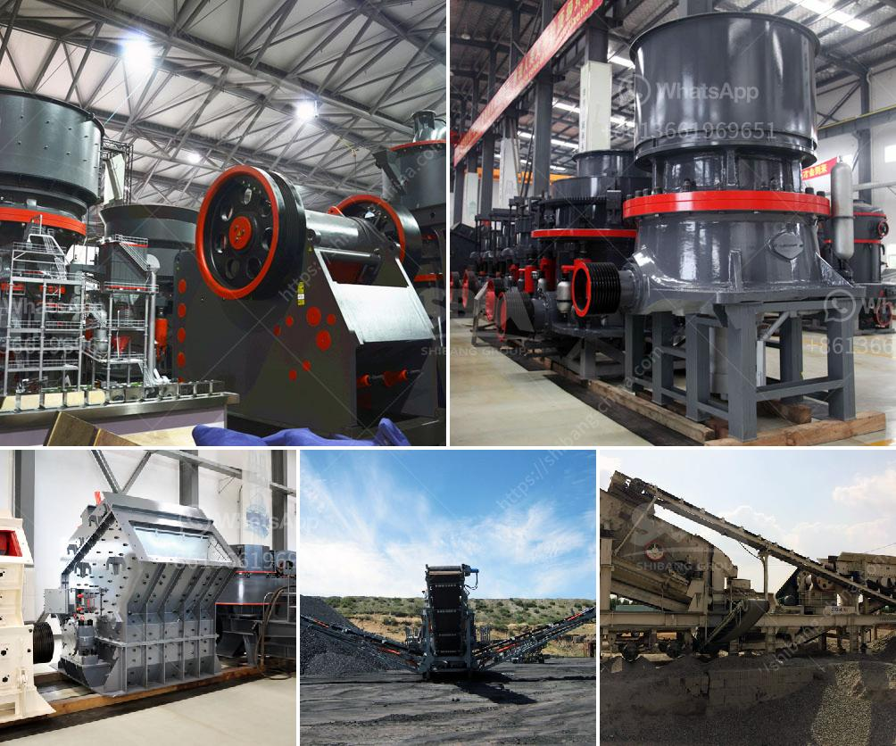

<h3>مصنع كامل لاستخراج النحاس للبيع</h3>
يعتبر النحاس أحد المعادن الهامة في صناعة العديد من المنتجات والتطبيقات المختلفة. ولتلبية الاحتياجات المتزايدة للنحاس، تم تأسيس مصانع استخراج النحاس الكاملة التي تعمل على إنتاج النحاس بكفاءة عالية وجودة ممتازة.

يتألف المصنع الكامل لاستخراج النحاس من عدة مراحل رئيسية تتضمن استخلاص النحاس من الخامات، التكرير، والتكوين النهائي للمنتجات. يتم استخلاص النحاس من الخامات باستخدام عمليات معدنية متنوعة مثل التكسير والترشيح والطحن. بعد ذلك، يتم تطبيق عملية التكرير لفصل النحاس عن المواد الأخرى الموجودة في الخامات. تتضمن التكرير عمليات تفصيلية لفصل النحاس عن الأكاسيد والشوائب الأخرى.

بعد تكرير النحاس، يتم تشكيله وتشكيله بما يتناسب مع الاحتياجات المختلفة للعملاء. يتم استخدام التقنيات المتقدمة لإنتاج منتجات نحاسية مثل الأسلاك والأنابيب والألواح والتجهيزات المختلفة. تتمتع هذه المنتجات بقوة ميكانيكية ممتازة ومقاومة عالية للتآكل، مما يجعلها مثالية للاستخدام في الصناعات المختلفة مثل البناء والسيارات والإلكترونيات وغيرها.

تعمل مصانع استخراج النحاس الكاملة على تحقيق عمليات الإنتاج الفعالة وتقليل التكاليف وزيادة الإنتاجية. تستخدم هذه المصانع تقنيات حديثة مثل التحكم الآلي والروبوتات لتحقيق دقة عالية في العمليات وتقليل الأخطاء البشرية. يتم أيضًا تطبيق أفضل الممارسات البيئية للحد من التأثير البيئي الناتج عن تلك العمليات وإعادة استخدام المواد الناتجة.

في الختام، يعد مصنع استخراج النحاس الكامل فرصة استثمارية ممتازة لأولئك الذين يتطلعون إلى الدخول في صناعة استخراج النحاس. يعمل هذا المصنع على تلبية الاحتياجات المتزايدة للنحاس وإنتاج منتجات نحاسية عالية الجودة. إن استثمارك في مصنع استخراج النحاس الكامل سيعود عليك بعائد مالي ممتاز وفرص عمل واسعة. لذا، اغتنم هذه الفرصة واستثمر في هذه الصناعة الواعدة.
<h3>Contact us</h3><ul><li><strong>Whatsapp:&nbsp;<a href="https://wa.me/8613661969651">+8613661969651</a></strong></li><li><a href="https://swt.shibang-china.com/?git&amp;zhl&amp;مصنع كامل لاستخراج النحاس للبيع"><strong>Online Service(chat now)</strong></a></li></ul><h3>Related</h3><ul><li><a href='آلة التكسير للبيع في نيجيريا.md'>آلة التكسير للبيع في نيجيريا</a></li><li><a href='كسارة الفك المزدوجة بسعة 10 طن في الساعة.md'>كسارة الفك المزدوجة بسعة 10 طن في الساعة</a></li><li><a href='شركات تصنيع آلات الكسارة في باكستان.md'>شركات تصنيع آلات الكسارة في باكستان</a></li><li><a href='كسارة الفك ميم FR.md'>كسارة الفك ميم FR</a></li><li><a href='مطحنة عمودية معلومات أيرلندا.md'>مطحنة عمودية معلومات أيرلندا</a></li></ul>