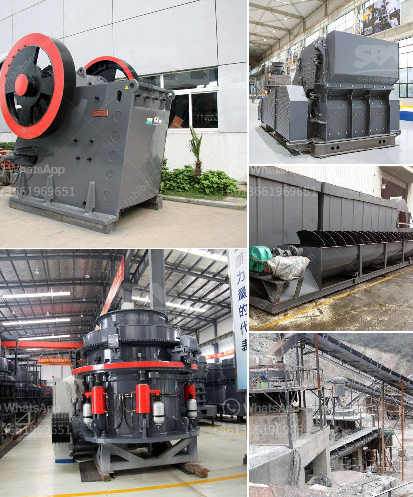

<h3>مصنع كامل لكسارة الحجر الجرانيت</h3>
تعتبر صناعة كسارة الحجر الجرانيت أحد أهم الصناعات في مجال التعدين والبناء. فالجرانيت يعتبر من المواد الطبيعية ذات القيمة العالية في مجال البناء والديكور، ويستخدم في صناعة الرخام والجرانيت للأرضيات والجدران والمطابخ والحمامات وغيرها من التطبيقات.

يتألف مصنع كسارة الحجر الجرانيت من عدة عناصر أساسية، منها المكونات الرئيسية وعمليات الإنتاج. الأجزاء الرئيسية تشمل:

1. المدخل والفرز: حيث يتم استقبال الحجارة الجرانيتية الخام وفرزها حسب الحجم والجودة. تستخدم معدات الفرز مثل المغربلة والناقلات لتنظيف الحجارة وتجهيزها للعملية التالية.

2. عملية التكسير: تتم عملية تكسير الحجارة الجرانيتية باستخدام الكسارات المختلفة، وتتضمن طحن الحجارة إلى أحجام صغيرة بحجم محدد. يتم الاختيار بعناية لاستخراج قطع الجرانيت ذات الدرجات العالية من الجودة.

3. الغسيل والفصل: بعد عملية التكسير، يجب غسيل وفصل الجرانيت عن الأوساخ والشوائب الأخرى التي قد تكون موجودة. تستخدم أنظمة غسيل المياه المتقدمة والآلات الفاصلة لتحقيق هذا الهدف.

4. التجفيف وتعبئة المنتج: بعد عملية الفصل، يتم نقل الجرانيت المعالج إلى آلات التجفيف لإزالة الرطوبة المتبقية. بعد ذلك، يتم تعبئة وتغليف المنتج النهائي بعناية في أكياس أو وحدات تخزين للنقل أو التخزين.

بالإضافة إلى العمليات المذكورة أعلاه، يجب أيضًا أن يتم توفير بعض التجهيزات والآلات الفرعية في المصنع، مثل محطات توليد الطاقة ومحطات معالجة المياه وأنظمة التحكم في الغبار. يجب توفير الصيانة الدورية لآلات المصنع لضمان العمل المستدام والسلس.

يُعَد إقامة مصنع كامل لكسارة الحجر الجرانيت تحدٍ كبير، حيث يتطلب تخطيطًا جيدًا وموارد مالية كبيرة لشراء المعدات وإنشاء المرافق اللازمة. كما يتطلب إعداد دراسة جدوى متأنية لتحديد الطلب على المنتج وتحديد مستوى المنافسة والتكاليف المرتبطة بالإنتاج والتوزيع.

باختصار، مصنع كسارة الحجر الجرانيت يُعَد استثمارًا كبيرًا في صناعة التعدين والبناء. يشتمل على العديد من العمليات والجهود لإنتاج المنتج النهائي بجودة عالية وفقًا لاحتياجات السوق المحلية والدولية.
<h3>Contact us</h3><ul><li><strong>Whatsapp:&nbsp;<a href="https://wa.me/8613661969651">+8613661969651</a></strong></li><li><a href="https://swt.shibang-china.com/?git&amp;zhl&amp;مصنع كامل لكسارة الحجر الجرانيت"><strong>Online Service(chat now)</strong></a></li></ul><h3>Related</h3><ul><li><a href='كم من الأرض مطلوبة لكسارة الحجر.md'>كم من الأرض مطلوبة لكسارة الحجر</a></li><li><a href='شركة تصنيع آلات كسارة الفك.md'>شركة تصنيع آلات كسارة الفك</a></li><li><a href='توازن المواد والطاقة لكسارة الفك.md'>توازن المواد والطاقة لكسارة الفك</a></li><li><a href='أفكار مشروع مصفاة النحاس صغيرة المقياس.md'>أفكار مشروع مصفاة النحاس صغيرة المقياس</a></li><li><a href='تجهيزات تعدين الفحم للبيع في ألمانيا.md'>تجهيزات تعدين الفحم للبيع في ألمانيا</a></li></ul>