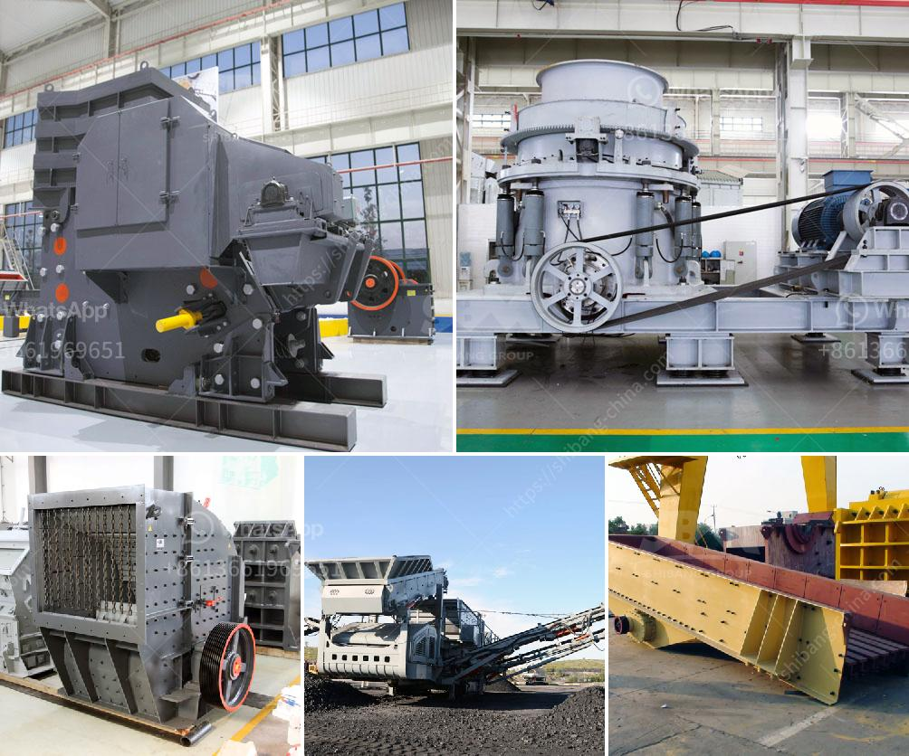

<h3>مصنع كبير للكسارة بسعة ١٠٠٠ حجر</h3>
تعد الكسارات من أهم الآلات المستخدمة في صناعة البناء وتجهيز المواد الخام لاستخدامها في الأعمال الإنشائية. ولتلبية الاحتياج المتزايد للحجارة المكسرة، تم إقامة مصنع كبير للكسارات بسعة ١٠٠٠ حجر في منطقة معينة.

تُعَد هذه المصنع مناسبة لتحقيق الإنتاجية العالية وتلبية الاحتياج المتزايد للحجارة المكسرة بشكل فعال. يتكون المصنع من مجموعة من الآلات والمعدات ذات التقنية العالية لتحقيق عملية الكسر وفصل الحجارة بطريقة فعّالة. يتم تغذية الحجارة إلى ماكينة الكسارة بشكل متواصل، حيث يتم سحق الحجارة بفعالية وتقسيمها إلى أحجام مختلفة وفقًا للمتطلبات المحددة.

يتم تجهيز المنتج النهائي بعد مرحلة الكسر بفصل المواد الأخرى غير المرغوب فيها مثل التربة والغبار والشوائب باستخدام نظام غربلة متقدم. تُوجه الحجارات المكسرة المنتجة إلى خزانة التحميل حيث يتم تخزينها حتى الوقت المناسب لاستخدامها في البناء أو الحفر.

يعتبر هذا المصنع كبيرًا وذات سعة كبيرة، مما يعني أنه يتم إنتاج كمية كبيرة من الحجارة المكسرة يوميًا. وذلك بفضل استخدام أحدث التقنيات والمعدات، بالإضافة إلى المهارات والخبرة العالية لفريق العمل.

تتمتع هذه المصنع بالعديد من المزايا. أحد أهم المزايا هو القدرة على تلبية الطلبات الكبيرة للحجارة المكسرة في وقت قصير وبكفاءة عالية، مما يمكن أن يؤدي إلى زيادة الإنتاجية وتحقيق أرباح أعلى للشركة.

كما أن وجود مصنع بهذه السعة يعني أنه يساهم في تقليل التكلفة والوقت المستغرق في الحصول على الحجارة المكسرة، حيث يُمكن للمشاريع الكبيرة التي تحتاج إلى كميات كبيرة من الحجارة الاعتماد على هذا المصنع كمصدر رئيسي للإمدادات.

باختصار، توفر مصانع الكسارات الكبيرة فرصًا لتلبية الاحتياجات المتزايدة للحجارة المكسرة في صناعة البناء والتشييد. تمثل هذه الأنواع من المصانع الاستثمارات الضخمة التي تساعد في تلبية الطلب المتنامي، وتساهم في تنمية الاقتصاد المحلي. كما أنها تعزز الكفاءة في تصنيع المواد الخام وتأمين الإمدادات في الوقت المناسب، مما يساهم في نجاح المشاريع الكبيرة وتنميتها.
<h3>Contact us</h3><ul><li><strong>Whatsapp:&nbsp;<a href="https://wa.me/8613661969651">+8613661969651</a></strong></li><li><a href="https://swt.shibang-china.com/?git&amp;zhl&amp;مصنع كبير للكسارة بسعة ١٠٠٠ حجر"><strong>Online Service(chat now)</strong></a></li></ul><h3>Related</h3><ul><li><a href='شركة تصنيع ختم الذهب في الصين.md'>شركة تصنيع ختم الذهب في الصين</a></li><li><a href='قائمة أسعار مصنع التكسير.md'>قائمة أسعار مصنع التكسير</a></li><li><a href='مصانع تكسير الفك في المملكة العربية السعودية.md'>مصانع تكسير الفك في المملكة العربية السعودية</a></li><li><a href='أسعار كسارات الفك في جنوب أفريقيا.md'>أسعار كسارات الفك في جنوب أفريقيا</a></li><li><a href='طحن الكرة الصين.md'>طحن الكرة الصين</a></li></ul>