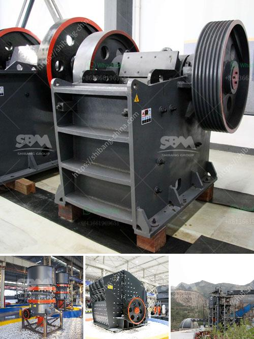

<h3>مصنع كربونات الكالسيوم المرسبة</h3>
يعد مصنع كربونات الكالسيوم المرسبة واحدًا من المصانع المهمة في صناعة المعادن والمواد الكيميائية. يتم استخدام مصنع كربونات الكالسيوم المرسبة لإنتاج مسحوق الجير المرسب والجير المطفأ للحموض، واللون الأبيض، والمواد اللافلزية المفيدة. يتم تصنيع المنتج بشكل رئيسي من صخور الحجر الجيري عالية النقاوة والجودة.

تبدأ عملية التصنيع بتكسير الحجر الجيري إلى حجم يمكن تناوله بواسطة الكسارة الأولية. ثم يتم نقل الحجر الجيري المكسور إلى مطحنة الكرة، حيث يتم طحنه إلى حجم جزيئي صغير جدًا. بعدها، يتم نقل المواد المطحونة إلى وعاء كبير يحتوي على محلول كبريتات الصوديوم.

تحتوي محلول كبريتات الصوديوم على نسبة عالية من الصودا الكاوية. عند دمج الصودا الكاوية مع الحجر الجيري المطحون، تحدث رد فعل كيميائي تسمى عملية الكربنة. يتم خلال هذه العملية تحويل الكالسيوم الموجود في الحجر الجيري إلى كربونات الكالسيوم المرسبة، وتكون الناتجة عبارة عن مسحوق أبيض ناعم.

بعد ذلك، يتم نقل المسحوق الأبيض إلى أفران التجفيف حيث يخضع لدرجة حرارة عالية للتخلص من الماء المتبقي فيه. تتبع هذه الخطوة عملية التصفية للحصول على منتج نهائي نقي. ثم يتم تعبئة المنتج في حاويات أو أكياس للاستخدام النهائي.

تستخدم كربونات الكالسيوم المرسبة في العديد من الصناعات. فهي تستخدم في صناعة الدهانات، وصناعة الورق، وصناعة الأدوية، وصناعة البلاستيك، بالإضافة إلى العديد من التطبيقات الأخرى. تعتبر كربونات الكالسيوم المرسبة منتجًا ضروريًا في صناعة البناء والتشييد حيث تستخدم في إنتاج المواد البنائية مثل الاسمنت والجبس.

باختصار، يعتبر مصنع كربونات الكالسيوم المرسبة أحد المصانع الحيوية في الصناعة الكيميائية. يلعب دورًا هامًا في إنتاج مواد البناء والمواد الكيميائية اللافلزية المفيدة. يعمل المصنع على توفير منتج ذو جودة عالية يتم استخدامه في العديد من التطبيقات الصناعية المهمة.
<h3>Contact us</h3><ul><li><strong>Whatsapp:&nbsp;<a href="https://wa.me/8613661969651">+8613661969651</a></strong></li><li><a href="https://swt.shibang-china.com/?git&amp;zhl&amp;مصنع كربونات الكالسيوم المرسبة"><strong>Online Service(chat now)</strong></a></li></ul><h3>Related</h3><ul><li><a href='كسارة الكرة باكستان للبيع.md'>كسارة الكرة باكستان للبيع</a></li><li><a href='تجهيزات تعدين الفحم للبيع في ألمانيا.md'>تجهيزات تعدين الفحم للبيع في ألمانيا</a></li><li><a href='آلة كسارة الذهب للبيع في جنوب أفريقيا.md'>آلة كسارة الذهب للبيع في جنوب أفريقيا</a></li><li><a href='معدات المحجر للسكك الحديدية.md'>معدات المحجر للسكك الحديدية</a></li><li><a href='آلة طحن الطين الصيني.md'>آلة طحن الطين الصيني</a></li></ul>